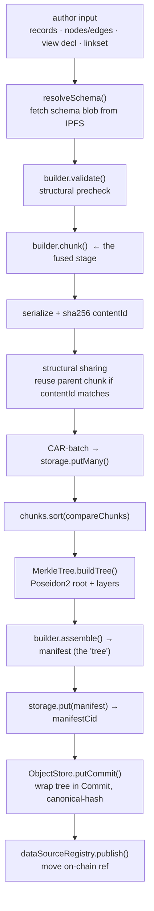
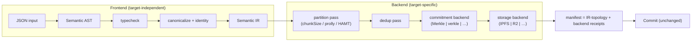

# Fangorn as a Compiler — Architecture Audit & Proposal

*Status: proposal. No code changes yet. This maps the **current** SDK onto the
"compiler for machine knowledge" model and recommends the smallest set of seams
that make the model real. Read `docs/PROTOCOL.md` first for the domain.*

---

## 0. The one-paragraph verdict

The thesis is right, but the codebase is closer to it than the framing suggests,
and further in a different way than the framing suggests. Storage is **already**
abstracted (`MetadataStorage`). The object model (`commit`/`tree`/`ref`) is
**already** representation-neutral in spirit. The real problem is narrower and
sharper than "JSON is baked in everywhere": **one function does the work of five
compiler passes at once**, and **one commitment scheme (Poseidon2 Merkle) is
stamped into the type of every artifact**. Fix those two things and most of the
LLVM-shaped goals fall out. Almost everything else on the wishlist (RDF frontend,
verkle/polynomial commitments, SQL emission) is a *new backend behind a seam you
don't have yet* — design the seam, don't build the backends.

Do **not** turn this into a 9-layer pipeline with nine packages. This is a
132-file SDK with a single real publish path. Over-abstracting it now buys
nothing and costs the working `commit → push` loop.

---

## 1. What the pipeline actually is today

There is one real pipeline. It lives in `PublisherRole.buildManifest`
(`src/roles/publisher/index.ts:210`) and the per-kind `ManifestBuilder`
implementations. Concretely, publishing runs:



The load-bearing observation: **`builder.chunk()` is not one thing.** Inside
`BundleBuilder.chunk` (`src/roles/publisher/builders/bundle.ts:54`) a single async
generator simultaneously:

1. **type-checks** every record (`validateRecord` → `schema/validate.ts`),
2. **normalizes representation** (`resolveRecord` collapses handle fields),
3. **assigns global identity** (`resolveLocalId` / `extractAliases` /
   `toEntityUri`, lines 96–98),
4. **validates graph invariants** (edge endpoints exist, declared relations,
   min/max cardinality, duplicate ids),
5. **partitions for storage** (per-type node buffers, edge buffers, `chunkSize`
   flushing — pure storage layout).

Passes 1–4 are target-independent semantics. Pass 5 is a target-specific storage
decision. They are interleaved line-by-line in one generator. **This fusion is
the single biggest source of the coupling the rewrite is trying to remove.** You
cannot swap the partitioning strategy (prolly tree, HAMT, graph-aware — the
PROTOCOL.md §3 "IMPORTANT" note) without touching validation, and you cannot add
an RDF frontend without reimplementing validation and identity inside it.

---

## 2. Mapping: proposed stage → what exists → gap

| Proposed compiler stage | Exists today as… | Location | Gap |
|---|---|---|---|
| **Frontend** (representation → AST) | `ManifestBuilder.chunk` input types (`PublishRecord`, `Node/Edge`, `ViewInput`, `LinkRecord`) | `builders/*`, `publisher/types.ts` | JSON is the *only* frontend; frontend logic is fused with partitioning |
| **Semantic AST** | — (implicit in builder input) | — | **Missing.** No representation-independent authored object |
| **Type checking** | `validate()` + `validateRecord` + bundle graph checks | `schema/validate.ts`, `builders/bundle.ts:78-163` | JSON-shaped; interleaved inside `chunk()`, not a standalone pass |
| **Canonicalization** | `canonicalize()` (commits), `resolveRecord` (handles), identity stamping | `objects/canonical.ts`, `builders/utils.ts`, `schema/identity.ts` | Scattered across three places; only the *commit* canonicalizer is clean |
| **Semantic IR** | the *manifest* is the nearest thing | `publisher/types.ts` | **Missing as an IR.** The manifest is already storage+commitment-shaped (`dataCid`, `leaf`, `tree: Hex[][]`) — it's an *output*, not an IR |
| **Optimization passes** | chunking, dedup (contentId+`parentBlobs`), diff | `publisher/index.ts:267-289`, `objects/store.ts:75` | Real, but hardwired into `buildManifest`; not composable or reorderable |
| **Commitment backend** | `MerkleTree` (Poseidon2) | `registries/datasource-registry/index.ts:46` | **Not abstracted.** Called by static methods; `root: Hex` + `tree: Hex[][]` baked into every manifest type and `Commit` |
| **Storage backend** | `MetadataStorage` | `providers/storage/types.ts` | **Already abstract** ✅ — but `putMany`/CAR leaks IPFS shape, and consumer bypasses it (`PinataBackend.getStatic`, `consumer/index.ts:120`) |
| **Publication** | `DataSourceRegistry.publish` | `registries/datasource-registry` | Concrete but appropriately isolated; one impl is fine |
| **Verification pipeline** | `validate()` + graph checks + `isCommit()` + merkle recompute | scattered | Not composable; no `verify(artifact): Result[]` seam |

**Already sufficiently abstract (leave alone):**

- `MetadataStorage` — the storage-backend interface the rewrite asks for already
  exists. It just needs tightening (§5).
- `ObjectStore` (`objects/store.ts`) — the git-object layer is genuinely
  representation-neutral: it deals in commits, trees-by-CID, refs, canonical
  hashing. A commit references `tree: string` (a CID) and `root: Hex`; it does not
  care that the tree is JSON. **This is the best-abstracted module in the repo and
  the natural home for the "representation-independent commit graph."**
- `canonical.ts` — small, isolated, correct. The template for what a pass should
  look like.
- The `ManifestBuilder` *polymorphism shape* (`kind` + per-kind impls) — the idea
  is right; the method boundaries are wrong (§3).

---

## 3. The core recommendation: split `chunk()` around a Semantic IR

Introduce exactly one new object — a **Semantic IR**: a representation-independent
graph of what the publisher meant, *before* any storage or commitment decision.
Then split the fused `chunk()` into a frontend (produces IR) and a backend
(consumes IR).



**What the IR is** (the minimum that unlocks the goals — resist adding more):

```ts
interface SemanticIR {
  schemaId: Hex;                 // the contract it conforms to
  nodes: IRNode[];               // typed things, with resolved identity
  edges: IREdge[];               // typed relations (topology, separate from attrs)
  provenance: { author: Address; parents: string[] };
}
interface IRNode {
  localId: string;
  type: string;
  entityUri: string;             // global identity, already resolved
  aliases: string[];             // the join contract (namespaces)
  attrs: Record<string, ResolvedField>;   // attributes, separate from topology
}
interface IREdge { rel: string; from: string; to: string; }
```

This directly satisfies five of the rewrite's IR requirements: normalized
identity, explicit provenance, topology separated from storage, graph structure
separated from attributes, invariants checkable in one place. Note it is
**record-set / bundle / view / linkset agnostic** — those four "kinds" become four
frontends that all lower to the same IR (a record-set is nodes with no edges; a
linkset is edges with no nodes; a view is a provenance-only IR).

**The semantic-correctness contract** the rewrite asks for (`⟦T(x)⟧ = ⟦x⟧`)
becomes concrete and testable: every backend pass is a function
`SemanticIR → SemanticIR` (or `→ physical layout`) that must preserve the node
set, edge set, and identity closure. Partitioning changes *which chunk* a node
lands in; it must not change *which nodes exist*. That is a property test you can
actually write — today you can't, because there's no IR to compare.

---

## 4. Extract the CommitmentBackend interface

This is the second-deepest coupling and the one PROTOCOL.md §12 already flags as
"the one thing we must own." Today `MerkleTree` is called by static method from
`buildManifest` (`index.ts:301-302`), and its output shape (`root: Hex`,
`tree: Hex[][]`) is a **structural field in every manifest type** and in `Commit`.
That means "Merkle" isn't a backend — it's in the type system.

Proposed seam (the rewrite's own requirement list, verbatim: deterministic
commitment, proof, verify):

```ts
interface CommitmentBackend<Layout> {
  readonly id: string;                       // "poseidon2-merkle-v1"
  commit(leaves: LeafInput[]): { root: Hex; layout: Layout };
  prove(layout: Layout, index: number): Proof;
  verify(root: Hex, leaf: LeafInput, proof: Proof): boolean;
}
```

Then `Commit.root: Hex` stays (a commitment is opaque bytes — good, it doesn't
leak the scheme), but `Commit` gains `commitment: string` (the backend id), and
the manifest stops carrying `tree: Hex[][]` inline — the layout becomes a
backend-owned artifact addressed by CID, not a field every consumer must
understand. `MerkleTree` becomes the first `impl CommitmentBackend`, unchanged
internally. **No behavior change; the Poseidon2 root on-chain is byte-identical.**

This is what makes verkle/vector/polynomial commitments *possible* without
promising them. You are not building them now. You are removing the assumption
that stops them.

---

## 5. Storage: tighten the seam that already exists

`MetadataStorage` is already the storage backend the rewrite wants. Two leaks to
close, both small:

1. **CAR leaks into the interface.** `putMany` (`storage/types.ts:22`) is an
   IPFS/CAR optimization exposed as a core method. Rename to intent
   (`putBatch`) and let non-IPFS backends implement it as a loop. The *reason*
   for batching (fewer round-trips) is universal; CAR is one realization.
2. **The consumer bypasses the interface.** `ConsumerRole.getEntry`
   (`consumer/index.ts:120`) calls `PinataBackend.getStatic` directly, hardwiring
   IPFS on the read path. Route it through `MetadataStorage.get` so R2 / CDN reads
   work through the same seam publishes already do.

That's it for storage. Do not add S3/R2/libp2p backends now — add them when a
consumer needs one. The interface being right is the deliverable.

---

## 6. Verification as composable passes

Today verification is: `validate()` (schema), graph checks (inside `chunk`),
`isCommit()` (structural), and implicit merkle-root recomputation — four
mechanisms in four places. The rewrite wants them to compose. Cheap win, because
once the IR exists they naturally do:

```ts
type VerifyPass = (ir: SemanticIR, ctx: VerifyCtx) => Diagnostic[];
// schemaConformance, graphInvariants, identityWellFormed,
// provenanceChain, signature, (future) zkConformance
const verify = (ir, passes) => passes.flatMap(p => p(ir, ctx));
```

This is a *reorganization*, not new logic — `validate.ts` and the bundle graph
checks move behind `VerifyPass` and now run on IR instead of raw JSON, which means
they run identically for any future frontend. The PROTOCOL.md §14 "no on-chain
proof that data conforms to its schema" gap becomes "add one more `VerifyPass`,"
not "re-architect."

---

## 7. Recommended module boundaries

Minimal. Four seams, not nine packages. Suggested layout inside `src/`:

```
src/
  ir/              # SemanticIR types + the semantic-correctness invariants
  frontends/       # json/ (today's builders, split: input → IR only)
  passes/          # typecheck, canonicalize-identity, partition, dedup, diff
  commitment/      # CommitmentBackend interface + merkle/ (moved from registry)
  storage/         # MetadataStorage (exists) — tightened
  objects/         # ObjectStore — unchanged, already right
  registries/      # publication — unchanged
```

`ManifestBuilder` splits into `Frontend<Input> → SemanticIR` and a shared backend
`lower(IR, {partition, commitment, storage}) → Manifest`. The four current
builders become four thin frontends; `buildManifest`'s upload/merkle/assemble
body becomes the one shared backend every frontend reuses.

---

## 8. What NOT to do (scope discipline)

- **No new frontends yet.** RDF / property-graph / SQL frontends are the *payoff*
  of the seam, not part of building it. Ship JSON-as-a-frontend first; a second
  frontend is the proof the seam works, and belongs in its own follow-up.
- **No new commitment or storage backends yet.** One impl behind each interface.
- **Don't touch the contract or the on-chain root format.** The Poseidon2 root
  and the `manifest_cid`-slot trick (PROTOCOL.md §13) must stay byte-stable
  through all of this. Every refactor here is above the chain.
- **Don't build a 9-stage pipeline object.** The stages are a *mental model*; the
  code needs exactly two boundaries (frontend|backend, and the commitment seam)
  plus a verify list. More structure than that is cost without a caller.
- **Keep `commit → push` green the whole way.** This is a refactor with an
  existing test suite (`objects.test.ts`, `bundle.test.ts`, `e2e.test.ts`); each
  step below should leave them passing.

---

## 9. Migration path (incremental, non-breaking)

Ordered so each step is independently shippable and reversible:

1. **Define `SemanticIR`** (`src/ir/`) + a `SemanticIR → today's-chunk-input`
   adapter. No behavior change; proves the IR can represent everything.
2. **Split one frontend** — `RecordSetBuilder` (simplest) into `frontend → IR`
   and route through the shared backend. Land it, keep the other three on the old
   path. Validate byte-identical CIDs against a golden fixture.
3. **Migrate bundle/view/linkset** frontends the same way. Delete the fused
   `chunk()` methods once all four are IR-based.
4. **Extract `CommitmentBackend`** from `MerkleTree`; move `tree: Hex[][]` out of
   the manifest into a backend-addressed layout artifact. Verify on-chain root
   unchanged.
5. **Extract `VerifyPass`** list; move `validate` + graph checks onto IR.
6. **Tighten storage** (`putBatch` rename, route consumer reads through the
   interface).

Steps 1–3 deliver ~80% of the thesis (frontend/backend separation + IR). Steps
4–6 are the "backends are swappable" guarantees. Stop after 3 if priorities shift;
it's still a coherent, better architecture.

---

## 10. Answers to the audit questions

1. **Semantics coupled to JSON?** Field/scalar types (`schema/types.ts`),
   `validate.ts`, and the manifest shapes. But the *object graph* (commit/tree/ref)
   is not — that's the seam to build outward from.
2. **Chunking mixed with representation?** In `builder.chunk()` — the central
   finding (§1, §3). `chunkSize`/buffering lives line-by-line next to validation.
3. **Merkle assumed not abstracted?** Yes — static `MerkleTree` calls + `root`/
   `tree: Hex[][]` in every artifact type and `Commit` (§4).
4. **Modules that are already passes?** `resolveRecord` (canonicalize), identity
   stamping (normalize), contentId+`parentBlobs` (dedup), `diffManifests` (diff),
   `MerkleTree` (commit). All real, all currently inlined.
5. **Where frontend/backend interfaces belong?** Split `ManifestBuilder` at the IR
   boundary; extract `CommitmentBackend`; keep/tighten `MetadataStorage` (§7).
6. **APIs that should be on IR not serialized objects?** `diffManifests` /
   `blobRefs` (operate on manifest JSON — should diff IR topology), and quickbeam's
   consumption path.
7. **Already abstract?** `MetadataStorage`, `ObjectStore`, `canonical.ts`, and the
   builder polymorphism *shape*.
```

