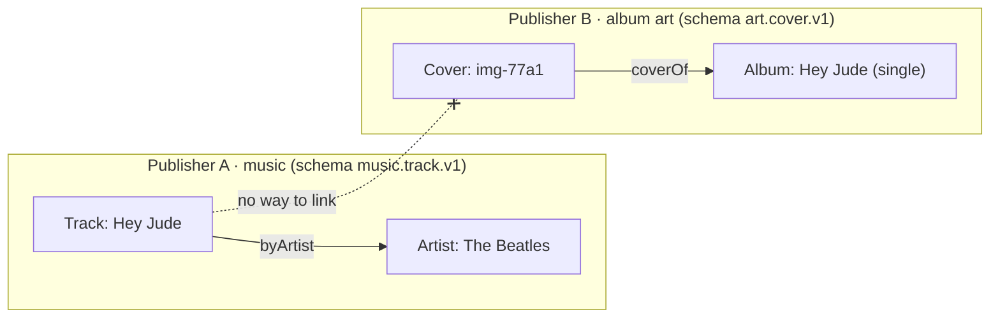
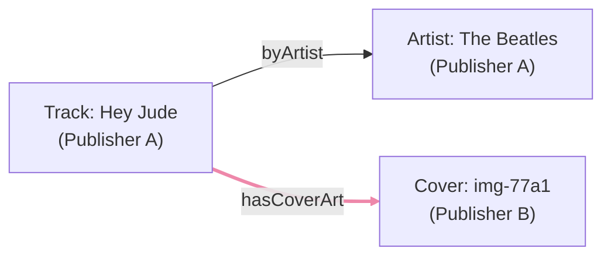
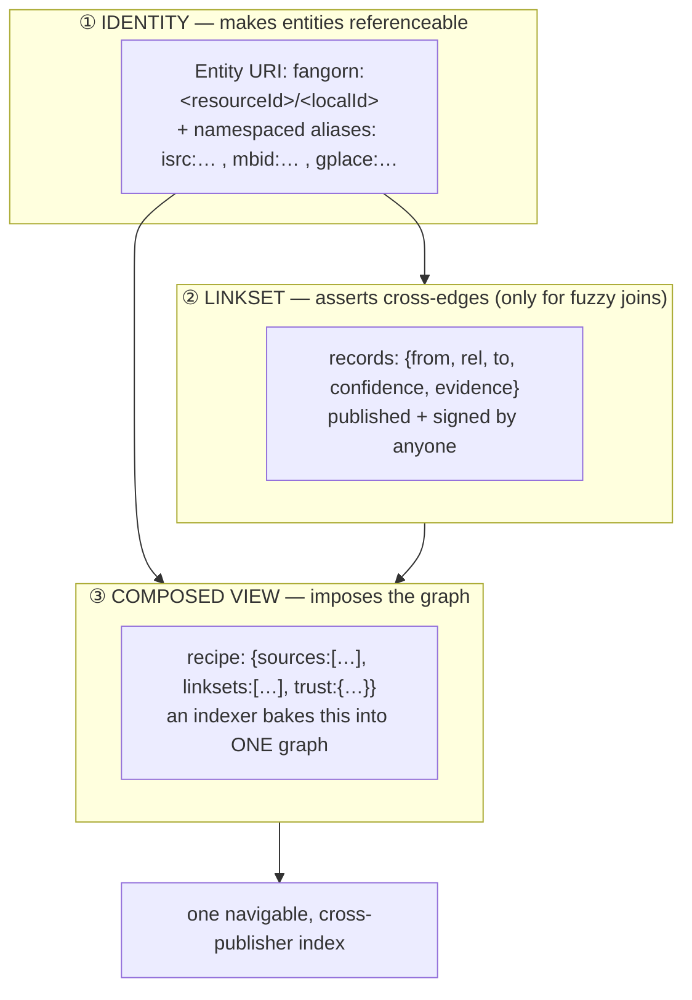
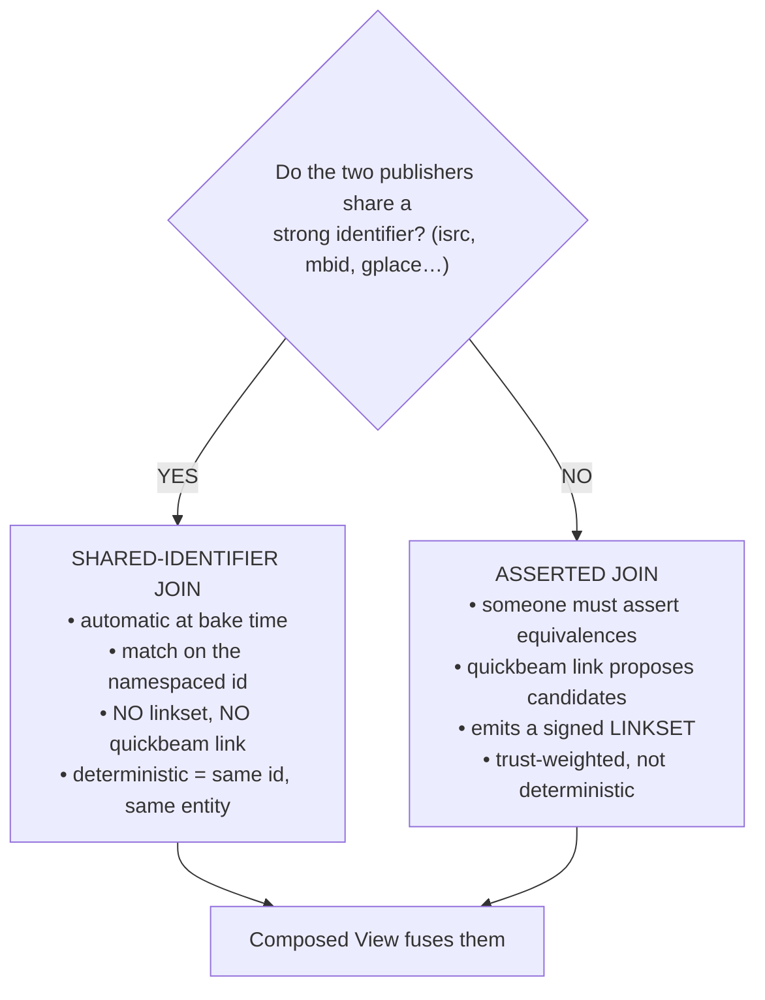
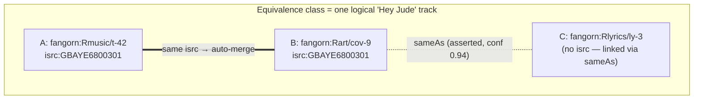
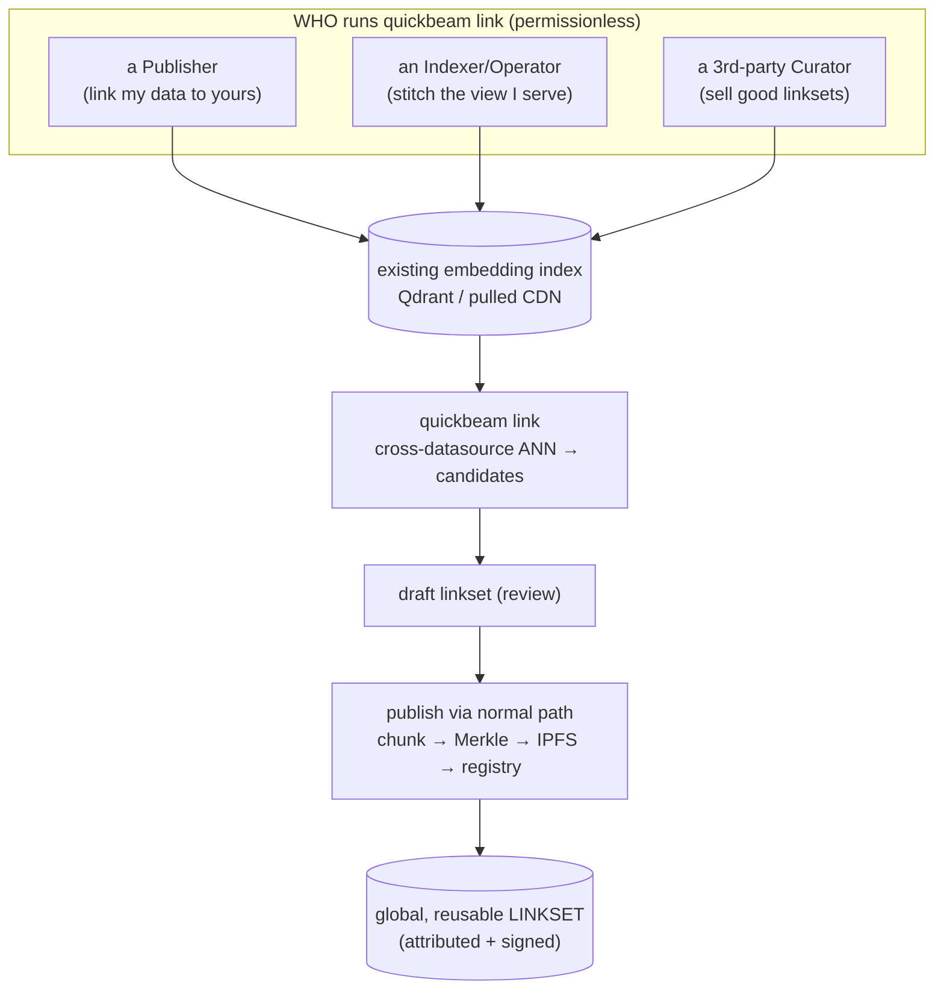
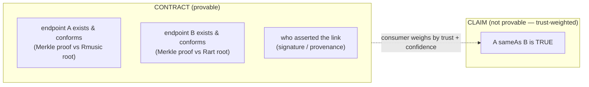
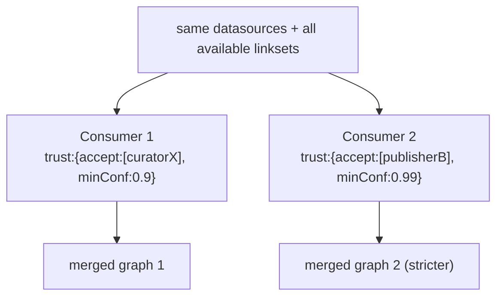
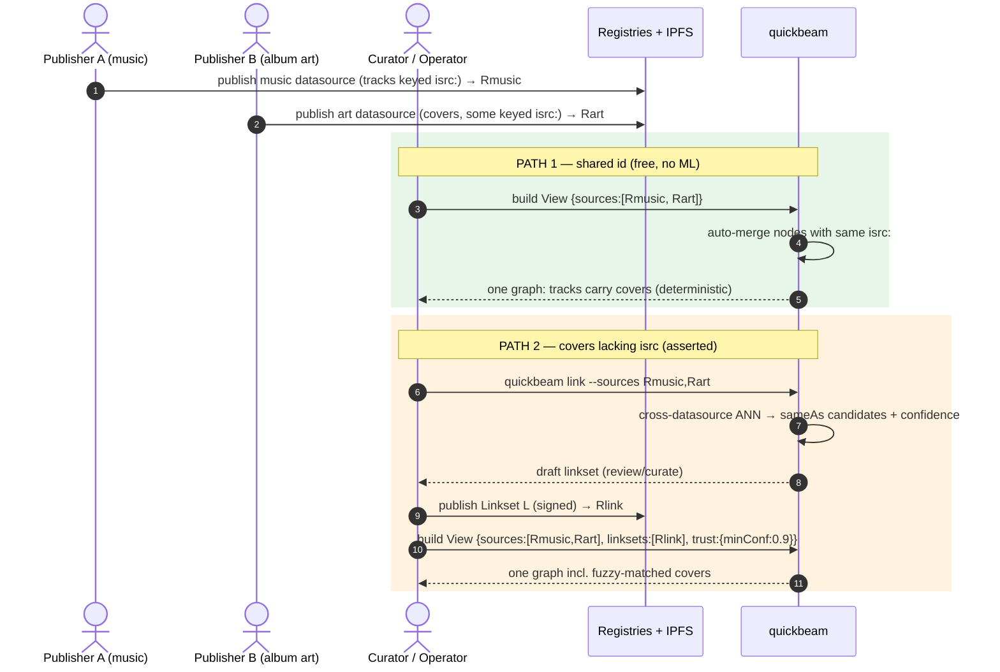
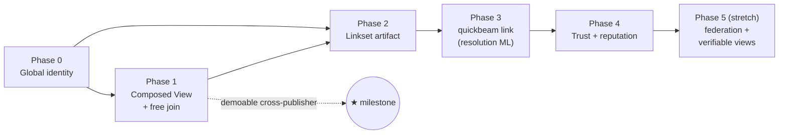

# Cross-Publisher Linking

*How Fangorn turns many isolated, signed graphs into one navigable web — the missing piece that distinguishes a semantic **web** from a pile of knowledge graphs.*

Status: **design draft v0.1** · Companion to [FRAMEWORK.md](./FRAMEWORK.md) (this is the detail behind **Gap E**) · Scope: `fangorn` SDK + `embeddings`/quickbeam.

---

## 1. The problem, in one picture

Today each publisher's data is a **self-contained graph**. Publisher A (music) and Publisher B (album art) can each publish typed, verifiable graphs — but nothing lets a Track in A's graph point at a Cover in B's graph. They are islands.



The goal is **one web**: a Track in A's graph linked to its Cover in B's graph, even though the two publishers never coordinated and used different schemas.



The pink edge is the cross-publisher link. The entire design below is about **how that edge comes to exist, who asserts it, and why a consumer should believe it.**

---

## 2. The key realization: identity is already half-global

Look at what the real data uses as node IDs today (from `stage_volumes/`):

| Node | id today | What it actually is |
|---|---|---|
| Business | `ChIJSc8NJe05VE0Rvsw7DHmujCs` | a **Google Place ID** — globally unique! |
| Category | `bar`, `establishment` | a **shared slug concept** |
| Locality | `eagle-river-wi` | a **shared slug concept** |
| Review | `ChIJSc8N…:0` | local (parent:index) |
| Reviewer | `rev-a5cb3e04fe5cb164` | local hash |

Some IDs are already global, externally-anchored keys (`ChIJ…` is a Google Place ID). The model just has **no way to *declare* "this id is global"**, and edges **can't cross a datasource boundary**. Two small holes — not a new subsystem.

So linking is mostly about giving entities a **global name** and letting edges reference foreign names.

---

## 3. Three pieces (don't conflate them)

This is the part that's easy to muddle. There are **three distinct concepts**, each with one job:



- **① Identity** — a global name for every entity. *Always needed.*
- **② Linkset** — a published, signed set of cross-edges. *Only needed when publishers don't share a strong id.* `sameAs` is just one relation.
- **③ Composed View** — the recipe that says "fuse these datasources (and these linksets) into one graph." **This is what imposes the cross-publisher graph structure — NOT the linkset.**

> Common misconception: *"`quickbeam link` produces the linkset, and the linkset is the graph."* No. The **View** is the graph. The linkset only supplies edges, and only in the fuzzy case. When publishers share a strong id, there is **no linkset and no `quickbeam link` at all** — see §4.

---

## 4. Two ways to link (and only one uses ML)

Everything hinges on this fork:



| | Shared-identifier join | Asserted join |
|---|---|---|
| Trigger | Both declare the same namespace (`isrc:`) | Only names / fuzzy signals |
| Mechanism | Match on namespaced id at bake | `quickbeam link` → linkset |
| Needs linkset? | **No** | **Yes** |
| Needs ML? | **No** | **Yes** (candidate generation) |
| Truth | Deterministic | Attributed claim, trust-weighted |

A subtle but crucial point: the join key is the **namespace**, not the field *name*. Publisher A can call the field `isrc`, Publisher B `isrcCode` — as long as both declare the value lives in the `isrc:` namespace, they join. The contract is the namespace.

---

## 5. Identity model — entities become equivalence classes

Every entity gets a **canonical Entity URI** (always exists, derived from the datasource):

```
fangorn:<resourceId>/<localId>
        └─ keccak256(owner ‖ schemaId ‖ keccak256(name)) ─┘   (version-stable, Merkle-resolvable)
```

and zero-or-more **namespaced aliases** declared on the node (`isrc:GBAYE6800301`, `mbid:5b11f4ce…`, `gplace:ChIJ…`).

Linking — whether by shared id or by `sameAs` assertion — **merges entities into equivalence classes** (a union-find). The "entity" you query is the *class*, not any single row:



- `N1`↔`N2` merge **for free** (shared `isrc:`).
- `N3` joins only via an **asserted `sameAs`** link (it had no ISRC).
- There is **no single canonical owner** of "Hey Jude" — it's a cluster, and **each consumer computes its own cluster** from the links it trusts (§7). No global consensus required.

---

## 6. Who runs what, and where

Nothing here is a central service. `quickbeam link` is a **CLI tool** (like `build`/`bake`) that runs against an existing embedding index — on whoever's machine/server. Three actors run it for different reasons; the *output* is always a published, content-addressed linkset.



Key properties:
- **Compute is anybody's**; the **artifact is global**. A curator who owns *neither* dataset can publish links between them.
- Because linksets are **signed/attributed**, *who ran it* is a **trust input, not an authorization gate** — consumers decide whose links they accept (§7).
- The composed-view **bake** runs wherever quickbeam runs today (operator server, or in-browser for small sets) — same `build`/`bake` infra.

---

## 7. Trust — the honest boundary

You **cannot** cryptographically prove a `sameAs` claim is *true*. You can prove who *said* it, and that both *endpoints exist and conform* (Merkle proofs against each datasource's committed root) — but "these two records describe the same real Beatles" is a human judgment.



So a Composed View carries a **trust policy**, and **different consumers get different (each internally consistent) merged graphs** from the same data:



This is why cross-publisher linking **drags the reputation layer in**: a linkset is only as good as its asserter, so the (currently dormant) ERC-8004 identity/reputation scaffolding finally has a concrete job — **scoring link asserters**. The mitigation against a bad/fuzzy linkset poisoning a view is simple: a consumer who didn't *accept* that asserter never sees its links.

---

## 8. End-to-end: music + album art



Path 1 is the **milestone to build first**: it proves cross-publisher linking with *zero* ML and near-zero risk. Path 2 adds the messy real-world case on top.

---

## 9. Implementation plan (phases)

Ordered so each phase ships a standalone win. Phases 0–1 need **no ML and no new infra**.



### Phase 0 — Global identity *(foundation; no linking yet)*
- Entity URI `fangorn:<resourceId>/<localId>` + namespaced aliases (`isrc:`,`mbid:`,`gplace:`).
- Per-node identity declaration: which field carries which namespace; reserved `@id`/`sameAs`.
- quickbeam: normalize node ids to **global keys**; key adjacency on the global key.
- Backfill Google Place IDs → `gplace:`.
- **Seams:** `src/roles/schema/types.ts` (node identity decl), `quickbeam/pipelines/fangorn_schema.py` (emit it), `quickbeam/embeddings.py` `_project`/`build_bundle_joined_data` (key on global id). **Risk: low.**

### Phase 1 — Composed View + multi-source bake *(the free-join win)*
- New schema `kind:"view"`: `{sources:[resourceId], linksets:[], trust:{}}`.
- Builder ingests multiple datasources; union-find auto-merge on matching global keys; `build --view <id>` → bake.
- **Deliverable (★):** music(isrc) + art(isrc) → one browsable graph. **Risk: low–med.**

### Phase 2 — Linkset artifact *(asserted cross-edges)*
- New schema `kind:"linkset"`; records `{from, rel, to, confidence?, evidence?}` over Entity URIs.
- Edge endpoints may be **foreign** URIs/namespaced ids (`EdgeShape`, `builders/bundle.ts`).
- SDK publishes linksets via existing Merkle/registry path (signed).
- Builder: View ingests linksets; union-find spans asserted `sameAs`; honor `minConfidence`; optionally Merkle-verify foreign endpoints. **Risk: med.**

### Phase 3 — `quickbeam link` *(resolution engine — the hard part)*
- Cross-datasource ANN over the embedding space + blocking (strong-id short-circuits; fuzzy on name+attrs+vector).
- Confidence scoring → **draft linkset**; curation modes: `auto` / `assisted` / `agent` (LLM adjudication).
- Runs CLI, against an existing index, on the curator's machine.
- **Risk: high — weakest joint.** False `sameAs` poisons a view. Mitigations: strong-id-first blocking, conservative thresholds, evidence per link, and **trust roots (Phase 4) so an un-accepted linkset can't poison anyone.**

### Phase 4 — Trust & reputation *(the social layer)*
- View `trust:{accept:[…], minConfidence:…}`; provenance/signature on every link.
- Wake ERC-8004 identity/reputation to score asserters.
- Per-consumer conflict resolution via trust-weighted union-find (no global consensus). **Risk: med.**

### Phase 5 — *(stretch)* federation + verifiable views
- Query-time "follow your nose" across separate indexes.
- Commit the View's output manifest hash on-chain → a served index is provably the fusion of its declared inputs (also closes FRAMEWORK.md's index-verifiability gap). **Risk: high; defer.**

---

## 10. What changes in code (summary)

| Layer | Change | File(s) |
|---|---|---|
| Identity | node identity/namespace declaration; reserved `@id`/`sameAs` | `src/roles/schema/types.ts`, `fangorn_schema.py` |
| Edge | endpoints may be foreign Entity URIs / namespaced ids | `src/roles/schema/types.ts` (`EdgeShape`), `builders/bundle.ts` |
| New artifacts | `kind:"linkset"`, `kind:"view"` (publish via existing path) | `src/roles/schema/`, `src/roles/publisher/builders/` |
| Builder | multi-source ingest; union-find on global ids; apply linkset edges; trust filter | `quickbeam/embeddings.py` (`_project`, `_walk_graph`, `build_bundle_joined_data`) |
| Resolution | new `quickbeam link` command (ANN candidates → draft linkset) | new `quickbeam/link.py` + CLI in `quickbeam/cli.py` |
| Trust | view trust policy; asserter reputation scoring | builder + registries (ERC-8004 hookup) |

**No new infrastructure:** linksets and views are *just datasources* — they reuse the entire publish/commit/serve pipeline. The only genuinely new model change is "an edge endpoint may be foreign, and the graph walk keys on global identity."

---

*See [FRAMEWORK.md](./FRAMEWORK.md) for how this fits the contract chain and the verification principle. Cross-publisher linking is the piece that makes Fangorn a **web**, not a catalog of islands.*
