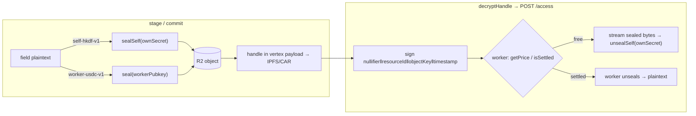

# Encryption architecture sketch

Status: **partially implemented** — the crypto primitives, the `/access` client half, and the
`SettlementRegistryClient` exist and are tested; the Worker's `unseal` step and the engine wiring
are pending. This sketch describes how PROTOCOL.md §8 ("FUTURE: who can read") is built as
**intent-bound sealed fields** on top of the v2 CAR-based `FangornEngine`.

It started life as a review of Lit Protocol + [storacha/specs#130](https://github.com/storacha/specs/issues/130)
(`w3-encrypt.md`) and the [storacha/lit-storacha-demo](https://github.com/storacha/lit-storacha-demo).
That prior art still informs the *shape* (double-encryption, a capability/condition language, a
resolver the registry points at). But the v1 we're actually building **does not use Lit or a
TEE** — it uses an R2 bucket behind a Cloudflare Worker. See §2 for why that's the right first
step, and §7 for what stays true if we ever swap a TEE/Lit backend back in.

---

## 1. What v1 is (and deliberately isn't)

The data this gates is low-stakes, and a large ciphertext that's fetched often would burn public
IPFS-gateway egress and ramp up cost. So v1 optimizes for **cheap and simple**, not maximal
trust-minimization:

- **Sealed payloads never touch IPFS.** The opaque ciphertext lives in **R2**; only a small
  *handle* (§3) rides inside the vertex (which is what goes to IPFS/CAR).
- **No Lit, no TEE.** A Cloudflare Worker in front of R2 is the "somewhat trusted" party. For the
  paid path it sees plaintext at release time — acceptable given the stakes, and swappable later.
- **Two conditions ("gadgets"), no more.** Everything routes through exactly two sealing modes
  (§4). More expressive composition (§8's "paid **and** subscriber") is future work.

The single non-negotiable that survives every backend swap: **the handle shape** (§3) and the
fact that *how a field is sealed* is decoupled from *who's allowed to open it*.

## 2. Why an R2 + Worker, not Lit/TEE, for v1

Lit's real mechanism (worth understanding, because it's what a future backend would re-implement):
its `accessControlConditions` don't encode "who can decrypt" — they encode one fact, *"the caller
is executing this exact immutable Lit Action, pinned by CID."* Lit's threshold network enforces
only that; all real authorization is ordinary code running inside the Action, in Lit's TEE. So the
"gadget" is really **auditable code + an enforcement primitive that pins it.**

For low-stakes data that's overkill. A Cloudflare Worker gives us the same *decoupling* — an
auditable, deployed-once gate that holds a key and only releases on a rule — without standing up
session sigs, capacity credits, or a Lit Action deploy. The trust assumption is weaker (we trust
the Worker operator, i.e. us), but that's a fine v1 trade for data that's "low stakes enough
anyway." The indirection in §3/§7 is what lets a stronger backend drop in later without changing
how vertices are staged or read.

## 3. The sealed-field handle (the one thing that must stay stable)

A sealed field is not stored inline as plaintext. In its place the vertex payload carries a
`HandleFieldInput` (`src/crypto/encryption.ts`):

```ts
interface HandleFieldInput {
  "@type": "handle";
  objectKey: string;    // R2 object key (signed over in the /access request)
  workerUrl: string;    // the ACCESS worker (see note below)
  encryption: {
    gadget: "self-hkdf-v1" | "worker-usdc-v1";
    resourceId: Hex;               // HKDF binding AND the Settlement Registry key
    ciphertextHash: Hex;           // integrity check on fetch
    workerPubkey?: Hex;            // present only for worker-usdc-v1
  };
}
```

**Double-encryption, R2 edition.** The bulk bytes are AES-256-GCM sealed and pushed to R2; the
key is never stored next to them — it's either re-derivable only by the owner (self gadget) or
held by the Worker and released only on settlement (worker gadget). Changing *who can read* means
re-sealing under a new gadget/`resourceId` and staging a new vertex that points at new bytes — it
never re-encrypts a payload the reader already can't open. This is PROTOCOL.md §8's "a new commit
pointing at a new rule."

> **`workerUrl` is the *access* worker — not the Pinata one.** Fangorn's existing CLI config
> `workerUrl` (`WORKER_URL`) is being repurposed to hand out presigned **Pinata upload** URLs.
> The access worker here is a *separate* endpoint and MUST NOT reuse it. It rides inline on each
> handle; when the CLI grows a `seal` command it should read a distinct `ACCESS_WORKER_URL`.

## 4. The two gadgets

Both are implemented in `src/crypto/encryption.ts` and share the AES-256-GCM primitives in
`src/crypto/aes.ts` and the `resourceId()` binding in `src/utils/manifest.ts`
(`keccak(owner ‖ schemaId ‖ name)`).

### `self-hkdf-v1` — fully private (own key)

```
key   = HKDF-SHA256(ownSecret, info = resourceId ‖ ":sealed")
bytes = nonce(12) ‖ aes-256-gcm(plaintext)
```

Only a party holding `ownSecret` can re-derive the key. The resource is priced 0, so the Worker's
`/access` lets any signed request through without a settlement check — the real gate is the
**crypto**, not the Worker (which sees only sealed bytes it can't open). `decryptHandle` reads via
`/access`, checks `ciphertextHash`, and `unsealSelf`s locally — no key ever leaves the owner.

### `worker-usdc-v1` — settlement-gated

```
key   = HKDF-SHA256(ECDH(ephemeral, workerPubkey), info = resourceId ‖ ":sealed")
bytes = ephemeralPub(32) ‖ nonce(12) ‖ aes-256-gcm(plaintext)
```

Sealed *to the Worker's* static X25519 key (`seal`), stored in R2. Reads go through the Worker's
`POST /access` (§4a): the Worker recovers the caller's settling address from a signature, checks
the Settlement Registry, `unseal`s with its own secret, and streams back **plaintext**. The Worker
sees plaintext at release time — acceptable at these stakes, and exactly the future TEE's job done
by a semi-trusted Worker for v1.

### 4a. The read rail: `POST /access` + Settlement Registry

Both gadgets read through one endpoint, `POST /access`, with a body the Worker verifies
(`webworker/src/index.ts`):

```
{ nullifier, resourceId, objectKey, timestamp, signature }
signature = personal_sign( keccak256(abi.encodePacked(
              uint256 nullifier, bytes32 resourceId, string objectKey, uint64 timestamp)) )
```

The Worker recovers the **stealth address** from that signature, reads `getPrice(resourceId)`, and:
- `price == 0` → free; stream the bytes (this is the **self-hkdf-v1** case — bytes come back
  still sealed, and only the owner's `ownSecret` opens them).
- `price > 0` → require `isSettled(stealthAddress, resourceId)`; on success `unseal` and stream
  plaintext (the **worker-usdc-v1** case).

The **settlement rail** the payer settles against is a contract with a tiny, public ABI —
`isSettled(address, bytes32)` / `getPrice(bytes32)` — modeled SDK-side as `SettlementRegistryClient`
(`src/contracts/settlement-registry/`). *How* the payer settles is a separate payment rail
(x402 / ERC-3009 USDC, PROTOCOL.md §12) and is out of band; the contract just records the result.
The client half of `/access` (`accessMessageHash`, `buildAccessRequest`, `decryptHandle`) lives in
`src/crypto/encryption.ts` and matches the Worker's hash byte-for-byte.



## 5. Mapping onto the v2 engine (the seam is smaller than expected)

The v2 engine (`src/engine/index.ts`, `graph.ts`, `car.ts`) is CAR-based, not pail-based. A vertex
is still:

```ts
interface Vertex { schemaId: SchemaID; payload: Record<string, unknown>; }
```

`createCommit` validates each vertex with `metagraph.validateVertex`, which only checks that
`schema.requiredFields` are **present** (`field in payload`), then dag-cbor-encodes the block into
the CAR delta. Crucially:

- A `HandleFieldInput` is a plain object → it dag-cbor-encodes fine, and it satisfies
  `field in payload`. **So sealing a field needs no engine change to *store*.** The staging step
  is: run `encryptAndUpload` for the sealed fields, drop the returned handle into
  `payload[field]`, stage the vertex as normal.
- Reading is symmetric and lazy: a namespace read returns the handle as-is; a caller who wants the
  value calls `decryptHandle(handle, …)` on demand — reading a namespace never forces decrypting
  everything in it.
- Which fields to seal (and under which gadget) is publisher intent, expressed at stage time. A
  natural home is a schema-level hint (e.g. `sealedFields?: { field: string; gadget: Gadget }[]`
  on `VertexSchema`), but v1 can start with the caller passing sealed handles in directly — no
  schema change required to prove the loop.

So the entire v1 integration is: **a stage-time helper that seals marked fields into handles, and
a read-time `decryptHandle`.** No new tree shape, no change to commits/CARs/pushes.

## 6. What's implemented vs. not

**Implemented (`src/crypto/encryption.ts` + `src/contracts/settlement-registry/`, tested in
`encryption.test.ts`):**
- Both gadgets: `sealSelf`/`unsealSelf` and `seal`/`unseal`, with `resourceId` binding and
  ciphertext-hash integrity.
- `HandleFieldInput` shape; `encryptAndUpload` (gadget-dispatched).
- The `/access` client half: `accessMessageHash` + `buildAccessRequest` (signature verified to
  recover the signer's address in a parity test) and `decryptHandle`.
- `SettlementRegistryClient` — the `isSettled`/`getPrice` rail, ABI-matched to the Worker.

**Deployed but being revised (`webworker/`):**
- The Worker already does `/access` (recover address → `getPrice`/`isSettled` → **proxy raw R2
  bytes**) and a Privy-gated, audio-only `/upload`. What's still needed there: the Worker holding
  a static X25519 key and performing the `unseal` step for `worker-usdc-v1`, and a generic
  (non-audio) upload. The Worker version is **not final** — treat these as expected changes.

**Not yet built:**
- **Engine wiring**: the stage-time seal helper and the schema-level `sealedFields` hint (§5).
- **Settlement contract**: a real (or mocked) deploy of `isSettled`/`getPrice`, plus the payer's
  settle/pay path (x402 / ERC-3009 USDC, out of band).

## 7. What survives a future backend swap

The whole point of the handle indirection is that a stronger backend (a TEE, Lit, an MPC network)
can replace `worker-usdc-v1` **without touching how vertices are staged or read**:

**Backend-agnostic (stays):**
- The `HandleFieldInput` shape and the double-encryption split (AES bytes in R2 + a key gated
  elsewhere).
- The `resourceId` binding and the ucanto/condition language — the same primitive the write-gate
  (§7 of PROTOCOL) uses, so read-gate and write-gate share one condition language.
- The gadget discriminator: a new backend is just a new `gadget` value + adapter, resolved the
  same way. (PROTOCOL.md §8's on-chain "gadget registry" is where the `gadget → resolver` mapping
  eventually lives; v1 hardcodes the two we ship.)

**v1-specific (would change on a swap):**
- `worker-usdc-v1`'s trust model (a semi-trusted Worker holds the key) → a TEE/threshold network
  would hold it instead, enforcing release cryptographically rather than by operator honesty.
- `/access` streaming Worker-unsealed plaintext → a TEE backend might return re-wrapped key
  material the caller opens, instead of trusting the Worker with plaintext.

## 8. Suggested order of work

1. **Deploy the settlement contract** (mock is fine): `isSettled`/`getPrice` over `resourceId`.
   The SDK's `SettlementRegistryClient` and the Worker's check are already ABI-matched to it.
2. **Prove the paid loop end-to-end**: price a `resourceId` > 0, settle a stealth address, then
   `buildAccessRequest` → `POST /access` → bytes. (Needs the Worker's `unseal` step for real
   plaintext; until then it proxies the sealed bytes.)
3. **Engine stage-time helper**: seal marked fields → handles → normal `createCommit`. Round-trip
   a vertex with one `self-hkdf-v1` and one `worker-usdc-v1` field back through `decryptHandle`.
4. **Only then** the on-chain gadget registry (§7) — least prior art; don't block v1 on it.
