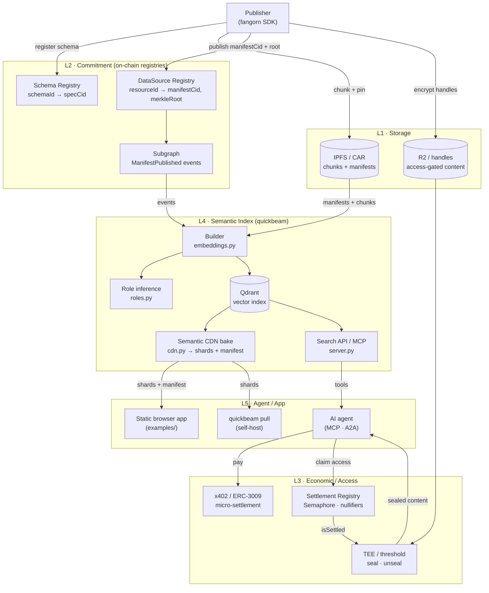
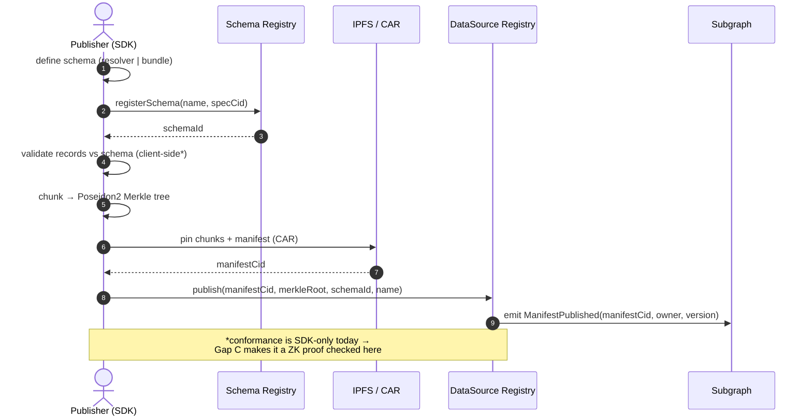
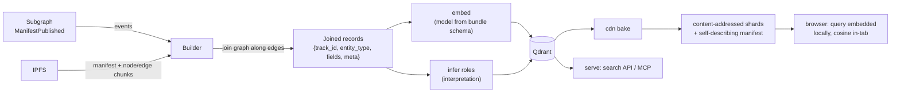
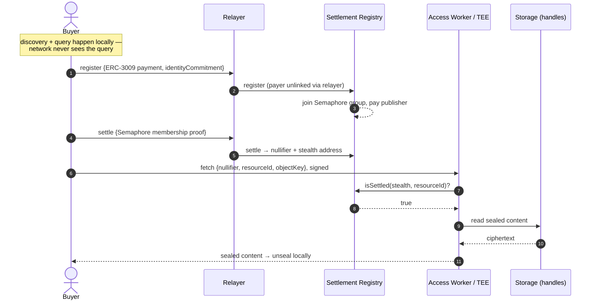

# The Fangorn Framework

*A semi-formal theory for the Fangorn ecosystem — the Semantic Web revived as the real Web 3.0, built on modern tooling, modern privacy, modern economic rails, and modern agents.*

Status: **draft v0.1** · Scope: cross-repo (`fangorn` SDK + `embeddings`/quickbeam, with seams into `contracts`, `recursive-proofs`, `x402f`, `subgraphs`) · Owner: this document is the canonical theory; code is measured against it, not the reverse.

---

## 0. Thesis

The original Semantic Web failed not because the idea was wrong but because the tooling, incentives, and trust model of its era could not carry it. Meaning was *declared* (RDF, OWL, SHACL) but never *verifiable*, never *paid for*, never *private*, and never *machine-actionable at scale*. Fangorn is the same ambition — **data that carries its own meaning** — rebuilt on four modern substrates:

| Original Semantic Web | Fangorn |
| --- | --- |
| RDF/OWL/SHACL shapes, trust-by-assertion | Schema + Bundle contracts, **on-chain registered, ZK-verifiable conformance** |
| No economic layer | **x402 / ERC-3009 micro-settlement**, pay-per-access |
| Public by default, no privacy | **Semaphore unlinkability + stealth addresses + TEE/threshold encryption** |
| Documents for humans; brittle scrapers for machines | **Embeddings + MCP/A2A**: a vector-native, agent-native discovery surface |

The unit of the framework is not the document or the triple. It is the **contract chain**: a sequence of artifacts where each makes a *semantic promise* to the next, and the framework's job is to make every promise **declared and verifiable** rather than **conventional and trusted**.

---

## 0.1 The protocol, in plain language

**Fangorn is an open protocol for building globally verifiable, context-aware knowledge graphs** — data with explicit meaning that anyone can publish, anyone can verify, and agents can navigate, while the people who produce it get paid and the people who query it stay private.

Think of it as four promises rolled into one protocol:

- **Globally verifiable.** Today, when a service says "here is structured data about restaurants," you have to trust them. In Fangorn, a publisher first registers a **schema** — a typed shape that says what a "Place" or an "Event" *is* — and then publishes data as a **DataSource** whose contents are committed to a public ledger as a cryptographic fingerprint (a Merkle root). Anyone, anywhere, can check that the data they downloaded matches the fingerprint the publisher committed, and (as the protocol matures) that the data actually conforms to the schema it claims — *without trusting the publisher or any server in the middle*. Meaning travels with the data, signed and checkable, instead of living in a company's private database.

- **Context-aware knowledge graphs.** Data isn't published as isolated rows; it's published as a **graph** — typed nodes (a Place, an Event, a Review) joined by typed edges (`hosts`, `reviews`, `locatedIn`), described by a SHACL-inspired **bundle** schema. This is the "semantic web" part: the relationships *are* the data. A consumer doesn't just get a list of bars; it gets bars that host events that were reviewed by people, all walkable as a graph.

- **Machine-native discovery.** A knowledge graph is only useful if you can *find* things in it. Fangorn turns each published graph into a **vector index** (embeddings) so that humans and AI agents can search it by meaning — "cozy bars with live music this weekend" — not just by keyword or exact match. Agents reach it through standard surfaces (MCP, A2A), so an autonomous assistant can discover, pay for, and read a dataset with no bespoke integration.

- **Private and paid.** Discovery is designed so the *query stays on your device* — the network learns what knowledge exists but never what you asked (the "Semantic CDN": knowledge is public, intent is private). And when access *should* cost something, payment rails (x402 / stablecoin micro-settlement) and privacy primitives (anonymous group membership, stealth addresses) let a buyer pay a publisher directly and unlinkably — pay-per-query economics without surveillance.

Put together: **a publisher defines meaning once (a schema), commits data against it (a datasource), and the protocol makes that meaning verifiable, searchable, monetizable, and private — for every downstream human or agent, forever, without a central intermediary.** That is the "real Web 3.0": not tokens bolted onto webpages, but the original Semantic Web finally given the trust, economic, privacy, and AI machinery it always needed.

The rest of this document makes that precise. The mechanism is the **contract chain** (§1): the path data travels from `Schema → DataSource → Bundle → Embedding → Consumption`, where every hop is a promise the protocol tries to make *verifiable* rather than *trusted*.

---

## 1. The Contract Chain (the spine)

```
   Schema ──▶ DataSource ──▶ Bundle ──▶ Embedding ──▶ Serving / Consumption
  (fangorn)   (fangorn)     (shared)   (quickbeam)    (CDN · browser · agent)
     │            │             │           │               │
   "shape"    "this data    "graph of    "this vector   "interpret &
              conforms"     typed nodes"  space"          discover"
```

Every arrow is a **promise** from a producer artifact to a downstream consumer. The framework classifies each promise on two axes:

- **Declared?** — is the promise written into the artifact, or only implied by convention/config?
- **Verified?** — can a consumer *check* the promise without trusting the producer or operator?

A promise that is *declared and verified* is a **contract**. A promise that is merely conventional is a **liability** — the source of every gap below.

### 1.1 The artifacts

- **Schema** (`fangorn`): a typed data shape. Two kinds:
  - *resolver* — a flat `SchemaDefinition = Record<field, FieldDefinition>` with `@type` ∈ `{string, number, boolean, bytes, array, object, handle, encrypted}` and constraints `{regex, enum, range, length, ref}`.
  - *bundle* — a SHACL-inspired subgraph shape: `{ nodes: Record<Type, schemaId>, edges: EdgeShape[] }`, each edge carrying `min`/`max` cardinality (≙ `sh:minCount`/`sh:maxCount`).
  - On-chain it is `schemaId → (specCid, agentId, name, owner)` in the **Schema Registry**; the full JSON spec lives off-chain on IPFS at `specCid`.
  - `src/roles/schema/types.ts`, `src/registries/schema-registry/`.

- **DataSource** (`fangorn`): a published dataset conforming to a schema. `(owner, schemaId, name) → (manifestCid, merkleRoot, version)` in the **DataSource Registry**. The data is chunked, pinned to IPFS, and committed as a **Poseidon2 Merkle root**. The universal join key across all registries is `resourceId = keccak256(owner ‖ schemaId ‖ keccak256(name))`.
  - `src/roles/publisher/`, `src/registries/datasource-registry/`.

- **Bundle** (shared vocabulary): the SHACL bridge. A bundle schema is registered like any schema (`kind:"bundle"`); a *published bundle manifest* (v3) carries `nodeChunks` + `edgeChunks` under one Merkle root. This is the artifact quickbeam consumes (`quickbeam build --bundle "<name>=<bundleSchemaId>"`).
  - SDK: `BundleInput`/`EdgeShape`/`ResolvedBundle` (`src/roles/schema/types.ts:86`), `BundleBuilder` (`src/roles/publisher/builders/bundle.ts`).
  - quickbeam: `stage_volumes/schemas/*.json`, generated by `quickbeam/pipelines/fangorn_schema.py`.

- **Embedding** (`embeddings`/quickbeam): a vector index over a bundle. The builder fetches the bundle's manifests from chain+IPFS, joins the graph along edges, infers semantic roles, composes document text, embeds it with a model, and loads it into Qdrant. Optionally **bakes** it into a content-addressed **Semantic CDN** (gzipped NDJSON shards + a self-describing manifest).
  - `quickbeam/embeddings.py`, `quickbeam/cdn.py`.

- **Serving / Consumption**: three faces of the same index —
  - *server* (`quickbeam serve`): paid, observed search API + MCP/x402 for agents.
  - *Semantic CDN* (`quickbeam cdn`): privacy-preserving — ships the *document* vectors to the client; only the *query* is embedded locally, so the network never sees intent ("knowledge is public, intent is private").
  - *browser app* (`examples/`): a fully static, schema-agnostic semantic explorer that reads the CDN manifest and reconstructs its entire UI with no per-domain code.

### 1.2 The promise table (current state)

| Arrow | Promise | Declared? | Verified? | Verdict |
| --- | --- | --- | --- | --- |
| Schema → DataSource | "this data conforms to this schema" | partial (schemaId arg) | **no** (client-side only; `publisher/index.ts:140`) | **liability → Gap C** |
| Schema → Publisher | "this publisher may publish this schema" | yes (contract has `isPublisher`) | **no** (SDK never calls `addPublisher`) | **liability → Gap D** |
| Bundle → Embedding | "embed me with *this* model/dim/distance" | **no** (bundle has no model slot) | no (hardcoded in 4+ places) | **liability → Gap A** |
| Embedding → Consumption | "interpret my fields with *these* roles" | no (inferred per-operator) | n/a | **interpretation, not contract — Gap B** |
| Embedding → CDN → Browser | "the query vector matches the doc vectors" | partial (`manifest.model`) | no (browser hardcodes model) | **part of Gap A** |
| Publisher A's graph → Publisher B's graph | "an entity in my graph may reference one in yours" | **no** (bundles are self-contained) | endpoints provable, the link itself is an attributed claim | **liability → Gap E** |

---

## 2. The Verification Principle

> **A semantic promise that crosses a trust boundary must be declared in an artifact and verifiable by its consumer. Promises that do not cross a trust boundary may remain interpretive.**

This single principle resolves the framework's central design tension and explains *why the four gaps are treated differently*:

- **The embedding model crosses a trust boundary.** A query embedded with model *X* against documents embedded with model *Y* produces silent garbage. Two publishers of one schema diverging on model breaks composability. → the model **must be a contract**, declared in the schema and inherited by every consumer. **(Gap A)**

- **Schema conformance crosses a trust boundary.** quickbeam (and any consumer) builds over published data *trusting* it matches the bundle shape. Today nothing on-chain verifies this. → conformance **must be a contract**, ideally a ZK proof binding the Merkle root to the schema shape. **(Gap C)**

- **Publisher authorization crosses a trust boundary.** Anyone can publish a DataSource against anyone's schemaId. → authorization **must be a contract**, gating `DataSourceRegistry.publish` on the existing publisher set. **(Gap D)**

- **Semantic roles do *not* cross a trust boundary.** Roles (title/spatial/temporal/tags…) are how a *given operator's UI* chooses to present fields. Different operators may legitimately present the same data differently; a wrong role degrades UX but never corrupts results or composability. → roles remain **interpretation**: inferred, locally overridable, and *improved* rather than promoted to contract. **(Gap B)**

This is the framework's sharpest claim: **the contract chain verifies structure + semantic space; it deliberately does *not* verify interpretation.** Meaning-that-must-compose is signed; meaning-that-only-presents stays soft. (See §6 for the decision record behind this split.)

---

## 3. Layer model

The ecosystem stacks into five layers. Each lower layer is a *substrate* the next depends on; each is independently swappable.

```
┌─────────────────────────────────────────────────────────────┐
│ L5  AGENT / APP        MCP · A2A AgentCard · static browser   │  discovery
├─────────────────────────────────────────────────────────────┤
│ L4  SEMANTIC INDEX     embeddings · roles · Semantic CDN      │  meaning
├─────────────────────────────────────────────────────────────┤
│ L3  ECONOMIC / ACCESS  x402 · ERC-3009 · Semaphore · TEE      │  settlement + privacy
├─────────────────────────────────────────────────────────────┤
│ L2  COMMITMENT         Schema/DataSource/Settlement registries│  trust
├─────────────────────────────────────────────────────────────┤
│ L1  STORAGE            IPFS / CAR · R2 · handles              │  bytes
└─────────────────────────────────────────────────────────────┘
```

- **L1 Storage** — BYO content-addressed bytes. The framework never moves content through a central party; it commits *pointers* (CIDs, handles) and proves *properties* of the bytes.
- **L2 Commitment** — the three registries are the coordination layer. They store *who/what/where* (schemaId, manifestCid, merkleRoot, price) — never content. This is the only globally-trusted layer.
- **L3 Economic / Access** — payment (x402/ERC-3009) and privacy (Semaphore unlinkability, stealth addresses, TEE-gated `seal`/`unseal`) gate access to L1 bytes against L2 commitments.
- **L4 Semantic Index** — quickbeam turns committed graph data into a vector space + role map, served publicly (CDN) or privately (local). **This is where the Semantic Web actually becomes navigable.**
- **L5 Agent / App** — humans and agents discover through MCP/A2A or the static browser, paying through L3, trusting through L2.

The "revival of the Semantic Web" is **L4 made first-class and verifiable on top of L1–L3** — meaning that is addressable, priced, private, and machine-native.

---

## 3.5 Architecture diagrams

*(Mermaid — renders in GitHub, the IDE preview, and most Markdown viewers. The ASCII diagrams above stay for terminal readers.)*

### 3.5.1 System architecture

How the pieces fit, grouped by the five layers of §3. Solid arrows = data/control flow; the registries (L2) are the only globally-trusted component.



### 3.5.2 Publish flow — committing meaning

A publisher turns local data into a globally verifiable datasource. Everything off-chain is content-addressed; the only on-chain writes are the schema registration and the single manifest commitment.



### 3.5.3 Build + serve flow — meaning becomes searchable

quickbeam consumes published bundles and produces a vector space, then serves it three ways. The embedding model is inherited from the bundle schema so every consumer shares one vector space (Gap A).



### 3.5.4 Private consume flow — paid, unlinkable access

When content is access-gated, the buyer pays and proves access without revealing identity or linking payment to retrieval. The worker/TEE gates on a single on-chain `isSettled` bit.



---

## 4. Repository roles

- **`fangorn`** (`@fangorn-network/sdk`) — the **commitment + access SDK** (L2–L3). Owns schemas, publishing (chunk→Merkle→IPFS→registry), and the 3-phase private consumer flow (purchase→claim→fetch). Defines the shared Schema/Bundle vocabulary. *Never touches content bytes directly.*

- **`embeddings`/quickbeam** — the **semantic index + serving toolkit** (L4–L5). Consumes fangorn-published bundles, builds embeddings, serves them three ways. Owns the role-inference interpretation layer and the privacy-preserving CDN thesis.

- **`examples/`** — the **proof**: a fully static, backend-free, schema-agnostic semantic explorer (bars & events in Eagle River, WI, from Google Places + Eventbrite) that turns a CDN manifest into a complete UI. The "Semantic Web TODAY, scan-a-QR-and-explore" demonstration.

- **Siblings (out of direct scope, but in the chain):** `contracts` + `recursive-proofs` (where Gap C's circuits/verifier live), `x402f` (facilitator for blind-signed payment credentials, per `CONTRACT_MIGRATION.md`'s Predicate-Registry direction), `subgraphs` (the on-chain event source quickbeam extracts from).

---

## 5. The four gaps, formalized

Each gap is a place where a promise in §1.2 is conventional rather than contractual. Resolutions reflect the decisions in §6.

### Gap A — The embedding model is not inherited from the bundle schema
**Promise:** *Bundle → Embedding: "embed me with this model/dim/distance."*
**Current:** the model is hardcoded/defaulted independently in ≥5 places — `embeddings.py:69`, `watcher.py:95`, `server.py:93`, `cdn.py:104`, and `examples/src/lib/embed.ts:17` (`MODEL` + `MATRYOSHKA_DIM=256`). The bundle schema (`fangorn_schema.py:227`) has **no slot** to declare it. `cdn bake` already records `manifest.model`/`manifest.dim` (`cdn.py:256`) but no consumer reads them back; the browser silently re-hardcodes. A bundle baked with a different model produces mismatched query vectors with no error.
**Trust boundary crossed?** Yes — query/doc vector-space mismatch corrupts results.
**Resolution (decided):** **the embedding model becomes a property of the bundle schema.** Add `embeddingModel`/`dim`/`distance` to the bundle doc and the published v3 manifest envelope; the schema is authoritative. The builder/watcher/CDN read it from the bundle/manifest and only fall back to the flag when absent; the browser reads `manifest.model`/`manifest.dim` instead of constants. The data path already exists at the manifest seam — this closes the loop at both ends.
**Seam:** `fangorn_schema.py:227` (declare) → `embeddings.py` `build_bundle_joined_data` ~`:1070` (inherit) → `cdn.py:256` (source from bundle, not flag) → `examples/src/lib/embed.ts` (consume).

### Gap B — Semantic roles are inferred and inconsistent
**Promise:** *Embedding → Consumption: "interpret my fields with these roles."*
**Current:** `roles.py:infer_roles` heuristically maps fields → roles; the on-disk `role_map.json` mis-assigns (`temporal←address`, `subtitle←userRatingCount`), patched by hand in `domains.json`; label singularization produces typos ("Addres", "Coordinate", `roles.py:197`).
**Trust boundary crossed?** **No** — roles are per-operator presentation; a wrong role degrades UX but never corrupts results or composability.
**Resolution (decided):** **keep roles interpretive — improve the heuristics, keep `domains.json` overrides.** Do *not* promote roles into the verifiable schema contract. Fix the mis-assignments and singularization, strengthen `ROLE_SYNONYMS`/value-shape signals, but the role map remains operator-local and overridable. This is the framework's deliberate "interpretation stays soft" stance (§2).
**Seam:** `quickbeam/roles.py` (`infer_roles`, `field_label`, `ROLE_SYNONYMS`); overrides in `domains.json`.

### Gap C — No on-chain verification that a DataSource conforms to its schema
**Promise:** *Schema → DataSource: "this data conforms to this schema."*
**Current:** conformance is enforced **client-side only** — `validate()` (`src/roles/schema/validate.ts`), `validateRecord` + cardinality checks (`builders/bundle.ts:74`), `resolveBundle` (`schema/index.ts:81`). On-chain, `DataSourceRegistry.publish(manifestCid, root, schemaId, name)` (`publisher/index.ts:140`) stores the tuple; the Merkle tree commits *chunk CIDs by index* — *where* the data is, not *what shape* it has. The contract cannot read the off-chain spec at `specCid`. README states it: *"Schema validation is client-side only — no on-chain enforcement"* (`README.md:418`).
**Trust boundary crossed?** Yes — quickbeam and every consumer builds over data they trust matches the shape.
**Resolution (decided):** **ZK proof of conformance.** Commit field-shape (not just chunk CIDs) and have `publish` carry a `conformanceProof` that a verifier checks, binding the Merkle root to `schemaId`'s shape. Circuits/verifier live in the `recursive-proofs` + `contracts` siblings; the SDK seam threads the proof through `PublisherRole.publish` → `DataSourceRegistry.publish`. (This work generalizes the committed leaf, which interacts with the Predicate-Registry migration in `CONTRACT_MIGRATION.md` — see §7.)
**Seam:** `src/roles/publisher/index.ts:140`; Merkle leaf definition `src/registries/datasource-registry/index.ts:52`.

### Gap D — Publisher↔schema authorization is unenforced
**Promise:** *Schema → Publisher: "this publisher may publish this schema."*
**Current:** the Schema Registry contract *already* tracks a publisher allowlist (`isPublisher`, `hasPublishers`, `addPublisher`, `getPublisherCount`), but the SDK **never calls `addPublisher`** and `DataSourceRegistry.publish` does not gate on it. Anyone can publish a DataSource against any schemaId.
**Trust boundary crossed?** Yes — provenance/accountability of a schema's data.
**Resolution (decided):** **wire up the existing surface.** Add an `addPublisher` wrapper in `SchemaRole`, and gate `DataSourceRegistry.publish` on schema-registry membership. This is the cheapest contract-chain fix (the on-chain surface already exists) and a natural near-term complement to Gap C.
**Seam:** `src/registries/schema-registry/` (add wrapper) + the `publish` path's authorization check.

### Gap E — No cross-publisher linking (every bundle is an island)
**Promise:** *the "web" in semantic web: "an entity in my graph may reference an entity in yours."*
**Current:** a bundle is a **self-contained** graph; `nodes: {Type → schemaId}` closes over local types and edges must resolve to local nodes (`fangorn_schema.py`, `embeddings.py:_project`). There is no global entity identity (node ids are local strings — though some are *already* global externally-anchored keys, e.g. Google Place IDs `ChIJ…`, and category/locality slugs are *already* shared concepts), and no way for an edge to point at a foreign datasource's entity. Result: Fangorn is **many isolated knowledge graphs, not one web** — the single biggest miss against the thesis.
**Trust boundary crossed?** Partly. *Referential* identity (does the target entity exist & conform?) is provable via the target datasource's Merkle root. The *sameAs assertion* (do two records denote the same real thing?) is **not** cryptographically provable — only attributable and trust-weighted.
**Resolution (design):** three pieces, all reusing existing machinery — **(1) global identity** (`fangorn:<resourceId>/<localId>` URIs + namespaced aliases `isrc:`/`mbid:`/`gplace:`), **(2) linksets** (published, signed cross-edge datasources; only needed when publishers don't share a strong id), **(3) composed views** (recipes `{sources, linksets, trust}` that an indexer fuses into one graph). Shared-id joins are free + deterministic; fuzzy joins go through `quickbeam link` (embedding ANN → candidate sameAs → curated linkset) and are trust-weighted. This **couples to Gap D** (a linkset is only as good as its asserter → reputation) and to index-verifiability.
**Seam:** identity decl in `src/roles/schema/types.ts` + `fangorn_schema.py`; foreign edge endpoints in `EdgeShape`/`builders/bundle.ts`; multi-source union-find in `embeddings.py` (`_project`/`_walk_graph`); new `quickbeam/link.py`.
**Full design + diagrams:** [CROSS_PUBLISHER_LINKING.md](./CROSS_PUBLISHER_LINKING.md).

---

## 6. Decision record (framework-defining choices)

Resolved with the product owner on 2026-06-25:

1. **Embedding model placement → property of the bundle schema** (not a separate registry, not manifest-only). The semantic space is part of the *published knowledge contract*; every consumer inherits it. *Implication:* schema authors now own model selection; changing a model is a schema version bump. Drives Gap A.

2. **Roles → keep inferred, improve heuristics** (not publisher-declared). Interpretation stays soft and operator-local. *Implication:* the contract chain verifies structure + semantic space but *not* interpretation — the framework's deliberate boundary (§2). Drives Gap B.

3. **On-chain schema↔datasource verification → ZK proof of conformance** (not auth-only, not on-chain descriptor). Full trustlessness; heaviest path. *Implication:* the Merkle commitment must evolve from "CIDs by index" to a shape-binding commitment; circuit work in siblings. Drives Gap C. (Auth-only, Gap D, is taken *as well* as the cheap complement, not instead.)

4. **Deliverable → this framework document first; gap closure deferred.** The theory is the canonical artifact and was delivered on its own; the four gaps (A, B, C, D) are *specified* here (§5) with precise code seams but intentionally **not yet implemented**. §7 is the execution plan for whenever closure is greenlit. Gap C's on-chain/circuit half is bounded at the SDK seam since contracts live in siblings. *Update this doc first when the theory changes; reconcile code to it.*

---

## 7. Execution plan

Ordered by tractability and dependency. This document (the theory) is the prerequisite for all of it.

| # | Gap | Repo(s) | Scope | Risk |
| --- | --- | --- | --- | --- |
| 1 | **A** model inheritance | embeddings (+ schema gen, cdn, browser) | declare `embeddingModel/dim/distance` in bundle schema + manifest; inherit in builder/watcher/cdn; consume in browser & server | low — data path exists |
| 2 | **B** role heuristics | embeddings | fix mis-assignments + singularization in `roles.py`; strengthen synonyms/value-shape signals; keep overrides | low |
| 3 | **D** publisher auth | fangorn | `addPublisher` wrapper in `SchemaRole`; gate `publish` on membership | low–med (touches publish path) |
| 4 | **C** ZK conformance | fangorn (seam) + siblings (`recursive-proofs`,`contracts`) | evolve Merkle leaf to shape-binding commitment; thread `conformanceProof` through `publish`; verifier interface | high — circuits + contract redeploy, cross-repo |

**Boundary on Gap C:** within `fangorn`/`embeddings` we define and thread the *interface* (commitment shape, proof argument, verifier call). The circuit and on-chain verifier are sibling-repo work (`recursive-proofs`, `contracts`) and are specified here, not implemented here, unless explicitly scoped.

---

## 8. Glossary

- **Contract chain** — Schema → DataSource → Bundle → Embedding → Consumption; the spine of the framework.
- **Semantic promise** — an obligation one artifact makes to its downstream consumer; a *contract* if declared + verified, a *liability* if conventional.
- **resolver schema** / **bundle schema** — flat field shape / SHACL-inspired typed subgraph shape.
- **resourceId** — `keccak256(owner ‖ schemaId ‖ keccak256(name))`; universal join key across registries.
- **manifest** — published dataset descriptor; carries Merkle root + chunk refs (fangorn) or shard list + model + role_map + bundle vocab (quickbeam CDN).
- **role map** — operator-local interpretation of fields into presentation roles (title/subtitle/spatial/temporal/tags/measures/relations/text); *not* a contract.
- **matryoshka** — embedding truncation to `dim` (256) preserving meaning; replicated builder↔browser.
- **Semantic CDN** — content-addressed, gzipped NDJSON vector shards + self-describing manifest, served statically so the *query stays on the client*.
- **Semaphore / nullifier / stealth address** — the unlinkability primitives of the private consumer flow.
- **handle / encrypted field** — access-controlled pointers/values gated by the Settlement Registry's `isSettled` bit.

---

*Companion analyses: the embeddings repo and fangorn SDK deep-dives that grounded this document are reproducible via the `embeddings-repo-master` and `fangorn-repo-master` agent passes. Update this doc first when the theory changes; reconcile code to it.*
