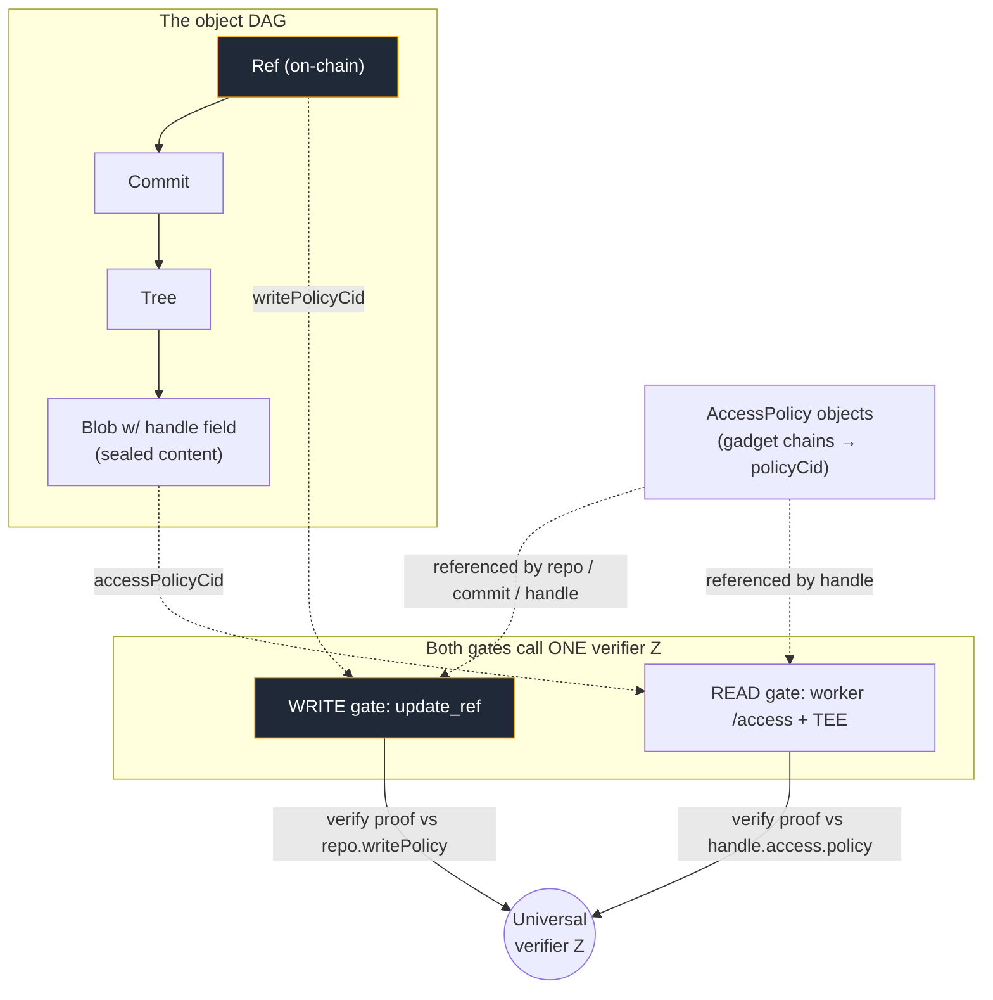

# Access Control in the Git-Native Model — the Gadget Predicate Layer

*How composable ZK gadgets become the single access-control language for the whole
object DAG: one predicate form gates **writes** (advancing a ref) and **reads**
(unsealing content), attached to objects and versioned like everything else.*

Companion to [`GIT_NATIVE_DATA_MODEL.md`](./GIT_NATIVE_DATA_MODEL.md),
[`GIT_NATIVE_IMPLEMENTATION_PLAN.md`](./GIT_NATIVE_IMPLEMENTATION_PLAN.md), and the
`gadgets` sibling repo (the universal inductive verifier).

---

## 1. The observation

Today Fangorn has **two unrelated access mechanisms**:

- **Write** — who may advance a repo's ref. In the git-native plan this is a 3-value
  `write_policy` enum (owner / allowlist / Semaphore group), each a bespoke branch in
  `update_ref`.
- **Read** — who may decrypt a `handle` field. Hardwired: the access worker checks
  `SettlementRegistry.isSettled(stealth, resourceId)` (`consumer/index.ts:84`,
  FRAMEWORK §3.5.4) and the TEE unseals. One condition, no composition.

The **gadgets** repo already builds the thing that unifies them: a *universal
inductive verifier* `Z` that folds a chain of registered ZK gadgets — `Payment`,
`ecdsa`, `merkle` (membership), `nullifier`, `keccak` (preimage), `poseidon2` — into a
**single recursive proof**, with the approved gadget set committed in a merkle tree.
The CLI even has the expression stub: `parseGadgetArg("Payment(0.00001)")`
(`cli/index.ts:28`).

> **Thesis.** An access rule is a *predicate*. Gadget chains are a composable predicate
> language with one on-chain verifier. So **every** access decision in Fangorn — write
> or read, repo-wide or per-field — is "produce a valid proof for this gadget chain."
> Write policy and the read gate stop being two subsystems and become two *call sites*
> of the same verifier.

---

## 2. Access policy as a content-addressed object

An access rule joins the DAG as a first-class immutable object, exactly like Blob /
Tree / Commit (§3 of the data-model doc). It is not a config flag — it is committed,
content-addressed, and therefore *versioned and auditable*.

```jsonc
// AccessPolicy object  →  policyCid
{
  "kind": "access-policy",
  "expr": {                          // boolean composition over gadget instances
    "op": "AND",
    "args": [
      { "gadget": "payment",    "id": "0x<registeredGadgetId>", "params": { "amount": "0.001", "token": "USDC" } },
      { "gadget": "membership", "id": "0x<registeredGadgetId>", "params": { "group": "0x<writerGroupRoot>" } }
    ]
  }
}
```

- `gadget.id` references a **registered** gadget (merkle-committed in the gadget
  registry — the "prove you used approved gadgets" property, and the pay-to-register
  economic hook from `gadgets/README.md`, aligned with the Predicate-Registry direction
  in `CONTRACT_MIGRATION.md`).
- `expr` is a boolean tree (`AND`/`OR`/`NOT`) that lowers to the linear gadget chain the
  inductive verifier folds. `Z` verifies one recursive proof that the presenter
  satisfied `expr`.
- The whole thing is content-addressed → a `policyCid`. Changing access = writing a new
  policy object and pointing at it in a commit (see §4). Access history is a walkable
  part of the DAG.

Distinguish two things the current `handle` overloads under the word "gadget":

| Concern | Field | Example | Meaning |
|---|---|---|---|
| **Sealing scheme** | `encryption.gadget` | `tee-aes-v1` | *how* bytes are encrypted (`crypto/encryption.ts` `seal`) |
| **Release predicate** | `access.policy` (new) | `policyCid` | *who/when* may open them (the gadget chain) |

---

## 3. One predicate, two gates



**Write gate (generalizes the `write_policy` enum).** `update_ref(..., authProof)` calls
`Z` with the repo's `write_policy_cid` + `authProof`. The enum values are just special
gadget chains:

| Enum today | Gadget chain |
|---|---|
| owner | `ecdsa(ownerKey)` |
| allowlist | `merkle(publisherSetRoot)` |
| group (Semaphore) | `membership(writerGroupRoot) AND nullifier(fresh)` |
| *(new)* pay-to-push | `payment(amount)` |
| *(new)* multi-sig / composite | `AND`/`OR` of the above |

So the enum in the implementation plan (S3/S6) is the **cheap subset**; the gadget layer
is its generalization — same call site, richer predicate.

**Read gate (generalizes `isSettled`).** The worker `/access` handler, instead of *only*
`isSettled`, verifies a recursive proof against the handle's `access.policy`. `isSettled`
becomes one gadget (`payment`/`membership` internally consults the Settlement Registry);
time-locks, allowlists, credential proofs, and compositions all follow for free.

---

## 4. Attachment & inheritance (git-attributes style)

Policy attaches at three granularities; **most specific wins**, inheriting upward:

```
handle.access.policy   ▸ overrides ▸   commit.policy   ▸ overrides ▸   repo.default_policy (on-chain)
```

- **Repo default** — on-chain, in `StorageRepo`: `write_policy_cid` and
  `read_policy_cid`. The baseline for every commit/handle that doesn't override.
- **Commit** — a commit may carry `policy` (a `policyCid`) that governs the data it
  introduces — e.g. "this drop requires payment" without touching the repo default.
- **Handle** — a specific encrypted field may pin its own `access.policy` (a premium
  field inside an otherwise-open dataset).

Because policies are commit-referenced, **an access change is a commit** → versioned,
attributed, reconstructable. "What was readable, by whom, at commit C?" is answered by
walking the DAG — no external audit log.

---

## 5. Sealing vs. the release gate (the key trade-off)

`seal(plaintext, teePubkey, resourceId)` binds ciphertext to `resourceId` via HKDF
(`info = resourceId ‖ ":sealed"`). Two ways to connect that to the policy:

| Mode | Binding | Re-policy cost | Property |
|---|---|---|---|
| **release-gated** *(default)* | `resourceId` only (as today) | **free** — new policy is just a new commit; the gate enforces the *current* tip policy | git-native mutability; **structural sharing preserved** (unchanged sealed blobs keep their CID, no re-seal on commit) |
| **seal-bound** *(opt-in, high-assurance)* | `resourceId ‖ policyCid` | **re-encrypt** — changing policy changes the ciphertext → new CID | tamper-proof: nobody can swap in a weaker policy; but breaks sharing and costs a re-seal |

**Recommendation:** default **release-gated** — access is enforced by the gadget proof at
the worker/TEE against the current committed policy, so re-pricing/re-policying stays a
cheap ref move (consistent with the whole "cheap mutation" thesis, I4). Offer
**seal-bound** per handle for content where re-encryption on policy change is acceptable
and swap-resistance matters. Neither mode can un-leak already-released plaintext — that's
inherent; revocation only governs *future* releases.

---

## 6. CLI

```bash
# define / attach a policy (expression → registered gadget chain → policyCid)
fangorn policy set 'AND(Payment(0.001,USDC), Membership(analysts))' --repo          # repo default (read)
fangorn policy set 'ecdsa(self)'                                     --repo --write  # who may push
fangorn commit -m "premium drop" --policy 'Payment(0.01,USDC)'                       # commit-scoped
fangorn seal report.pdf --field body --policy 'Membership(subscribers)'             # handle-scoped

# consumer side: build the proof for the chain, fetch, unseal
fangorn access <owner>/<repo> <entityUri> <field>     # resolves policy → proves → /access → unseal
```

`parseGadgetArg` (`cli/index.ts:28`) already parses `Name(args)`; extend it to the
`AND`/`OR`/`NOT` combinators that lower to the inductive chain.

---

## 7. How it slots into the implementation plan

Access control is a **cross-cutting track** parallel to the data-model slices; the
read-side is largely independent, the write-side *generalizes* S3/S6.

| Slice | Value | Depends on | Redeploy |
|---|---|---|---|
| **AC0** policy object + expression language | `AccessPolicy` spec (S0-style fixture) + `parseGadgetArg` → boolean combinators | S0 | — |
| **AC1** per-handle read policy plumbed through | handles carry `access.policy`; commit/repo defaults; worker reads the policyCid but still enforces `isSettled` as the sole gadget | S1, AC0 | — |
| **AC2** gadget-verified read gate | worker `/access` verifies a **recursive proof** (universal `Z`) instead of hardwired `isSettled`; `payment`/`membership` gadgets consult settlement | AC1, `gadgets` | worker/verifier deploy |
| **AC3** gadget-native write auth | `update_ref` verifies `authProof` vs `write_policy_cid` via `Z`; enum becomes chains | S3, `gadgets` | folds into a contract cut |
| **AC4** seal-binding option + audit | per-handle `resource+policy` binding; policy-change-as-commit surfaced in `log` | AC1 | — |

**Recommended order:** land **AC0 + AC1** alongside S1 (they're pure additions — policies
ride in commits, worker just reads a field), then **AC2** (the first real gadget-verified
gate, biggest UX win for read access), then **AC3** when the write path's contract cut
happens (S3/S6). AC3 is where the `write_policy` enum retires into the gadget chain.

---

## 8. Open questions

1. **Verifier location for reads.** Does the read gate verify the recursive proof
   *on-chain* (worker reads a boolean result — trust-minimized, gas cost) or *in the
   worker/TEE* (cheaper, but trusts the worker to run `Z` honestly)? TEE attestation may
   bridge this.
2. **Gadget registry ownership.** Where does the registered-gadget merkle tree live —
   the `gadgets` repo's own registry, or folded into the Predicate-Registry from
   `CONTRACT_MIGRATION.md`? Pay-to-register economics (`gadgets/README.md`) attach here.
3. **Nullifier scope across gates.** A `nullifier` gadget used for both push (write) and
   access (read) needs distinct external-nullifier domains so a read can't be replayed as
   a write or vice-versa.
4. **Policy composition limits.** Max chain depth the inductive verifier folds
   economically; do we cap `expr` size / gadget count per policy?
5. **Default-open vs default-closed.** If a commit/handle names no policy, is content
   public (no gadget) or does it inherit a repo default that may be closed? (Recommend
   explicit repo default; unset handle ⇒ inherit, never implicitly public.)
```
