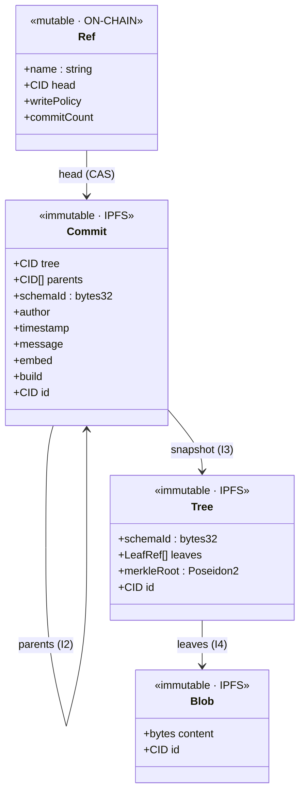
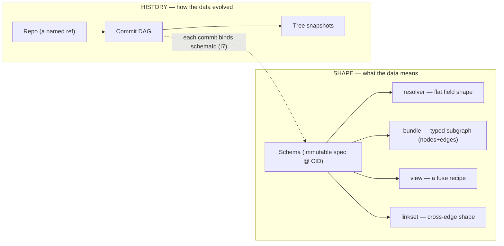
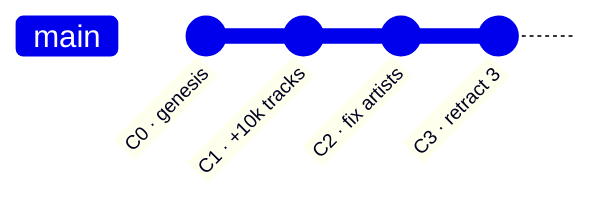
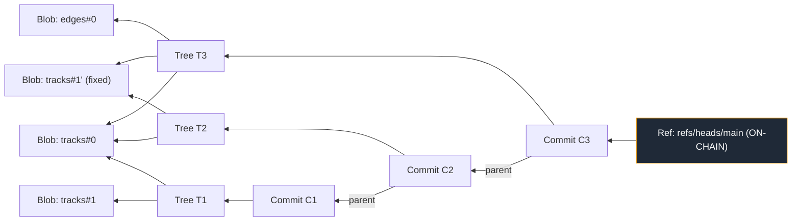
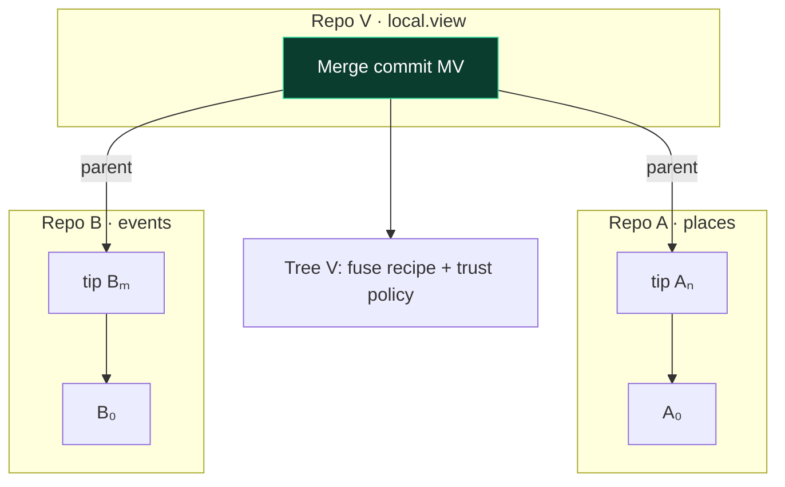
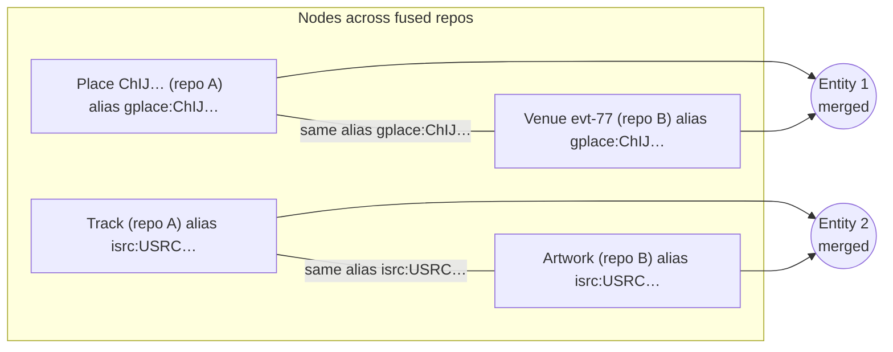
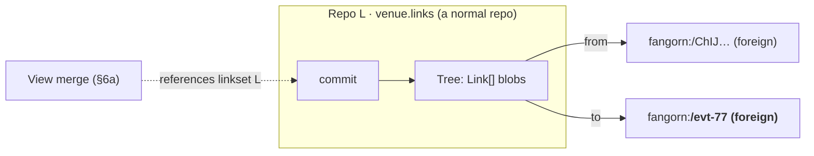
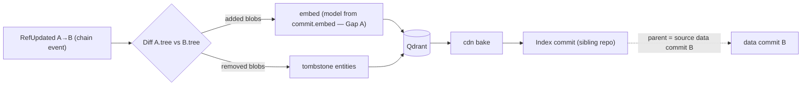

# A Git-Native Data Model for Fangorn

*First-principles design. Not a refactor of the current code — a derivation of what
the data model **should** be if we take "a dataset is a repository" seriously, and a
reconciliation of that ideal with schemas, bundles, linksets, views, embeddings, and
on-chain authority.*

Status: **design v1.0 (first principles)** · Companion to [`FRAMEWORK.md`](./FRAMEWORK.md)
and [`DATASOURCE_GIT_MODEL.md`](./DATASOURCE_GIT_MODEL.md) (the code-grounded v0.2).

---

## 1. What we are actually building

Strip away the implementation. Fangorn wants a substrate where:

- **anyone can publish** structured, typed data,
- **anyone can verify** it (that they got the bytes the publisher committed, and — as
  the system matures — that those bytes conform to a declared shape),
- **the data composes** across publishers into one navigable knowledge graph,
- **it is versioned** — data changes over time, and consumers need to know *what*
  changed and *reconstruct any past state*,
- **authorship and access are governed on-chain**, privately where required.

Version control systems already solved most of this shape of problem — *content that
evolves, must be reconstructable at any point, shared across parties, and
tamper-evident*. Git's insight was that all of this falls out of **one content-addressed
Merkle-DAG of immutable objects, with a thin layer of mutable named pointers on top.**
We adopt that insight wholesale and add the three things Git lacks for our purpose:
**typed shapes (schemas), cross-repo identity (the "web"), and on-chain authority.**

---

## 2. Seven invariants (the theory)

Everything below is derived from these. If a design choice violates one, it's wrong.

| # | Invariant | Consequence |
|---|---|---|
| **I1** | **Content addressing.** Every object is named by the hash of its bytes. | Objects are immutable; equal content ⇒ equal name ⇒ automatic dedup. |
| **I2** | **History integrity.** A commit names its parent(s) by CID. | Lineage is tamper-evident: you cannot alter the past without changing every descendant's CID. |
| **I3** | **Verifiable state.** Each snapshot carries a Merkle root over its leaves. | Membership (and, later, schema-conformance) is provable against the on-chain ref without trusting a server. |
| **I4** | **Structural sharing.** Unchanged sub-objects keep their CID across versions. | Diffs and storage are cheap; a new commit re-pins only what changed. |
| **I5** | **Authority lives at the ref, not the object.** Creating objects is permissionless; *advancing a named pointer* is authorized. | Publishing bytes to IPFS needs no permission; moving the repo's on-chain tip does. |
| **I6** | **Identity enables composition.** An entity carries a global name independent of the repo it lives in. | Objects in different repos can denote the same real thing → they can be merged/linked. |
| **I7** | **Shape is declared, not assumed.** Every commit binds to the `schemaId` its contents conform to. | Meaning travels with the data; relationships and embeddings have a contract to build on. |

**The load-bearing reframe (I5):** there is **one global object DAG**; a "repo" is not
a partition of it — it is a *named, mutable, authorized entry point* into it. Just as
Git has one object store and many refs, Fangorn has one IPFS object graph and many
on-chain refs. This is why cross-repo linking is natural rather than bolted on (§6).

---

## 3. The object model

Four object kinds, three of them immutable and content-addressed (I1), one mutable and
on-chain (I5).



- **Blob** — an opaque, content-addressed chunk of data: one leaf's worth of typed
  nodes (`Track[]`), or edges (`Edge[]`), or asserted cross-links (`Link[]`). The
  smallest reusable unit; identical blobs across commits share one CID (I1, I4).
- **Tree** — a *typed snapshot*: an ordered set of `LeafRef {role, blobCID, leafHash}`
  plus the Poseidon2 **merkleRoot** over the leaves, bound to a `schemaId` (I3, I7).
  This is the manifest, promoted to a first-class object. Trees reference Blobs;
  unchanged Blobs keep their CID, so two trees differ only in the leaves that changed.
- **Commit** — the unit of history: one `tree` + `parents[]` + provenance
  (`author`, `timestamp`, `message`) + the two contracts a downstream builder needs
  (`embed` for the vector space, `build` for reproducible projection). A commit is a
  *dated, attributed, parented pointer to a verifiable snapshot*.
- **Ref** — the only mutable thing, and the only thing on-chain: a repo's `name → head`
  commit CID, plus its `writePolicy` and `commitCount`. Moved only by an authorized
  compare-and-swap (I5).

Nothing here says "delete." Deletion is just a new tree whose leaf set omits a blob —
history retains the old commit, but the *current state* (the tip's tree) no longer
contains it (I2 + I4 make this cheap and non-destructive).

---

## 4. Two axes, deliberately separated

A single concept in the old model ("datasource") conflated *shape* and *history*.
First principles say split them (I7 vs I2–I5):



- **Schema** answers *"what shape and meaning?"* It is an immutable spec at a CID;
  a new version is a new `schemaId`. Schemas are **not** replaced by repos — they are
  the contract that makes relationships (bundle edges) and embeddings possible. This is
  the point of the whole framework; the git reframe touches *history*, never *shape*.
- **Repo** answers *"where does it live and how did it get here?"* — a named ref over a
  commit DAG.

A **repo conforms to a schema**; a **commit declares its `schemaId`**. `fangorn commit
-s music.catalog.v1` = *"commit into the repo typed by this schema,"* never *"schema
instead of repo."*

---

## 5. History as a DAG

A repo's history is a commit DAG anchored by its on-chain ref. Linear in the common
case; the DAG shape appears at merges (§6) and, if enabled, branches.



Made explicit as objects (I2 = the parent chain; I4 = shared blobs shown reused):



Read it as: the on-chain **Ref** points only at the tip `C3`; everything reachable by
walking `parents` and `tree→leaves` is immutable history in IPFS. `C2` changed one leaf
(`B2→B3`) and reused `B1`; `C3` added `B4` and reused `B1`,`B3`. **State at any commit =
its tree; diff between commits = leaf-set difference (I4).** No indexer is required to
reconstruct or verify any of this (I1–I3).

---

## 6. The "web": cross-repo composition

Invariant I5 (one global object DAG; repos are just refs) plus I6 (global identity)
make cross-publisher linking *native*. Two mechanisms, both plain commit topology.

**Global identity (I6).** Every node carries an Entity URI
`fangorn:<resourceId>/<localId>` and namespaced aliases (`isrc:…`, `gplace:…`). The
alias *namespace* is the join contract, not the field name.

### 6a. View = a cross-repo merge commit

A view fuses several source repos into one graph. First-principles: that *is* a merge —
a commit whose `parents` are the current tips of **different repos**.



The merge commit pins *exactly which source tips were fused*, so the fused graph is
reproducible and attestable. The fuse itself is a **union-find over global identity**:



Shared strong id ⇒ deterministic, zero-ML join.

### 6b. Linkset = a repo of cross-repo edges (the fuzzy case)

When there is no shared id ("Marina Bar" vs "Marina Bar & Grill"), a **linkset** repo
publishes *asserted* edges whose endpoints are **foreign** Entity URIs. Its blobs are
`{from, rel, to, confidence, evidence}`; a view that references the linkset feeds those
assertions into the *same* union-find.



So the object DAG **spans repos**: `Commit.parents` may cross repo boundaries (views),
and blob *content* may reference foreign entities (linksets). "Cross-repo ref" is not
made obsolete by going git-native — it *is* the git-native structure: a parent edge or
a content edge that leaves the repo. The semantic-web "web" is the shape of the DAG.

---

## 7. Authority: `commit` is free, `push` is governed (I5)

The trust boundary is the ref, so the CLI splits the two operations Git fuses:

```mermaid
sequenceDiagram
    autonumber
    actor Dev as Author (CLI)
    participant IPFS as IPFS (object DAG)
    participant Chain as DataSource Registry (refs)
    participant SR as Schema Registry / Writer Group

    Note over Dev,IPFS: commit — PERMISSIONLESS
    Dev->>Dev: chunk → Blobs; assemble Tree (+Poseidon2 root)
    Dev->>Dev: wrap Commit(parents = local HEAD)
    Dev->>IPFS: pin Blobs/Tree/Commit (skip CIDs already present — I4)
    IPFS-->>Dev: commit CID; advance LOCAL HEAD

    Note over Dev,Chain: push — AUTHORIZED (the only gated step)
    Dev->>Chain: update_ref(expected_old, new_cid, root, auth)
    Chain->>SR: check writePolicy(auth)
    SR-->>Chain: ok / reject
    Chain->>Chain: CAS: head == expected_old ? advance : NonFastForward
    Chain-->>Dev: RefUpdated  |  rejected
```

Building objects crosses no trust boundary (content addressing means anyone can pin
anything; a bad object simply won't be referenced). Advancing the on-chain tip does.
`push` therefore enforces a per-repo **write policy**:

| Policy | Check at `update_ref` | `author` | Anonymity |
|---|---|---|---|
| **owner** | `sender == repo.owner` | address | none |
| **allowlist** | Schema Registry `isPublisher(schemaId, sender)` | address | none |
| **group** | Semaphore membership proof + nullifier (relayer-submitted) | pseudonym | unlinkable |

The **group** policy is *"push is rejected unless you prove membership in the repo's
writer group"* — reusing the same Semaphore relayer/nullifier machinery the private
*consumer* flow already runs, pointed at writes. `push` also enforces **CAS** against the
current tip (I2): a stale `expected_old` is a non-fast-forward and is rejected, which is
what makes concurrent authorship safe.

---

## 8. The CLI (the primary entry point)

A repo has a local `.fangorn/` (like `.git/`): config (`owner`, `schemaId`, remote) and
a local `HEAD`. Porcelain, grouped by the model above.

```bash
# ── shape (schema) ────────────────────────────────────────────────
fangorn schema register music.track.v1  --def track.json      # immutable spec → schemaId
fangorn schema register music.catalog.v1 --bundle catalog.json # bundle over node schemas

# ── repo lifecycle ────────────────────────────────────────────────
fangorn init  music-catalog -s music.catalog.v1     # bind cwd → repo typed by a schema
fangorn clone <owner>/music.catalog.v1              # fetch tip commit + tree locally

# ── the commit / push split (§7) ──────────────────────────────────
fangorn add     data.jsonl                          # stage input (optional)
fangorn commit  -m "add 10k tracks"                 # Blobs→Tree→Commit, pin to IPFS, move LOCAL HEAD
fangorn push                                        # authorized CAS update_ref   ← trust boundary
fangorn status                                      # local HEAD vs on-chain tip (ahead / behind)
fangorn log                                         # walk parents (self-verifying, no indexer)
fangorn show <commit>                               # inspect a snapshot + diff vs parent

# ── the web: cross-repo (§6) ──────────────────────────────────────
fangorn view create local.view -s <placesRid> <eventsRid>   # merge-commit repo over source tips
fangorn link add fangorn:<A>/ChIJ… sameAs fangorn:<B>/evt-77 --confidence 0.93
                                                    # stage a foreign-endpoint edge → linkset commit

# ── access policy at creation ─────────────────────────────────────
fangorn init … --policy owner|allowlist|group [--group <id>]
```

`fangorn commit -m "…" -s "…"` is the one-liner from the prompt; with a bound `.fangorn`
(or `--push`) it commits and pushes in one step. The two-phase model underneath is what
makes offline commits, non-fast-forward detection, and push-auth clean.

---

## 9. Embeddings, tethered to the commit stream

The whole point of committing typed graph data is that something downstream can build a
navigable index from it. quickbeam becomes a *consumer of the commit DAG* rather than a
poller of snapshots.



- **Commit-diff builds (I4).** A `RefUpdated A→B` event carries both commit CIDs; the
  builder diffs the two trees and embeds only added blobs, tombstoning removed ones —
  no more `processed_track_ids`, and deletes finally propagate.
- **Contracts inherited from the commit (I7).** `commit.embed{model,dim,distance}` fixes
  the vector space (FRAMEWORK Gap A); `commit.build{profiles,maxDepth}` makes the
  projection reproducible by any operator.
- **View merges are the fuse input (§6a).** For a view repo, the builder walks the merge
  commit's parents (the fused source tips) instead of re-deriving sources from a
  manifest.
- **Index-as-a-repo (I2 closes the loop).** The CDN bake is itself committed into a
  sibling *index repo* whose commit's parent is the **source data commit** it was built
  from — a verifiable, versioned lineage from data → index.

---

## 10. On-chain shape (the minimum the ledger must hold)

By I5 the ledger holds only refs — never content. Single ref per repo in v1.

```rust
struct Repo {
    head_cid: string,          // the ref (tip commit CID)
    merkle_root: bytes32,      // denormalized from tip tree (cheap verify / settlement)
    price_root: bytes32,
    name: string,
    commit_count: u64,
    write_policy: u8,          // 0 owner · 1 allowlist · 2 group
    writer_group_id: bytes32,
}
// keyed owner → schema_id → name_hash  (resourceId unchanged; join keys preserved)
```

`update_ref(schema_id, name, expected_old_cid, new_commit_cid, merkle_root, price_root, auth)`
does: **policy check** → **CAS on `head_cid`** → set tip, denormalize roots, bump
`commit_count`, emit `RefUpdated(old_cid, new_cid, …)`. Reads (`get_merkle_root`,
`get_price_root`, `get_name`, `resource_id`) keep their current signatures so the
Settlement Registry is untouched.

---

## 11. What this buys us (scorecard against §0's goals)

| Goal | How the model delivers it | Invariant |
|---|---|---|
| Publish | permissionless object creation; ref = the only gate | I1, I5 |
| Verify bytes | Poseidon2 root per tree, anchored on-chain | I3 |
| Verify shape (future) | tree binds `schemaId`; ZK conformance commits to leaf shape | I3, I7 |
| Compose | one global DAG; identity + merge/linkset topology | I5, I6 |
| Version | parented commits; any past state reconstructable; cheap diffs | I2, I4 |
| Delete / retract | new tree omitting a blob; history preserved | I2, I4 |
| Concurrency-safe writes | CAS on the ref | I2 |
| Governed / private authorship | per-repo write policy incl. anonymous Semaphore group | I5 |
| Incremental, reproducible index | commit-diff builds; inherited embed/build contracts | I4, I7 |

---

## 12. Open questions (decisions that fork the build)

1. **Schema evolution within one repo.** v1 keys the repo by `schemaId` (schema-scoped),
   so "new schema version = new repo." Letting a repo migrate schemas across commits
   means decoupling the key (`repoId = keccak(owner ‖ name)`, `schemaId` per commit) —
   which touches the universal join key. v2?
2. **Views as merge commits — adopt in v1** or keep the current view artifact and revisit?
   (This doc argues native merges are the cleaner model.)
3. **Branches/tags.** The object model already supports many refs per repo; v1 ships one.
   When do we expose `refs/heads/*` + immutable `refs/tags/*`?
4. **Anonymous-push nullifier scope.** External nullifier bound to the new commit CID vs.
   a monotonic counter, so a group member can push *many* commits, not one.
5. **Force-update / rollback.** With a single ref, do we permit non-fast-forward moves,
   and gated how (owner-only override)?
6. **Detached commit signatures.** `author` is `msg.sender`/pseudonym; should the commit
   object also carry a signature so off-chain verification needs no chain read?
7. **Re-price path.** Is `set_price_root` a real (empty-diff) commit, or a side channel
   leaving `head_cid` untouched?
```
