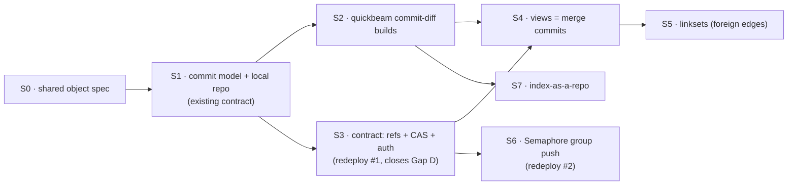

# Git-Native Data Model — Implementation Plan

*Iterative vertical slices. Each slice is independently shippable and produces real,
demoable value — no slice is a pure "layer" that sits unused until a later one lands.*

Companion to [`GIT_NATIVE_DATA_MODEL.md`](./GIT_NATIVE_DATA_MODEL.md) (theory) and
[`DATASOURCE_GIT_MODEL.md`](./DATASOURCE_GIT_MODEL.md) (code seams).

---

## Strategy: defer the redeploy, not the value

The coordinated cut is the *end state*; we reach it in slices. The one genuinely
expensive/risky step is a **contract redeploy** (Stylus `DataSourceRegistry` +
migration + subgraph re-index). So the plan front-loads everything that works against
the **existing** contract and isolates the redeploy into a single slice (S3).

**The enabling trick (S1–S2):** the current contract already stores a
`manifest_cid`. A commit is just a content-addressed object — so **we store the
*commit* CID in that slot instead of the manifest CID.** Parent links live inside the
commit object in IPFS. That gives us the *entire* git object model + self-verifying
history + incremental builds **with zero contract change**. S3 later upgrades the slot
from "last-write-wins pointer" to "CAS ref with auth," but nothing above it has to wait.

Redeploys: **exactly two**, both isolated (S3 required; S6 optional/opt-in). S1, S2,
S4, S5, S7 touch no contract.

---

## Slice 0 — Shared object spec (½ day, no code paths change)

**Value:** TS (SDK/CLI) and Python (quickbeam) serialize/parse commits identically —
the prerequisite for everything cross-language.

- Write `docs/objects/` JSON specs + fixtures for **Blob / Tree / Commit** (the §3
  object model): exact field names, canonical serialization (sorted keys), CID codec,
  Poseidon2 root placement.
- Golden fixtures checked into both repos; a tiny conformance test each side parses the
  same fixture to the same struct.

**Done when:** one committed fixture round-trips in both `fangorn` and `quickbeam`.

---

## Slice 1 — Commit model + local repo, on the existing contract (core)

**Value:** a user can version data locally, get **self-verifying, parented history**,
diff commits, and push — reconstructing any past state from IPFS *without the subgraph*.
Runs against today's deployed contract.

**SDK (`fangorn`)**
- `src/objects/` (new): `types.ts` (Commit, Tree, LeafRef), `store.ts`
  (`putObject`/`getObject` over the existing `MetadataStorage`; `buildCommit`,
  `walkParents`, `diffTrees`).
- `src/roles/repo/` (new): local `.fangorn/` — `config.json` (`owner`, `schemaId`,
  remote) + `HEAD` (tip commit CID). Read/write helpers.
- `src/roles/publisher/index.ts`: after the existing builder produces a manifest, wrap
  it as a **Tree** object, then a **Commit** (`parents = [localHEAD]`, `embed`/`build`
  from schema), pin both. **Skip re-pinning blobs whose CID is already in the parent
  tree** (structural sharing, I4). Push = existing `dataSourceRegistry.publish(commitCid,
  root, schemaId, name)` — the commit CID rides in the `manifest_cid` slot.

**CLI (`src/cli/cli.ts`)**
- `init <name> -s <schema>`, `commit -m <msg> [files…]`, `push`, `status` (local HEAD vs
  on-chain tip), `log` (walk parents in IPFS), `show <commit>` (snapshot + diff vs
  parent), `clone <owner>/<schema>`.
- Keep `publish upload` working as an alias into the commit path (back-compat).

**Demo / acceptance**
- `fangorn init`; commit twice; `fangorn log` shows two parented commits; `fangorn show`
  prints the leaf-diff; on-chain `manifest_cid` == tip commit CID; deleting a record in
  the 2nd commit yields a tree that omits its blob while history retains it; a fresh
  clone reconstructs full history from IPFS alone.

**Risk:** low — pure addition; no redeploy; existing publish path preserved as alias.

---

## Slice 2 — quickbeam commit-diff builds (+ Gap A)

**Value:** incremental builds (embed only what changed), **deletes finally propagate**,
and the embedding model is **inherited from the commit** (Gap A) instead of hardcoded.

**quickbeam (`embeddings/`)**
- `quickbeam/objects.py` (new, mirrors S0 spec): load Commit/Tree; `diff_trees(a,b)` →
  `{added_blobs, removed_blobs}`.
- `embeddings.py`: the join builders accept `(commit, parent_commit)`; embed added
  blobs, **tombstone removed entities** in Qdrant (delete by `entity_uri`).
- Read `commit.embed.{model,dim,distance}`; fall back to the CLI flag only when absent
  (kills the ~5 hardcoded sites the FRAMEWORK doc flags).
- `watcher.py`: on a new tip, resolve the commit, diff against the last-built commit,
  build the delta. `processed_track_ids` retired in favor of the tree diff.

**Demo / acceptance**
- Commit +100 records, then a commit that removes 10; the watcher embeds 100 then
  removes exactly 10 from Qdrant; the collection's vector dim matches `commit.embed.dim`;
  no full re-scan on the second cycle.

**Risk:** med — touches the join + Qdrant mutation path. Depends on S1.

---

## Slice 3 — Contract: refs + CAS + auth (redeploy #1, closes Gap D)

**Value:** concurrency-safe pushes (**CAS** rejects stale writes), non-fast-forward
detection, real per-repo write auth, and a clean `RefUpdated` trigger for quickbeam.

**Contract (`contracts/stylus`)**
- Replace `StorageDataSource` with `StorageRepo { head_cid, merkle_root, price_root,
  name, commit_count, write_policy, writer_group_id }`. Keying unchanged.
- `create_repo(schema_id, name, write_policy, writer_group_id)`; `update_ref(schema_id,
  name, expected_old_cid, new_cid, merkle_root, price_root, auth)` →
  **policy check → CAS on `head_cid` → set tip, bump `commit_count`, emit RefUpdated**.
- Policies **owner** + **allowlist** (allowlist = `RawCall` to Schema Registry
  `isPublisher`, reusing the existing `add_publisher` cross-call pattern — this closes
  Gap D). `write_policy=2/group` field reserved but not yet enforced (see S6).
- Preserve `get_merkle_root`/`get_price_root`/`get_name`/`resource_id` signatures →
  SettlementRegistry untouched. Port the existing test suite.

**SDK**
- `datasource-registry/index.ts`: `createRepo`, `updateRef(expectedOld,…,auth)`,
  `readRef`. Switch the publisher push from `publish()` → `updateRef` with CAS.
- CLI surfaces `--policy owner|allowlist` at `init`; `push` maps `NonFastForward` to a
  rebase-style error.

**Migration**
- Backfill script: each existing `(manifest_cid, version=N)` → wrap as an initial commit
  (`parents:[]`) if it isn't already one (post-S1 tips already are), set `head_cid`,
  `commit_count=N`, `write_policy=allowlist`.
- Subgraph: index `RefUpdated`; keep first-commit → `ManifestPublished` mapping for
  continuity.

**Demo / acceptance**
- Two racing pushes from the same repo: one lands, the other gets `NonFastForward`; an
  address not on the allowlist is rejected; quickbeam switches its trigger from polling
  to `RefUpdated`.

**Risk:** med — the redeploy. Isolated here so S1/S2 already de-risked the object model
in production first.

---

## Slice 4 — Views as cross-repo merge commits

**Value:** attested, reproducible cross-publisher fusion — a view commit pins the *exact
source tips* it fused.

- SDK: `fangorn view create <name> -s <sourceRid…>` produces a commit with
  `parents = [tip(sourceA), tip(sourceB), …]` and a tree = fuse recipe (+ trust policy
  slot). Re-express `publishView` over the commit path.
- quickbeam: view build walks the merge commit's parents as the fuse inputs (instead of
  re-deriving sources from a manifest); union-find on Entity URIs/aliases is the existing
  `build_view_joined_data`, now keyed off commit parents.

**Demo / acceptance:** view over two repos; `quickbeam build --view …` yields one fused
graph where entities sharing an alias merge; re-running against the same source tips is
byte-reproducible.

**Risk:** low–med. Depends on S1 (+ ideally S3 for stable tips).

---

## Slice 5 — Linksets (foreign-endpoint edges, the fuzzy join)

**Value:** join entities with **no shared id** via signed, asserted `sameAs` edges.

- SDK: `fangorn link add <fromURI> <rel> <toURI> [--confidence]` → linkset commit whose
  blobs are `{from, rel, to, confidence, evidence}` with **foreign** Entity URIs;
  validate endpoints (valid URI or known alias).
- quickbeam: feed linkset edges referenced by a view into the same union-find.

**Demo / acceptance:** two entities with different ids merged in a view *only* because a
referenced linkset asserts `sameAs`; an invalid endpoint is rejected at `link add`.

**Risk:** med — foreign endpoints are the one genuinely new model element (cross-manifest
adjacency in quickbeam). Depends on S4.

---

## Slice 6 — Semaphore group push (redeploy #2, opt-in)

**Value:** anonymous / collective authorship — *"push rejected unless you prove
membership in the repo's writer group,"* unlinkable to a wallet.

- Contract: enforce `write_policy=group` in `update_ref` — verify a Semaphore membership
  proof against `writer_group_id`'s root + nullifier (scope the external nullifier to the
  new commit CID so a member can push *many* commits — open decision #4).
- SDK: writer-group management (create group, add member) + relayer-submitted push with
  proof — reusing the settlement flow's `generateProof`/relayer/group-reconstruction
  machinery, pointed at writes.

**Demo / acceptance:** a group member pushes via relayer and lands; the gas payer ≠ the
author; a non-member's proof fails; two commits from one member both succeed (nullifier
scoping correct).

**Risk:** high — on-chain proof verification + second redeploy. Isolated last on the
critical path; storage field reserved in S3 so no earlier rework.

---

## Slice 7 — Index-as-a-repo (verifiable index lineage)

**Value:** the embedding index becomes a versioned, auditable artifact whose lineage
points back at the data it was built from.

- quickbeam `cdn.py`: the bake commits its manifest+shards into a sibling **index repo**
  whose commit's parent is the **source data commit** it built from.

**Demo / acceptance:** `quickbeam cdn bake` emits an index commit; walking its parent
lands on the exact data commit; re-bake of the same data commit is reproducible.

**Risk:** low–med. Depends on S1 (repo primitives) + S2 (build). Parallelizable with S4+.

---

## Sequencing & parallelism

| Order | Slice | Redeploy | Blocks | Can parallelize with |
|---|---|---|---|---|
| 1 | S0 spec | — | S1, S2 | — |
| 2 | S1 commit model | — | S2, S3, S4, S7 | — |
| 3 | S2 quickbeam diff | — | S7 | S3 |
| 4 | S3 refs+CAS+auth | **#1** | S4, S6 | S2 |
| 5 | S4 views | — | S5 | S7 |
| 6 | S5 linksets | — | — | S7 |
| 7 | S6 group push | **#2** | — | S5, S7 |
| 8 | S7 index-as-repo | — | — | S4–S6 |

**Recommended critical path:** S0 → S1 → S3 → S4 → S5, with S2 running alongside S3 and
S6/S7 as opt-in follow-ons. First shippable value (versioned history + incremental
embeds) lands after **S1+S2**, before any redeploy.

---

## Cross-cutting concerns (every slice)

- **Back-compat:** keep `publish upload` and `datasource info` working as aliases
  through S3; only rename in a later, announced cut.
- **Testing:** each slice ships its acceptance demo as an e2e test (`src/e2e.test.ts`
  pattern; quickbeam `test_roles.py`), plus the S0 golden fixture on both sides.
- **Fixtures:** the places/music demos (`src/test/publish_*.ts`, quickbeam
  `stage_volumes/`) become the running end-to-end for S1–S5.
- **Docs:** update `checkpoint_guide_1.md` per slice so the "what you can do today"
  table tracks reality.

---

## Open decisions that gate specific slices

- **S3/S1:** schema-scoped `resourceId` (repo = one schema) is assumed. Schema evolution
  within a repo (decouple the key) is out of scope until decided (theory §12.1).
- **S4:** commit to views-as-merge-commits (this plan assumes yes).
- **S6:** anonymous-push nullifier scope (commit CID vs. counter).
- **S3:** force-update / rollback policy for the single ref (allowed? owner-gated?).
