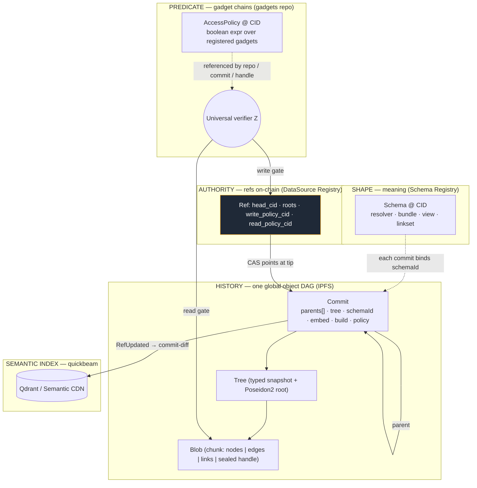
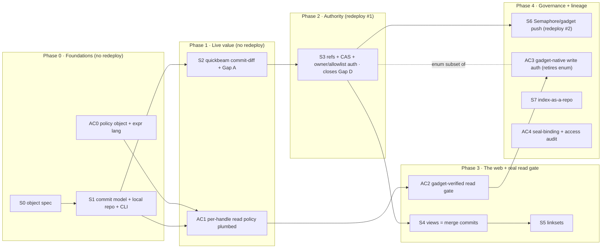

# The Git-Native Redesign — Master Plan

*The single, holistic view of Fangorn's data-model redesign: datasets as repositories,
manifests as commits, the registry as refs, IPFS as history, gadget chains as the
universal access-control predicate, and quickbeam tethered to the commit stream —
driven by a git-like CLI.*

Status: **umbrella v1.0.** This ties together four companion documents; it does not
replace them. Each section here is a synthesis with a pointer to the deep-dive.

| Companion | Role |
|---|---|
| [`GIT_NATIVE_DATA_MODEL.md`](./GIT_NATIVE_DATA_MODEL.md) | First-principles **theory** — invariants, the object DAG, cross-repo composition, drawn diagrams. |
| [`DATASOURCE_GIT_MODEL.md`](./DATASOURCE_GIT_MODEL.md) | **Code-grounded** v0.2 — exact seams in the current contract/SDK/quickbeam. |
| [`GIT_NATIVE_ACCESS_CONTROL.md`](./GIT_NATIVE_ACCESS_CONTROL.md) | The **gadget predicate layer** — one predicate form gates writes *and* reads. |
| [`GIT_NATIVE_IMPLEMENTATION_PLAN.md`](./GIT_NATIVE_IMPLEMENTATION_PLAN.md) | The **vertical slices** (data-model track S0–S7). |
| [`GIT_NATIVE_PRIOR_ART.md`](./GIT_NATIVE_PRIOR_ART.md) | **Prior art & tooling** — LakeFS/Dolt/Ceramic/Qri/Radicle + IPLD/Iroh/Lit/RISC Zero/Substreams; the substrate decisions (Prolly tree, dag-cbor, …). |
| **this doc** | The unified model + the **merged roadmap** (S-track ⋈ AC-track) + consolidated decisions. |

Also upstream: [`FRAMEWORK.md`](./FRAMEWORK.md) (the ecosystem theory and its four gaps)
and the `gadgets` sibling repo (the universal inductive verifier).

---

## 1. Thesis

Fangorn wants one substrate where data can be **published permissionlessly, verified by
anyone, composed across publishers, versioned over time, governed on-chain, and made
searchable by agents** — the Semantic Web with the trust, economic, privacy, and AI
machinery it always lacked (see `FRAMEWORK.md`).

The redesign delivers that by taking one idea seriously: **a dataset is a git
repository.** Everything follows from a single content-addressed Merkle-DAG of immutable
objects with a thin layer of mutable, *authorized* named pointers on top — plus three
things git lacks: **typed shapes (schemas), cross-repo identity (the "web"), and a
gadget-based access predicate (governance).**

The rigidity we are removing lives entirely in the current *ref model* (a last-write-wins
on-chain slot with a version counter), **not** in schemas. Shapes stay strict — they are
what makes relationships and embeddings possible. We make *history* flexible, not
*meaning* loose.

---

## 2. The unified model at a glance

Two orthogonal axes (**shape** vs **history**), one global object DAG, one predicate
language gating both ends, one downstream index.



**Read it as five planes that meet at the commit:**
1. **Shape** — a schema (immutable spec at a CID) types the repo; every commit binds the
   exact `schemaId` its contents conform to.
2. **History** — one global content-addressed DAG. `Blob ⊂ Tree ⊂ Commit`, commits
   parented (linear, or multi-parent for cross-repo view merges). A repo is *not* a
   partition of this DAG — it's a named, authorized entry point (a ref) into it.
3. **Authority** — the only mutable, on-chain state: a ref (`head_cid`) moved by an
   authorized compare-and-swap, plus denormalized roots and the repo's policy pointers.
4. **Predicate** — access rules are gadget chains (content-addressed `AccessPolicy`
   objects). One verifier `Z` gates **writes** (advancing the ref) and **reads**
   (unsealing handle content).
5. **Index** — quickbeam consumes the commit stream (diffing trees on `RefUpdated`),
   inheriting the embedding contract from the commit.

---

## 3. Invariants (the whole thing derives from these)

From `GIT_NATIVE_DATA_MODEL.md` §2, extended with the access-control axioms:

| # | Invariant | Pays off as |
|---|---|---|
| **I1** | Content addressing → immutable objects, automatic dedup | cheap storage |
| **I2** | Commits name parents by CID → tamper-evident lineage | self-verifying history, safe CAS |
| **I3** | Each tree carries a Poseidon2 root | membership/conformance provable on-chain |
| **I4** | Unchanged sub-objects keep their CID | cheap diffs, incremental builds, no re-pin/re-seal |
| **I5** | Authority is at the ref, not the object | `commit` permissionless, `push` governed |
| **I6** | Entities carry global identity independent of repo | cross-repo merge & linkset |
| **I7** | Every commit binds a `schemaId` | relationships + embeddings have a contract |
| **I8** | Access rules are **predicates**, expressed as gadget chains | one verifier gates write *and* read |
| **I9** | Policies are content-addressed objects referenced by commits | access changes are versioned & auditable |

The load-bearing reframe is **I5 + I8**: there is *one* object DAG and *one* predicate
language; "repo," "write policy," and "read gate" are all just named or referenced entry
points onto them.

---

## 4. End-to-end lifecycle

The full path a datum travels, unifying publish, authority, access, and index. Compare
`FRAMEWORK.md` §3.5 — this is that contract chain, now git-native.

```mermaid
sequenceDiagram
    autonumber
    actor Pub as Publisher (CLI)
    participant SR as Schema Registry
    participant IPFS as IPFS (object DAG)
    participant DSR as DataSource Registry (refs)
    participant Z as Verifier Z (gadgets)
    participant QB as quickbeam
    actor Con as Consumer

    Pub->>SR: register schema (shape) → schemaId
    Note over Pub,IPFS: commit — PERMISSIONLESS (I5)
    Pub->>Pub: chunk → Blobs; Tree (+Poseidon2 root); seal handle fields
    Pub->>Pub: wrap Commit(parents, schemaId, embed, build, policy)
    Pub->>IPFS: pin Blobs/Tree/Commit (skip CIDs already present — I4)
    Note over Pub,DSR: push — GOVERNED (I5, I8)
    Pub->>DSR: update_ref(expected_old, new_cid, roots, authProof)
    DSR->>Z: write gate — proof vs write_policy_cid
    Z-->>DSR: ok
    DSR->>DSR: CAS(head==expected_old) → advance; emit RefUpdated
    DSR-->>QB: RefUpdated(A→B)
    QB->>IPFS: diff A.tree vs B.tree; embed added, tombstone removed (I4)
    Note over QB: model/dim from commit.embed (Gap A)
    Con->>DSR: resolve tip → handle + read_policy
    Con->>Z: read gate — proof vs handle.access.policy (I8)
    Z-->>Con: ok → worker/TEE unseals → decrypt locally
```

---

## 5. The CLI (the one entry point)

A repo has a local `.fangorn/` (like `.git/`). Porcelain, grouped by plane:

```bash
# shape
fangorn schema register music.catalog.v1 --bundle catalog.json      # immutable spec → schemaId

# repo lifecycle
fangorn init  music-catalog -s music.catalog.v1 [--policy <expr>]    # bind cwd → repo typed by a schema
fangorn clone <owner>/music.catalog.v1

# commit (local, permissionless) / push (on-chain, governed)
fangorn add     data.jsonl
fangorn commit  -m "add 10k tracks" [--policy 'Payment(0.01,USDC)']  # Blobs→Tree→Commit, pin to IPFS, move HEAD
fangorn push                                                         # authorized CAS update_ref  ← trust boundary
fangorn status | log | show <commit>                                # ahead/behind · walk parents · diff

# the web (cross-repo)
fangorn view create local.view -s <placesRid> <eventsRid>           # merge-commit over source tips
fangorn link add fangorn:<A>/x sameAs fangorn:<B>/y --confidence .93 # foreign-endpoint edge → linkset commit

# access (gadget predicates)
fangorn policy set 'AND(Payment(0.001,USDC), Membership(analysts))' --repo
fangorn seal report.pdf --field body --policy 'Membership(subscribers)'
fangorn access <owner>/<repo> <entityUri> <field>                   # prove chain → /access → unseal
```

`fangorn commit -m "…" -s "…"` is the one-liner; with a bound `.fangorn` (or `--push`) it
commits and pushes in one step. Detail: data model §8, access control §6.

---

## 6. Merged roadmap (data-model track ⋈ access-control track)

Two slice tracks, interleaved into phases. **Guiding rule: defer the redeploy, not the
value** — ship real capability against the *existing* contract by storing the *commit*
CID in today's `manifest_cid` slot; isolate contract redeploys into their own slices.



| Phase | Slices | Ships (real, demoable value) | Redeploy |
|---|---|---|---|
| **0 Foundations** | S0, S1, AC0 | Version data locally; self-verifying parented history; `log`/`show`/`diff`; deletes; push via the existing contract | — |
| **1 Live value** | S2, AC1 | Incremental embeds + deletes propagate; model inherited from commit (Gap A); per-handle read policies ride in commits | — |
| **2 Authority** | S3 | Concurrency-safe pushes (CAS), non-fast-forward detection, real write auth (closes Gap D), clean `RefUpdated` trigger | **#1** |
| **3 The web + read gate** | S4, S5, AC2 | Attested cross-repo fusion (view merges); fuzzy joins (linksets); first **gadget-verified read gate** (isSettled → one gadget among many) | worker/verifier |
| **4 Governance + lineage** | S6, AC3, S7, AC4 | Anonymous/collective + composite push predicates; the write-policy enum retires into gadget chains; verifiable data→index lineage; access audit trail | **#2** (opt-in) |

First shippable value lands at the **end of Phase 1 — before any redeploy.** Exactly two
contract redeploys across the whole program (P2 required, P4 opt-in). Per-slice scope,
files, and acceptance demos: `GIT_NATIVE_IMPLEMENTATION_PLAN.md` (S) and
`GIT_NATIVE_ACCESS_CONTROL.md` §7 (AC).

---

## 7. What this closes from `FRAMEWORK.md`

| Framework gap | How the redesign resolves it |
|---|---|
| **Gap A** — embedding model not inherited | `commit.embed{model,dim,distance}` is authoritative; quickbeam reads it (S2) |
| **Gap C** — no on-chain conformance | tree binds `schemaId` + Poseidon2 root; the shape-binding commitment is the seam a ZK conformance proof plugs into (future, on the tree leaf) |
| **Gap D** — publisher auth unenforced | `update_ref` allowlist policy via Schema Registry `isPublisher` (S3); generalized to gadget chains (AC3) |
| **Gap E** — no cross-publisher linking | native: views = cross-repo merge commits, linksets = repos of foreign edges (S4–S5) |

(Gap B — semantic roles — stays interpretive by design; unaffected.)

---

## 8. Consolidated open decisions

The forks that gate specific slices, gathered from all four docs:

| # | Decision | Gates | Recommendation |
|---|---|---|---|
| 1 | **Schema evolution within a repo** — keep `resourceId` schema-scoped (new schema = new repo) vs. decouple the key (`repoId = keccak(owner‖name)`, `schemaId` per commit) | S1, S3 | v1 schema-scoped (preserves the universal join key); revisit as v2 |
| 2 | **Views as merge commits** in v1 vs. keep the separate view artifact | S4 | adopt merge commits (first-principles cleaner) |
| 3 | **Branches/tags** — object model already supports many refs; when to expose `refs/heads/*`, `refs/tags/*`? | post-v1 | single ref in v1; add when demand appears |
| 4 | **Read-gate verifier location** — on-chain (trust-min, gas) vs. worker/TEE (cheap, trusts attestation) | AC2 | start in TEE w/ attestation; offer on-chain verify for high-assurance |
| 5 | **Gadget registry ownership** — `gadgets` repo's own registry vs. fold into the Predicate-Registry (`CONTRACT_MIGRATION.md`) | AC2, AC3 | align with Predicate-Registry direction; pay-to-register economics live there |
| 6 | **Seal binding** — release-gated (resourceId only) default vs. per-handle seal-bound (resourceId‖policyCid) | AC4 | release-gated default; seal-bound opt-in for high-assurance |
| 7 | **Anonymous-push nullifier scope** — bind external nullifier to commit CID vs. counter; distinct domains for read vs. write nullifiers | S6, AC3 | commit-CID scope; separate read/write nullifier domains |
| 8 | **Force-update / rollback** with a single ref — permitted? gated how? | S3 | owner-gated non-fast-forward only; default reject |
| 9 | **Default-open vs default-closed** when a commit/handle names no policy | AC1 | explicit repo default; unset handle inherits, never implicitly public |
| 10 | **Re-price path** — `set_price_root` as an empty-diff commit vs. side channel | S3 | model as a real (empty-tree-diff) commit for a uniform history — like `git commit --allow-empty` (Ceramic/Git precedent) |

**Substrate decisions from the prior-art scan** (full analysis in `GIT_NATIVE_PRIOR_ART.md` §3):

| # | Decision | Gates | Recommendation |
|---|---|---|---|
| 11 | **What the Tree object is** — flat leaf list vs. **Prolly tree / Merkle-search tree** | S0, S1, S2, S4 | **Prolly tree** (Dolt/LakeFS): log-scale diff, deterministic root, native 3-way merge. Highest-leverage borrow. |
| 12 | **Object codec** — hand-rolled JSON vs **IPLD dag-cbor + IPLD Schema** | S0 | IPLD dag-cbor; carry the **Poseidon2 root alongside the CID** (dual-hash — CID for addressing, Poseidon2 for ZK/on-chain) |
| 13 | **Core language** — TS/Py vs a **Rust `fangorn-core`** (Prolly + Iroh) with bindings | cross-cutting | prototype the Prolly diff engine in `fangorn-rs/`; commit if diff perf demands |
| 14 | **Push anchoring** — one tx/push vs **batched anchor** of many tips | S3, scale | one-tx first; add Ceramic-style batched anchoring as a gas slice when volume warrants |
| 15 | **Read gate: build vs buy** — custom worker/TEE vs **Lit Protocol** network | AC2 | buy Lit for read decryption; keep ZK gadget chains for the on-chain write gate (see Decision 4) |
| 16 | **Proving stack** — Noir only vs **Noir + RISC Zero zkVM** | AC3, S6 | hybrid: Noir for cheap common gadgets, zkVM for arbitrary-logic gadgets; keep the registry interface stack-agnostic |

Decision 4 (read-gate verifier) is reinforced by the scan: **TEE-first, then hybrid**, with
Lit Protocol as the concrete off-the-shelf network (Decision 15).

---

## 9. Glossary (delta over `FRAMEWORK.md` §8)

- **Repo** — a named, authorized ref over a commit DAG; identified by `resourceId`
  (v1: schema-scoped). *Not* a partition of the object graph.
- **Commit** — `{parents[], tree, schemaId, author, ts, message, embed, build, policy}`,
  content-addressed. The unit of history; ≥2 parents = a cross-repo view merge.
- **Tree** — a typed snapshot: leaf refs to blobs + Poseidon2 root, bound to a `schemaId`.
  (The old "manifest," promoted to a first-class object.)
- **Blob** — an opaque content-addressed chunk (typed nodes, edges, links, or a sealed
  handle payload).
- **Ref** — the mutable on-chain tip pointer; moved only by an authorized CAS.
- **AccessPolicy** — a content-addressed boolean expression over registered gadgets
  (`policyCid`); the predicate a write or read gate verifies.
- **Gadget** — a basic ZK statement (`payment`, `ecdsa`, `merkle`, `nullifier`, …)
  registered in the gadget registry; composed into policies, folded by verifier `Z`.
- **Write gate / read gate** — the two call sites of `Z`: advancing a ref, and unsealing
  a handle.
- **commit-diff build** — quickbeam embedding only the leaf-set delta between two
  commits' trees on `RefUpdated`.
```
