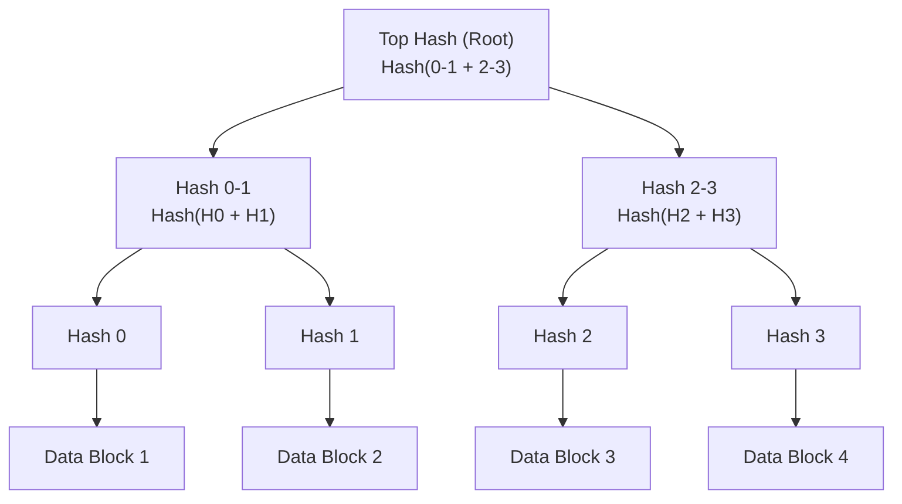

# How it Works

The goal of this article is to describe how 'data vaults' work in this current incarnation of Fangorn. This is a pragmatic first attempt at realizing 'intent bound data' on top of LIT + noir.

## Data Vaults

A 'data vault', as represented in the [zkgate.sol](../contracts/ZKGate.sol) contract, is an entry in storage, where each vault looks contains:

- `passwordHash`: The sha256 hash of the vault password
- `poseidonRoot`: The root of the manifest
- `manifestCid`: The CID of the full manifest in storage
- `owner`: The owner of the manifest (wallet address)

#### Manifests

Each vault represents an **owned**, **password-protected** 'state' that exists as a Merkle tree. This state, called a `manifest`, is identified both by:

- the `manifestCid`, pointing to the full manifest that holds the full tree and references all data in the vault
- the `poseidonRoot` is the poseidon hash of the root of the tree.

### Vault Creation

Vault creation requires a password to be hashed with `Sha256`, and this hash is used to seed the vault. VaultIds are derived internally within the zkgate contract by computing `Sha256(callerAddress || passwordHash)`.

<!-- Vaults an also be given a  -->

### Vault State and Mutations

Mutating a vault's state is done in a naive way at the moment. That is, the vault owner is at liberty to modify the state of their vault at will, either by updating an existing manifest or producing an entirely new one.

#### The Manifest and VaultEntry

As stated above, a `manifest` represents the state of the vault's storage. Each vault looks holsd:

- `version`: The version of the vault (currently only version 1 exists)
- `poseidon_root`: The root of the tree
- `entries`: A collection of `VaultEntry` objects
- `tree`: A Merkle tree where each leaf represents a commitment to a unique (vaultId, tag) combo, used for enabling private data access

Merkle tree where each leaf contains a `VaultEntry` that holds:

- tag: A unique name for the data
- cid: The CID pointing to the ciphertext
- index: The index of the entry in the manifest (must be unique)
- `leaf`: A unique commitment Poseidon2(vaultId, tag)

#### Commiting the Manifest

### Data Access
