# Fangorn Protocol 

Goal: to explain what Fangorn is, the problems it solves, and how the pieces fit together.

---

## What Fangorn is, in one breath

Fangorn lets anyone **publish structured data about the world**, lets anyone else
**verify it and search it**, lets the data from different publishers **join up into one
big graph**, and lets publishers **get paid** and readers **stay private**.

The running example in this repo is small towns: **places** (bars, venues), the
**events** they host, and **reviews** people write. But the same machinery works for
music catalogs, business listings, anything.

---

## 1. The data is a graph

Everything starts here. Fangorn data isn't rows in a table — it's a **graph of typed
things connected by typed relationships**.

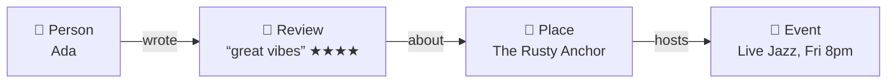

Two kinds of building block:

- **Nodes** — the things. A `Place`, an `Event`, a `Review`, a `Person`.
- **Edges** — how they relate. A Place *hosts* an Event. A Review is *about* a Place.

That's the "knowledge graph." The relationships **are** the value: you don't just get a
list of bars, you get bars that host events that people reviewed, all walkable.

---

## 2. Shapes: schemas

For a graph to be verifiable and joinable, everyone has to agree on what a "Place" *is*. That agreement is a **schema** (a typed shape).

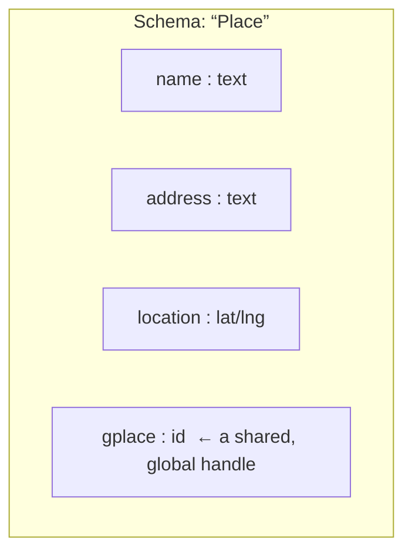

A schema says a Place has a `name`, an `address`, a `location`, and a `gplace` id. The 
last one matters a lot later: it's a **globally recognized handle** (a Google Place ID like `ChIJ...`) that lets *my* Place and *your* Place be recognized as the same real bar, even though we're different publishers.

Schemas are the part that makes relationships and search possible. **They don't change in this redesign — they're the good part.** What changes is everything about how the data is *stored and versioned*.

> A **bundle** is just a schema for a whole subgraph at once: "here are the node types
> (Place, Event, Review) and the edges allowed between them (hosts, about, wrote)."

---

## 3. How the graph is stored

You can't put a million-node graph on a blockchain, and you shouldn't trust a company's server to hold it honestly. So Fangorn stores the data on **IPFS** (a network where every piece of data is named by a hash of its own contents) and puts only a tiny fingerprint on-chain.

Here's the actual structure. The graph gets chopped into **chunks** (called *blobs*), a **tree** lists those chunks and carries one combined fingerprint, and a **commit** wraps the tree with a note about who made it and when.

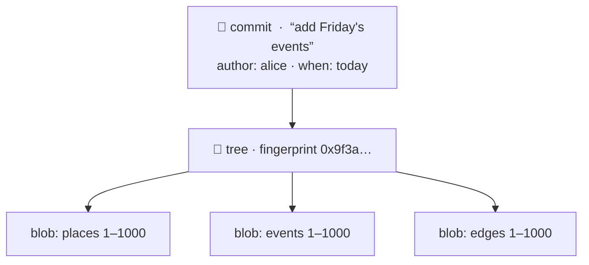

Why this shape?

- **Named by content.** Each blob's name *is* the hash of its bytes. If you download it
  and it doesn't match the name, you know it was tampered with. No trust required.
- **The tree's fingerprint** (a Merkle root) is one hash that stands in for the entire
  dataset. Put *that* on-chain and anyone can later prove "this record really is part of
  the published dataset."
- **Identical chunks are stored once.** If two versions share a blob, they share its
  name — so nothing is duplicated (this is what makes versioning cheap, next).

> This is exactly how **git** stores your code: blobs (file contents), trees
> (directories), and commits (snapshots with a message and a parent). Fangorn is git for
> knowledge graphs.

---

## 4. How data changes over time: commits

Today's system can only *overwrite*. You republish, a counter ticks up, and the old state is gone from the chain — history is something you have to reconstruct by trusting an external index. That rigidity is the whole reason for this redesign.

Instead, each **commit points back at the one before it.** History becomes a chain you can walk and verify yourself.

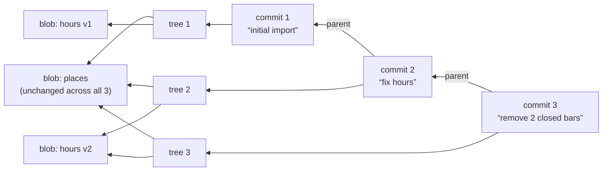

Read it from the right: commit 1 imports everything. Commit 2 fixes opening hours — so it makes a *new* hours blob but **reuses the places blob unchanged** (same content, same name, no re-upload). Commit 3 removes two closed bars — a new tree that simply doesn't list their data.

This gives you, for free:

- **Real history** — walk the parents to see exactly what changed and when, verifiably,
  without trusting anyone's index.
- **Deletes** — a new snapshot that omits something. The old history still exists, but
  the *current* state no longer includes it.
- **Cheap updates** — only the chunks that changed get re-uploaded.

---

## 5. Where "the latest version" lives: the registry

The blockchain holds exactly one small thing per dataset: a **pointer to the newest commit**. That pointer is the only mutable, on-chain piece. Everything it points to lives in IPFS and never changes.

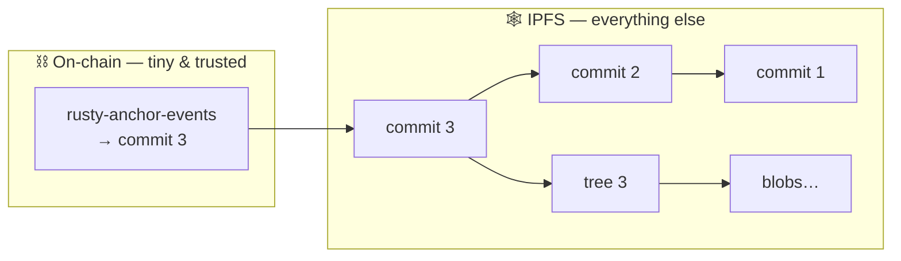

So a **dataset is a repository**: a name that points at the tip of a commit history.
Updating it means moving that pointer to a newer commit — and *that move* is the moment
where permission and safety get checked (§7).

---

## 6. The web: joining different publishers' data

This is the "semantic **web**" part, and it's where Fangorn stops being a pile of isolated datasets and becomes one connected graph.

Suppose publisher **A** publishes *places* and publisher **B** publishes *events*. Both describe the same bar — and both tagged it with the same global handle (`gplace:ChIJ...`). Because the handle matches, the two graphs can be recognized as talking about the same real thing and **fused into one**.

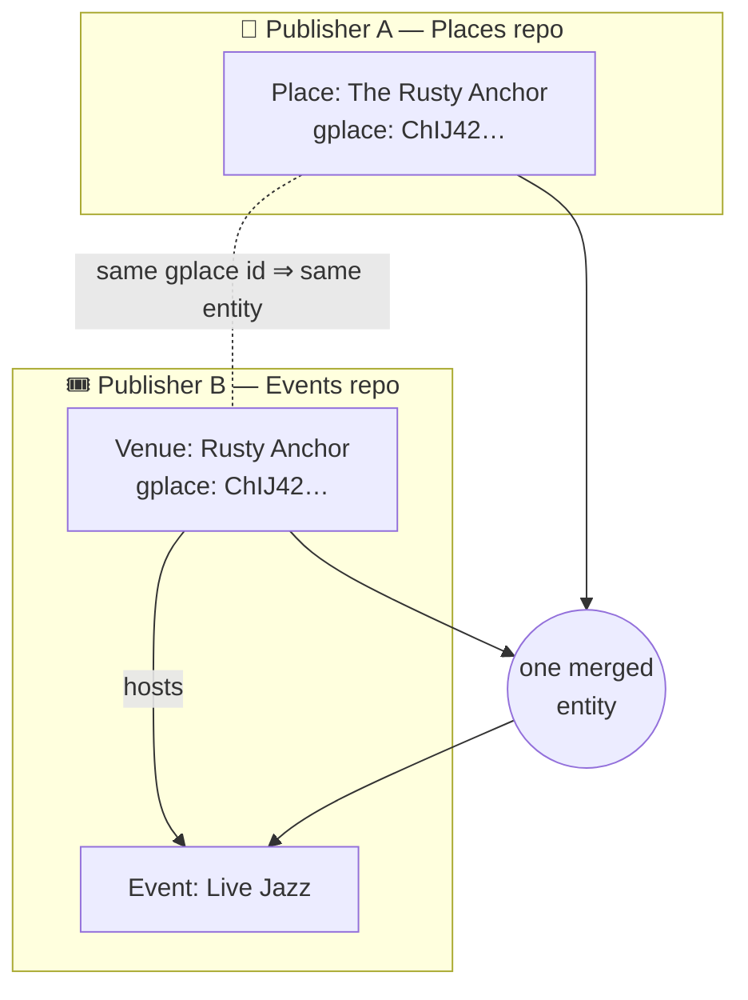

Now a search can return "a bar (from A) hosting live jazz this weekend (from B)" — a fact neither publisher had alone.

Two ways this happens:

- **Shared handle (free & automatic).** When both sides carry the same global id, they just merge. No matching, no guessing.
- **A linkset (for the fuzzy case).** When there's *no* shared id — "Marina Bar" vs
  "Marina Bar & Grill" — someone publishes a small dataset of **asserted links** that say "these two are the same," which you can choose to trust.

A **view** is a saved recipe that says "fuse repo A + repo B (+ this linkset) into one graph." In git terms, a view is a **merge**: a commit whose parents are the tips of *several different repos*.

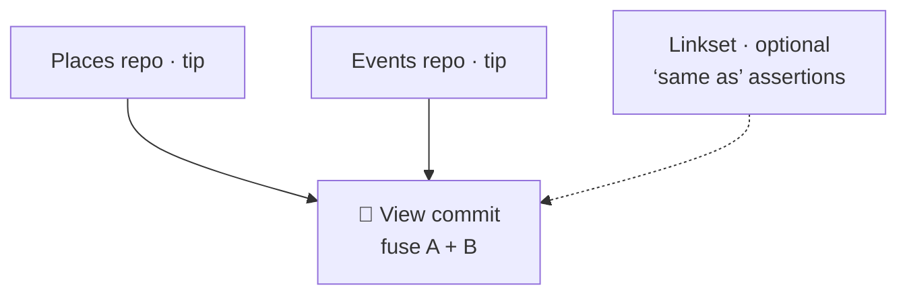

---

## 7. Who can write: commit is free, publishing is permissioned

Building a commit is like writing in your own notebook — nobody can stop you, because IPFS data is just content nobody has to accept. The controlled step is **moving the on-chain pointer** to your new commit. That's the only place permission is checked.

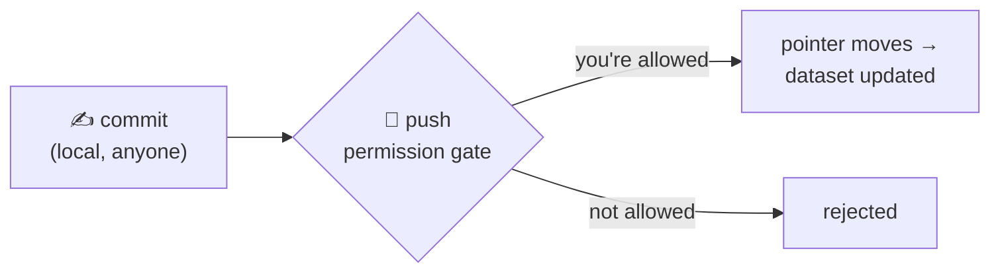

The gate can be set per repo:

- **Owner only** — just you.
- **Allowlist** — a set of approved publishers.
- **Private group** — prove you belong to a group *without revealing which member you are* (using the same anonymous-membership tech the payment side already uses). This is the "push is rejected unless you can prove you're in the group" case.

The gate also does a **safety check**: it only accepts your commit if it builds on the *current* tip. If someone else pushed while you were working, you're told to catch up first — so two people can't silently clobber each other.

---

## 8. Who can read: locking individual fields

Some fields are public (a bar's name). Some shouldn't be (a paid dataset, a private document). Those get **sealed** — encrypted so that only someone who meets a condition can open them.

The condition is a **rule you have to satisfy** — "you paid," "you're a subscriber", "you signed with this key" — and rules can be combined ("paid **and** subscriber").

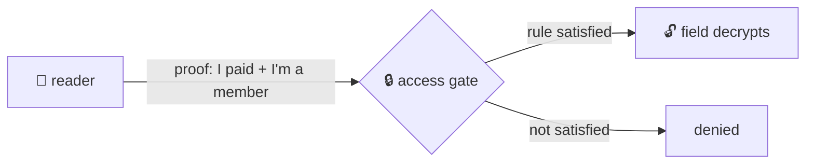

The important design choice: these rules are the **same kind of rule** used to gate writing (§7). Fangorn has *one* way to express "who is allowed to do this" — a composable condition — and it's used both for **who can publish** and **who can read**. (The building blocks for these conditions are the "gadgets" in the sibling `gadgets` repo; you don't need the details here.)

---

## 9. Making it searchable: embeddings

A graph is only useful if you can find things in it. **quickbeam** (in `~/fangorn/embeddings`) turns a published graph into a **search index by meaning** — so "cozy bars with live music this weekend" works, not just exact keyword matches.

Because datasets are now commit histories, quickbeam gets a big win: when a dataset updates, it sees exactly which commit is new, compares it to the previous one, and only re-indexes **what changed** — adding new records, removing deleted ones. No more re-processing the whole dataset every time.

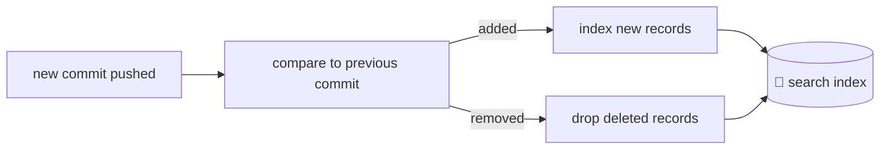

The search index can be served as a paid API for agents, or shipped to your browser so the **query never leaves your device** ("the knowledge is public; what you asked is private").

---

## 10. Putting it together: the whole life of a dataset

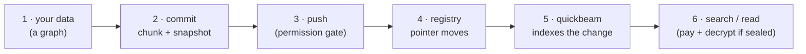

1. You have a graph of typed things.
2. `commit` chunks it, snapshots it, and records what changed vs. last time.
3. `push` asks the chain to point at your new commit — checked against the repo's write
   rule.
4. The registry pointer moves; the change is now public and verifiable.
5. quickbeam notices, diffs it, and updates the search index.
6. People and agents find your data and read it — paying and decrypting where required.

---

## 11. What using it looks like (the CLI)

It reads like git, on purpose.

```bash
# describe the shape once
fangorn schema register places.v1 --bundle places-schema.json

# start a repo for your data
fangorn init rusty-anchor -s places.v1

# snapshot your data locally (chunks it, records what changed) …
fangorn commit -m "initial import" places.jsonl

# … then publish it (this is the permissioned step)
fangorn push

# see history, inspect a change
fangorn log
fangorn show <commit>

# join your data with someone else's
fangorn view create town-guide -s <places-repo> <events-repo>

# lock a field behind a rule
fangorn seal report.pdf --field body --rule "subscriber"
```

---

## 12. How we plan to build it

Plain version — no code names. We build in stages, each one usable on its own, and we avoid touching the smart contract until we've proven the idea works around it.

1. **Commits, working against today's contract.** Add the commit/snapshot machinery and
   the `commit` / `push` / `log` commands. We sneak the commit into the *existing*
   on-chain pointer slot, so this ships with **no contract change**. You get real,
   verifiable history immediately.
2. **Smarter search.** quickbeam switches to diffing commits — incremental updates and
   working deletes.
3. **The new contract (one redeploy).** Replace the "overwrite + counter" with a proper
   pointer that checks permission and prevents clobbering.
4. **The web.** Cross-publisher views and linksets.
5. **Access rules.** Sealed fields with composable read conditions; anonymous-group
   publishing.

The one piece worth prototyping early and carefully is the **tree structure** — the thing that lets us compare two big datasets and find the difference quickly. Mature projects that do exactly this (Dolt, LakeFS) use a self-balancing content-addressed tree for it, and we should too. Everything else is straightforward once that's solid.

---

## Appendices (deep dives — optional)

- `GIT_NATIVE_DATA_MODEL.md` — the formal object model and invariants.
- `GIT_NATIVE_ACCESS_CONTROL.md` — how the read/write rules work in detail.
- `GIT_NATIVE_IMPLEMENTATION_PLAN.md` — the build broken into fine-grained slices.
- `GIT_NATIVE_PRIOR_ART.md` — the projects and tools we're borrowing from.
- `GIT_NATIVE_REDESIGN.md` — the exhaustive cross-referenced version of this doc.
- `FRAMEWORK.md` — the original ecosystem theory.
```
