# The Fangorn Guide

> "Certainly the forest of Fangorn is perilous - not least to those that are too ready with their axes; and Fangorn himself, he is perilous too; yet he is wise and kindly nonetheless."
>  J.R.R. Tolkien, The Two Towers

## What is Fangorn?

Fangorn lets anyone **publish structured data about the world**, lets anyone else
**verify it and search it**, lets the data from different publishers **join up into one
big graph**, and lets publishers **get paid** and readers **stay private**.

The running example in this repo is small towns: **places** (bars, venues), the
**events** they host, and **reviews** people write. But the same machinery works for
music catalogs, business listings (anything with typed things and relationships).

### Properties

Fangorn is inspired by the ideas behind the [Semantic Web](https://www.w3.org/RDF/Metalog/docs/sw-easy); by the idea that *data should carry its own meaning*. 

> "The Semantic Web is an extension of the current web in which information is given well-defined meaning, better enabling computers and people to work in cooperation."
> - "The Semantic Web" (Berners-Lee et al.), May 2001, Scientific American

Fangorn re-envisions these ideas in the context of the trust models, payment rails, privacy, and agentic machinery that the original version lacked. Concretely, Fangorn makes data:

- **Verifiable:** A publisher commits a cryptographic commitment of their data on-chain. Anyone can verify authenticity of the data they downloaded without trusting the publisher or any centralized authority. Intent travels *with* the data instead of living in a company's private database.
- **Connected:** Data is published as a **graph** of typed nodes joined by typed edges, and graphs from different publishers **fuse** into one when they describe the same real things. The relationships *are* the value.
- **Searchable:** Each published graph becomes a **vector index** so people can search it by meaning ("cozy bars with live music this weekend") and AI agents get a verifiable, machine-readable brain.
- **Paid and private:** Unlike the traditional web, Fangorn makes knowledge public while intent remains private. That is: not all data is created equal, instead data is intent-bound and data access is context-aware. Data publishers may require a proof, a payment, or any other condition before a buyer can access data. We do not dictate the exact access control mechanism, but allow a modular bring-your-own-access-control mechanism.

---

## 1. Enter the Forest: Data as a graph

Data in fangorn isn't rows in a table (e.g. like [Dolthub](https://github.com/dolthub/dolt)), it's a **graph of typed things connected by typed relationships**.

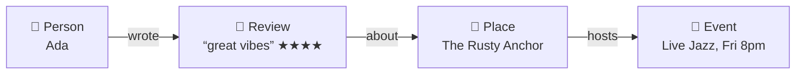
```mermaid
flowchart LR
    P["🍺 Place<br/>The Rusty Anchor"]
    E["🎷 Event<br/>Live Jazz, Fri 8pm"]
    R["📝 Review<br/>“great vibes” ★★★★"]
    A["👤 Person<br/>Ada"]

    P -->|hosts| E
    A -->|wrote| R
    R -->|about| P
```

As in any graph, there are two kinds of building blocks:

- **Nodes** - the things. A `Place`, an `Event`, a `Review`, a `Person`.
- **Edges** - how they relate. A Place *hosts* an Event. A Review is *about* a Place.

That is, data is encoded as a knowledge graph, with the relationships between data represented as types edges.

---

## 2. Shapes and Schemas

For a graph to be verifiable and joinable, all participants must agree on what a "Place" *is*. The contract between parties is a **schema** (a typed shape). Well-defined schemas make relationships between data easy to define and make search possible. They are immutable and registered onchain in the **schema registry**.

> A **bundle** is just a schema for a whole subgraph at once: "here are the node types (Place, Event, Review) and the edges allowed between them (hosts, about, wrote)." A bundle is the artifact the search indexer consumes.


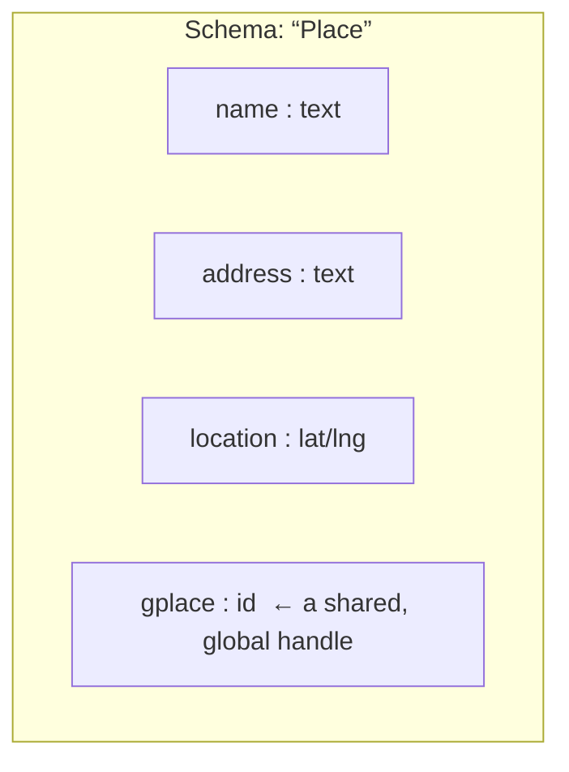
```mermaid
flowchart TB
    subgraph S["Schema: “Place”"]
        f1["name : text"]
        f2["address : text"]
        f3["location : lat/lng"]
        f4["gplace : id  ← a shared, global handle"]
    end
```

For example, a schema (as above) could say a `Place` has a `name`, an `address`, a `location`, and a `gplace` id.

---

## 3. Graph Chunking

You can't store a million-node graph on a blockchain, and if we want a globally verifiable graph then we cannot trust a platform's server to hold it. So, Fangorn stores the data on **IPFS** as a Merkle tree, mapping only the root of the tree onchain.

The graph gets split into **chunks** (or *blobs*) and then builds a **Merkle tree** with "chunky" leaves, each committing to a set of chunked data.

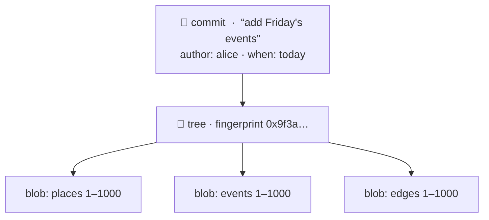
```mermaid
flowchart TD
    C["📌 commit  ·  “add Friday's events”<br/>author: alice · when: today"]
    T["🌳 tree  ·  fingerprint 0x9f3a…"]
    B1["blob: places 1–1000"]
    B2["blob: events 1–1000"]
    B3["blob: edges 1–1000"]

    C --> T
    T --> B1
    T --> B2
    T --> B3
```

### Key Features

- **Tamper-proof:** Each blob is identified by  the hash of its bytes. If you download it
  and it doesn't match the name, you know it was tampered with. No trust required.
- **Cryptographically verifiable:** By storing the Merkle root only, anyone can prove "this record really is part of
  the published dataset" without bloating onchain storage.
- **Content-Addressed Storage** If two versions share a blob, they share its name and nothing is duplicated.

> This is the similar to how **git** works: blobs (file contents), trees (directories), and commits (snapshots with a message and a parent). Fangorn is like git for knowledge graphs.

The specific `object` layout (field names, canonical serialization for cross-language byte-parity, where the Poseidon2 root sits) is pinned by the golden fixture in [`docs/objects/`](./objects/).


> IMPORTANT!!!!!!!!!!!!!!!!!!!!!!!!!!!!!!!!!!!!!!!!!!!

Graph Traversal Over "Chunky" Leaves

The Problem: Graph queries typically require traversing relationships (e.g., Find the reviews of events hosted at place X). If a client or an AI agent wants to traverse an edge, do they have to pull down the entire 1,000-edge blob just to read one relationship?

The Fix: Look closely at how IPLD (InterPlanetary Linked Data) structures graphs. Instead of arbitrary chunks of 1,000, you may want your Merkle tree layout to be graph-aware (e.g., using a Prolly Tree or a Hash Array Mapped Trie), allowing clients to fetch specific subgraphs or single nodes cryptographically without downloading adjacent, unrelated data.

---

## 4. Versioning: commits and history

Data on the web is almost never meant to be a static snapshot. Instead, knowledge transforms as new data and new relationships between data (which is also data!) is ingested, transforming knoweledge into new knowledge. Fangorn make the **full history** of those changes verifiable and auditible by treating each changes to a datasource as a **commit**. Each changeto a datasource is cryptographically linked to its parents. With the full history stored onchain it becomes easy (and cheap) to verify provenance using the same mechanisms that let you `git log` a codebase.

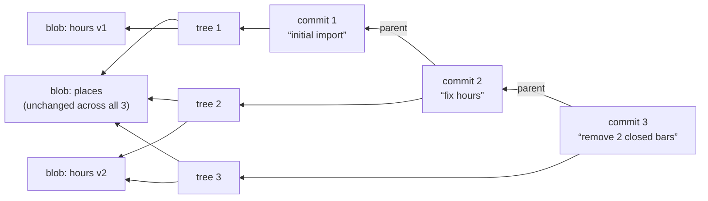
```mermaid
flowchart RL
    C3["commit 3<br/>“remove 2 closed bars”"] -->|parent| C2["commit 2<br/>“fix hours”"] -->|parent| C1["commit 1<br/>“initial import”"]

    C1 --> T1["tree 1"]
    C2 --> T2["tree 2"]
    C3 --> T3["tree 3"]

    T1 --> BP["blob: places<br/>(unchanged across all 3)"]
    T2 --> BP
    T3 --> BP

    T1 --> BE1["blob: hours v1"]
    T2 --> BE2["blob: hours v2"]
    T3 --> BE2
```

---

## 5. Where "the latest version" lives: the registry

The **Datasource registry**, a smart contract deployed onchain, holds the latest Merkle root that points to the newest
commit to the datasource, while the actualy data it points to lives in IPFS (and is immutable).

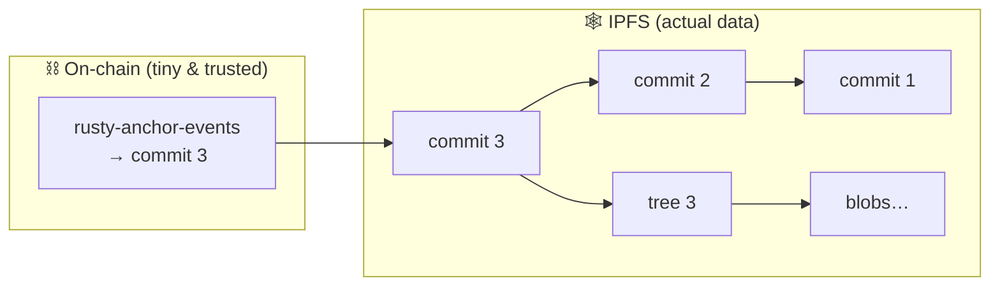
```mermaid
flowchart LR
    subgraph chain["⛓️ On-chain (tiny & trusted)"]
        REF["rusty-anchor-events<br/>→ commit 3"]
    end
    subgraph ipfs["🕸️ IPFS (actual data)"]
        C3["commit 3"] --> C2["commit 2"] --> C1["commit 1"]
        C3 --> T3["tree 3"] --> BLOBS["blobs…"]
    end
    REF --> C3
```

A **dataset is a repository**: a unique identifier that points at the tip of a commit history. Updating a datasource means updating the Merkle root to point to a newer commit. 


> TODO: Do I really need this?? 

```rust
struct Repo {
// the pointer: tip commit CID
    head_cid: string,      
    // denormalized from the tip tree (cheap verify / settlement)
    merkle_root: bytes32,  
    price_root: bytes32,
    name: string,
    commit_count: u64,
    // 0 owner · 1 allowlist · 2 group
    write_policy: u8,      
    writer_group_id: bytes32,
}
// keyed owner → schema_id → name_hash
```

---

## 6. The web: joining different publishers' data

This is the "semantic **web**" part: separate datasets, published independently, connect
into one graph. It's what makes Fangorn more than a collection of isolated files.

Suppose publisher **A** publishes *places* and publisher **B** publishes *events*, both describing the same bar and both tagged with the same global handle (`gplace:ChIJ...`). Because the handle matches, the two graphs can be recognized as talking about the same "real" thing and **fused into one**.

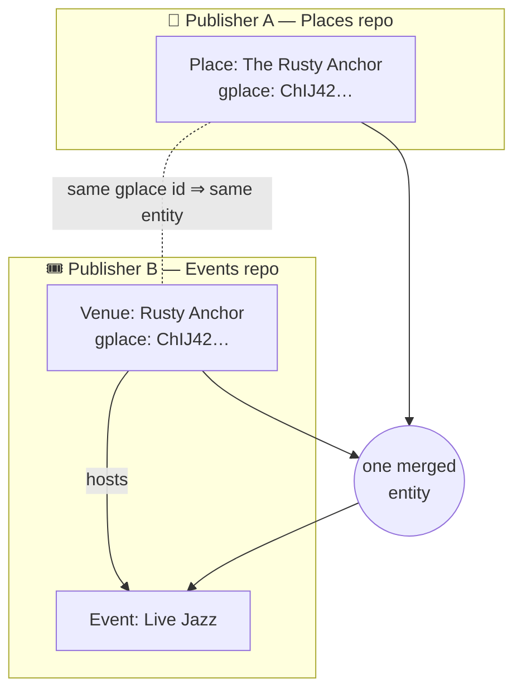
```mermaid
flowchart TB
    subgraph A["📍 Publisher A — Places repo"]
        PA["Place: The Rusty Anchor<br/>gplace: ChIJ42…"]
    end
    subgraph B["🎟️ Publisher B — Events repo"]
        EB["Venue: Rusty Anchor<br/>gplace: ChIJ42…"]
        EV["Event: Live Jazz"]
        EB -->|hosts| EV
    end

    PA -. "same gplace id ⇒ same entity" .- EB
    PA --> M(("one merged<br/>entity"))
    EB --> M
    M --> EV
```

Now a search can return "a bar (from A) hosting live jazz this weekend (from B)", a fact that emerges from the relationship that neither publisher built by themselves.

Two ways this happens:

- **Shared handle (free & automatic).** When both sides share a global identifier, they simply merge using a deterministic, zero-ML join. The join contract is the alias *namespace* (`gplace:`, `isrc:`, `mbid:`), not the field name.
- **A linkset (for the fuzzy case).** When there's *no* shared id, e.g. "Marina Bar" vs "Marina Bar & Grill", someone must publish a small dataset of **asserted links** that dictate "these two are the same," which you can choose to trust.

A **view** is a saved recipe that says "fuse repo A + repo B (+ this linkset) into one graph." In git terms, a view is a **merge**: a commit whose parents are the tips of *several different repos*. Because the merge commit pins the exact source tips it fused, the fused graph is reproducible and attestable.

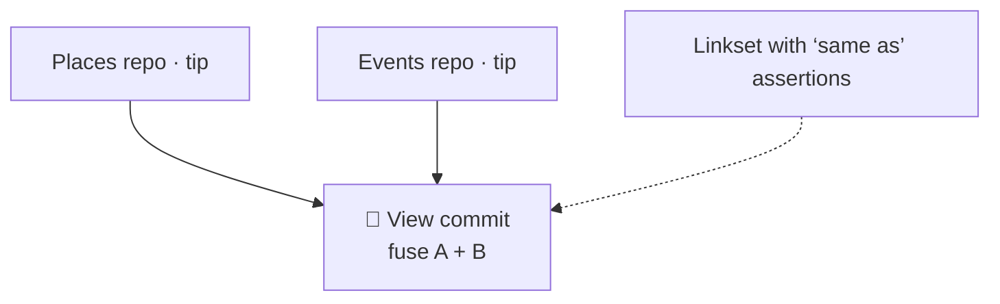
```mermaid
flowchart TB
    A["Places repo · tip"] --> V["🔀 View commit<br/>fuse A + B"]
    B["Events repo · tip"] --> V
    L["Linkset with ‘same as’ assertions"] -.-> V
```

Fusion is powerful but **trusted**: anyone who uses the same alias can claim their record *is* your entity, which could poison a merged result. This means that a view is opinonated and  it can weight or restrict which publishers it trusts to contribute to an entity.


The "Moving Target" Problem in Views (Merges)

Section 6 states that a View is a merge commit whose parents are the tips of several different repos.

If Publisher A (Places) and Publisher B (Events) are updating their data multiple times a day, a static View commit will instantly fall out of date.

Does the View creator have to continuously push new merge commits to stay updated? Or can a View be defined as a dynamic recipe (a smart contract tracking the live heads of Repo A and Repo B) rather than a static snapshot?

---

## 7. Who can write: commit is free, publishing is permissioned

Like git, data commitments exist entirely locally, meaning commits are permisionles. Onchain updates to datasources, however, are permissioned.

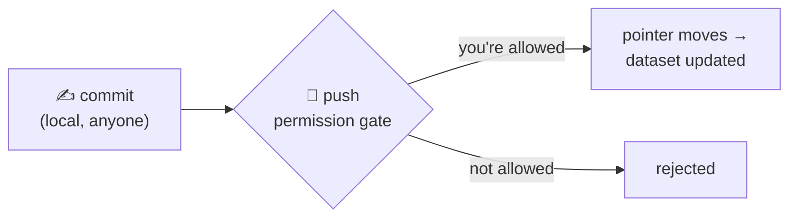
```mermaid
flowchart LR
    W["✍️ commit<br/>(local, anyone)"] --> P{"🚪 push<br/>permission gate"}
    P -->|"you're allowed"| OK["pointer moves →<br/>dataset updated"]
    P -->|"not allowed"| NO["rejected"]
```

The gate can be set per repo:

- **Owner only:** just you.
- **Allowlist:** a set of approved publishers.
- **Private group:** prove you belong to a group *without revealing which member you are*, using anonymous group-membership proofs. The push is rejected unless you can prove you're in the group, but nobody learns which member you are.

The gate also does a **safety check**: it only accepts your commit if it builds on the *latest* Merkle root (tip). If someone else pushed while you were working, you    must catch up first (so many publishers can't overwrite each other's changes).

---

## 8. FUTURE: Who can read: locking individual fields

Some fields are public (e.g. a bar's name), while some should be conditionally accessible (a paid dataset, a private document). Those get **sealed** (i.e. encrypted) under a 'gadget' that's defined within an onchain **gadget registry**.

The condition is a **rule you have to prove you satisfy**, like "you paid," "you're a subscriber," "you signed with this key". Rules can be composed (e.g. "paid **and** subscriber") to build more expressive access conditions.

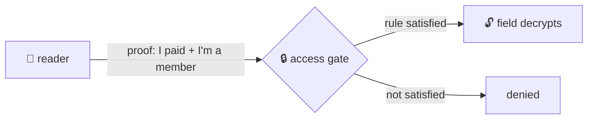
```mermaid
flowchart LR
    U["👤 reader"] -->|"proof: I paid + I'm a member"| G{"🔒 access gate"}
    G -->|rule satisfied| D["🔓 field decrypts"]
    G -->|not satisfied| X["denied"]
```

These are the **same kind of rule** used to gate writing (§7): Fangorn has one way to express "who is allowed to do this" — a composable condition — and uses it for both **who can publish** and **who can read**. Fangorn doesn't dictate *which* conditions you use; a publisher brings their own (payment, membership, a signature, or a combination).

How a field is encrypted is kept separate from who's allowed to open it. That separation means changing who-can-read is just a new commit pointing at a new rule — the data doesn't have to be re-encrypted, and the history of who-could-read-when is part of the record.

---

## 9. Making it searchable: embeddings

A graph is only useful if you can find things in it. **quickbeam** turns a published graph (in respect to a published linkset or bundle shape) into vector embeddings. Because a dataset is a history of commits, quickbeam can index **incrementally**: when a dataset updates, it compares th newest commit to the previous one and only re-indexes

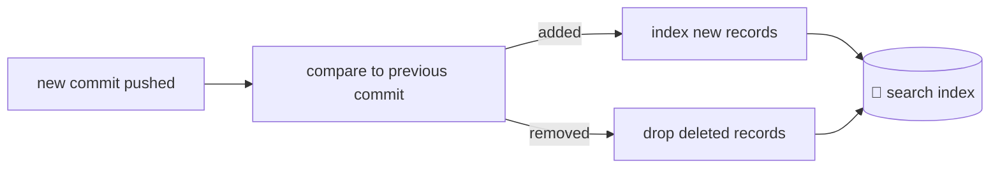
```mermaid
flowchart LR
    NEW["new commit pushed"] --> DIFF["compare to previous commit"]
    DIFF -->|added| ADD["index new records"]
    DIFF -->|removed| DEL["drop deleted records"]
    ADD --> IDX[("🔎 search index")]
    DEL --> IDX
```

For search to work across everyone, two things ride *inside the commit*:

- **The embedding model** (which model, dimensions, distance metric). A query embedded with
  one model but compared against documents embedded with another produces silent nonsense.
  Making the model a property of the data means every consumer searches the same vector
  space, instead of each tool guessing.
- **The build recipe**, so anyone rebuilding the index gets the same result.

The search index can be served as a paid API for agents, or shipped to your browser so the
**query never leaves your device** ("the knowledge is public; what you asked is private").

---

## 10. Putting it together: the whole life of a dataset

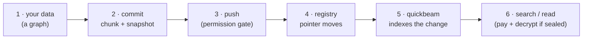
```mermaid
flowchart LR
    D["1 · your data<br/>(a graph)"] --> C["2 · commit<br/>chunk + snapshot"]
    C --> PU["3 · push<br/>(permission gate)"]
    PU --> REG["4 · registry<br/>pointer moves"]
    REG --> QB["5 · quickbeam<br/>indexes the change"]
    QB --> USE["6 · search / read<br/>(pay + decrypt if sealed)"]
```

1. You have a graph of typed things.
2. `commit` chunks it, snapshots it, and records what changed vs. last time.
3. `push` asks the chain to point at your new commit — checked against the repo's write
   rule.
4. The registry pointer moves; the change is now public and verifiable.
5. quickbeam notices, diffs it, and updates the search index.
6. People and agents find your data and read it — paying and decrypting where required.

---

## 11. Usage (CLI)

It reads like git, on purpose. A repo has a local `.fangorn/` directory (like `.git/`).

```bash
# ── shape (schema) ────────────────────────────────────────────────
fangorn schema register places.v1 --bundle places-schema.json   # immutable spec → schemaId

# ── repo lifecycle ────────────────────────────────────────────────
fangorn init  rusty-anchor -s places.v1 [--policy owner|allowlist|group]
fangorn clone <owner>/places.v1                                  # rebuild history from IPFS alone

# ── the commit / push split ───────────────────────────────────────
fangorn commit -m "initial import" places.jsonl                  # chunk → tree → commit, pin, move LOCAL HEAD
fangorn commit --bundle <stageDir> -m "add graph"                # commit a typed node+edge bundle
fangorn push                                                     # authorized CAS update_ref ← trust boundary
fangorn status                                                  # local HEAD vs on-chain tip (ahead/behind)
fangorn log                                                     # walk parents (self-verifying, no indexer)
fangorn show <commit>                                           # snapshot + diff vs parent

# ── the web: cross-repo (later phase) ─────────────────────────────
fangorn view create town-guide -s <places-repo> <events-repo>   # merge-commit over source tips
fangorn link add fangorn:<A>/x sameAs fangorn:<B>/y --confidence .93

# ── access ────────────────────────────────────────────────────────
fangorn seal report.pdf --field body --rule "subscriber"        # lock a field behind a rule
fangorn access <owner>/<repo> <entityUri> <field>               # prove rule → fetch → unseal
```

`commit` + `push` is the two-phase split git fuses; keeping them separate is what makes
offline commits, non-fast-forward detection, and push-auth clean.

---

# Part II — Building Fangorn (for contributors)

*Everything above describes what Fangorn is and how it works. The rest is for people
working on it: what we build ourselves vs. reuse, the current status, and known gaps.*

---

## 12. What we build vs. borrow vs. buy

The biggest engineering risk is **reinventing things other projects already solved.** The
guiding rule: own only what is genuinely ours, borrow or buy the rest.

| Piece | Decision | Why |
|---|---|---|
| **The versioning tree** (the thing that diffs two big datasets fast) | **Borrow** — `prolly-trees` (or Dolt/LakeFS-style), don't hand-roll | A self-balancing, content-addressed tree with log-scale diff + 3-way merge is a *solved problem*. Hand-rolling it is the main source of "reinventing the wheel." |
| **The on-chain settlement root** (Poseidon2) | **Build** — this is the one thing we must own | It's why we can't just adopt Dolt/pail wholesale: they hash their own way and aren't ZK/on-chain aware. This is the whole justification for the git-native work. |
| **Content storage** | **Buy/reuse** — IPFS / Pinata | Already in place; content-addressing is native. |
| **The read gate** (decrypt-iff-rule) | **Buy** — Lit Protocol (threshold/TEE network) | Standing up our own threshold/TEE network is a project unto itself; keep ZK gadgets for the on-chain *write* gate only. |
| **Payment / privacy rails** | **Reuse** — x402 / ERC-3009 + Semaphore | Already integrated on the consumer side. |
| **The semantic fusion + search layer** | **Build** — this is the differentiator | quickbeam over a fused cross-publisher graph is what makes Fangorn *not* just Dolt, not just IPFS. Protect this; don't let versioning plumbing crowd it out. |

**Why not just use Dolt/DoltHub?** Dolt nails versioned tabular data with great diff/merge
— but it's single-authority, has no on-chain settlement, no payment/access gate, and no
semantic layer. Those are architectural, not features you can bolt on. Given trustless
on-chain settlement is a hard requirement, Dolt-as-the-product is out — but *borrowing its
tree* (above) is exactly right. Fangorn's novelty is **paid + decentralized + semantic
fusion**, a combination no single existing tool covers.

---

## 13. How we're building it — status and roadmap

We build in stages, each usable on its own, and avoid touching the smart contract until
the idea is proven around it. The enabling trick for early stages: the current contract
already stores a pointer, so we **store the *commit* CID in that existing slot** — the
entire git object model + verifiable history ships with **no contract change**.

**Near-term (the MVP loop): `commit → push → pay → read`.** This is the smallest thing
that honors every hard requirement (trustless, paid, versioned) and is where most value
already lands.

| Stage | What it delivers | Contract redeploy | Status |
|---|---|---|---|
| **Object model + local repo + CLI** | Version data locally; self-verifying parented history; `log`/`show`/`diff`; deletes; push via the existing contract | — | ✅ done |
| **Bundle & view commits** | Typed graphs and view recipes become first-class commits on the same rail (not one-shot scripts) | — | ✅ done |
| **Incremental search builds** | quickbeam diffs commits — embed only what changed, deletes propagate, model inherited from the commit | — | ✅ done (verify on live GPU/Qdrant before relying) |
| **Real refs + auth (redeploy #1)** | Concurrency-safe pushes (compare-and-swap), owner/allowlist write auth, clean update trigger | **#1** | ⬜ next |
| **The read gate** | Sealed fields gated by a real rule (buy Lit — §12), not a single hardwired "paid" bit | worker/verifier | ⬜ later |

**Later (the "web" + governance) — the differentiator, deferred not dropped:**

| Stage | What it delivers | Redeploy |
|---|---|---|
| **Views = cross-repo merge commits** | Attested, reproducible cross-publisher fusion | — |
| **Linksets** | Fuzzy joins between publishers with no shared id (needs the publisher-whitelist fix, §6) | — |
| **Anonymous / group push** | Prove membership in a writer group without revealing identity | **#2** (opt-in) |
| **Index-as-a-repo** | The search index itself becomes a versioned artifact whose lineage points back at the data it was built from | — |

**Exactly two contract redeploys across the whole program** (one required, one opt-in).
First shippable value already landed — before any redeploy.

The one piece worth prototyping early and carefully is the **tree structure** (§12) — the
thing that lets us diff two big datasets quickly. Everything else is straightforward once
that's solid.

---

## 14. Where the current code stands (honest gaps)

Some of the four promises are still enforced by convention rather than by code. Honest
scorecard so nothing hides:

- **Embedding model not inherited** → *closed*: the model rides in the commit (§9).
- **No on-chain proof that data conforms to its schema** → *open*: the tree binds a
  `schemaId` and a Poseidon2 root, which is the seam a future ZK conformance proof plugs
  into; not yet built.
- **Publisher authorization unenforced** (anyone could publish against anyone's schema) →
  *closes with refs + auth* (redeploy #1, §13).
- **No cross-publisher linking** → *addressed by views + linksets* (later phase, §6).

Semantic *roles* (how a UI labels fields as title/spatial/temporal/…) stay interpretive by
design — a wrong role degrades presentation but never corrupts results, so it's improved
heuristically, not promoted to a verified contract.

---

## 15. Glossary

- **Node / Edge** — a typed thing / a typed relationship between things (§1).
- **Schema** — an immutable typed shape at a CID; a new version is a new `schemaId`. A
  **bundle** is a schema for a whole subgraph (node types + allowed edges).
- **Blob** — a content-addressed chunk (some nodes, edges, or links).
- **Tree** — a typed snapshot: the list of blobs + one Poseidon2 fingerprint, bound to a
  schema.
- **Commit** — a dated, attributed, parented pointer to a tree; the unit of history. Two+
  parents from *different* repos = a view merge.
- **Ref / Repo** — the one mutable, on-chain thing: a named pointer to the tip commit,
  moved only by an authorized compare-and-swap. A repo *is* a ref over a commit history.
- **View** — a merge commit that fuses several source repos into one graph.
- **Linkset** — a repo of asserted `sameAs`-style edges between foreign entities (the
  fuzzy join).
- **Entity URI / alias** — a node's global name (`fangorn:<repo>/<id>`) and shared handles
  (`gplace:`, `isrc:`) that let publishers' data fuse. The alias *namespace* is the join
  contract.
- **Seal / access rule** — encrypting a field, and the composable condition that must be
  satisfied to decrypt it (the same condition language gates writes).
- **quickbeam** — the tool that turns a committed graph into a searchable vector index,
  built incrementally from the commit stream.
- **Poseidon2 root** — the ZK/on-chain-friendly fingerprint we commit for settlement; the
  one hash we must own (§12), carried alongside the IPFS CID.

---

*Archived design notes (superseded by this guide, kept for detail and code seams) live in
[`docs/archive/`](./archive/). The cross-language object fixture lives in
[`docs/objects/`](./objects/).*
