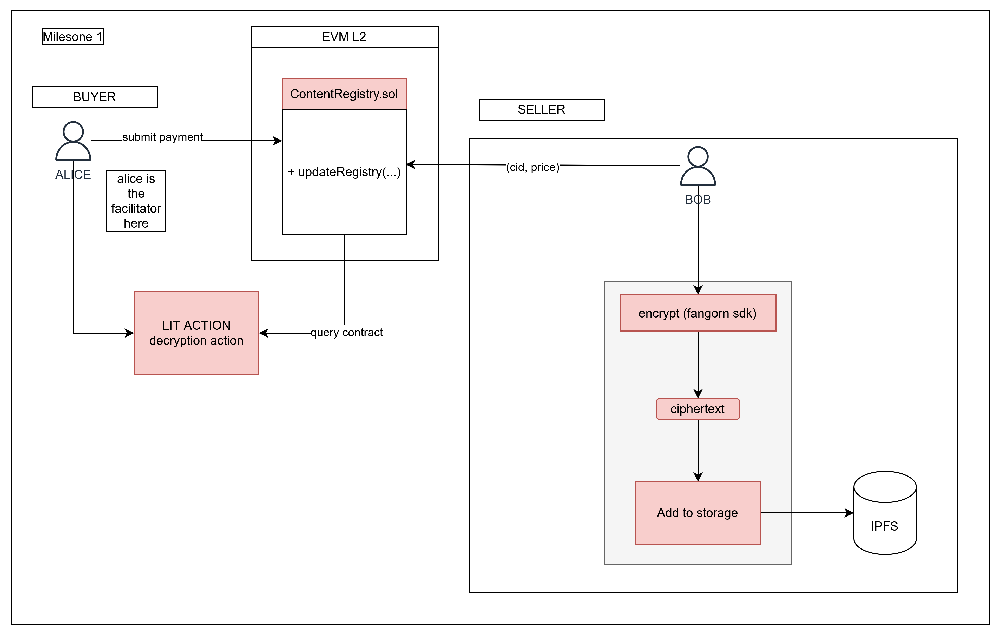
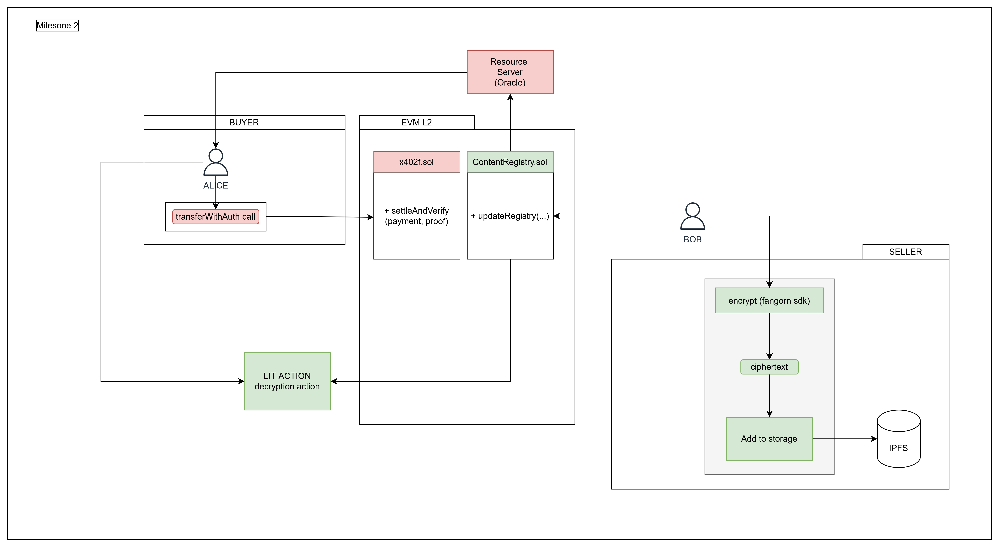
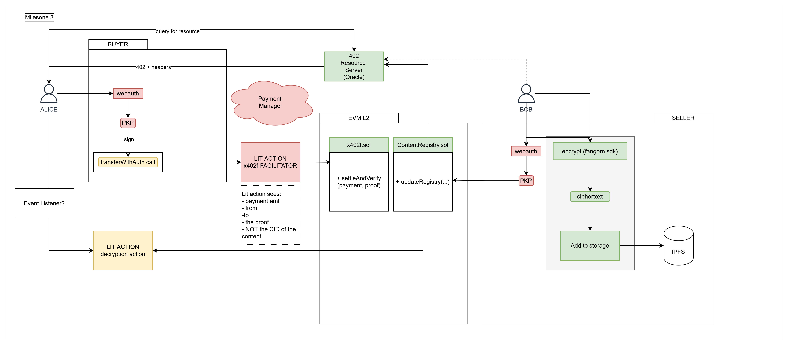

# Open Grant Proposal: Fangorn

**Name of Project:** x402f

**Proposal Category:** integration-adoption

**Proposer:** [driemworks]()

**Do you agree to open source all work you do on behalf of this grant and dual-license under MIT, APACHE2, or GPL licenses?:** Yes.

# Project Description

Fangorn extends Lit Protocol's Access Control Conditions with ZK-verified, privacy-preserving predicates and introduces the Blind Facilitator pattern — trustless atomic settlement powered by PKPs.
This grant delivers infrastructure that makes Lit ACCs arbitrarily expressive while maintaining buyer privacy, and demonstrates PKPs as the foundation for autonomous payment systems.

---

AI agents are projected to transact over $1 trillion in data purchases by 2030. The x402 HTTP standard is emerging as the protocol for machine-to-machine payments. But x402 has a critical gap: payment doesn't guarantee delivery. When an agent pays for data and receives nothing—or garbage—it has no recourse. Agents can't file disputes. They can't escalate to support. They just fail.

Fangorn solves this by making x402 delivery cryptographically guaranteed, which we are calling `x402-lit`. Content is encrypted and stored on IPFS. The decryption key is controlled by Lit Protocol's threshold network. When an agent pays and submits a valid settlement proof on-chain, Lit's Access Control Conditions verify the settlement and release the decryption key. Payment and delivery become atomic. No trust required, no disputes needed. It elimates issues that can arise due to the server deviating from expected behaviour. No bait and switch, no withholding, etc.

We've already built the core primitives. Our vault demo—live on Base Sepolia—demonstrates Lit-based threshold encryption with ZK proof-gated access. We're now extending this to x402-compliant agentic commerce, positioning Lit as essential infrastructure for the machine economy.

## Value

In standard x402:

- Payment happens (centralized facilitator executes transferWithAuthorization)
- Server should deliver content... but might not
- No atomicity guarantee
- If the facilitator is unavailable, payments cannot be processed

Standard x402:
Client signs auth → Facilitator submits tx → Server delivers (trust required)

x402f:

- Content encrypted with Lit
- Client signs auth + generates ZK proof
- LIT action submits to settleAndVerify() that does:
  1. Verify zkp
  2. Call transferWithAuthorization
  3. Emit event
- Lit decrypts (ACC checks if settlement happened)

- it makes x402 payments more secure:
  - trust minimized: server can't rug the delivery
  - trustless facilitator: no worries of server going down, decentralized
  - no wallet needed to complete payments
  -

### Benefits of getting this right:

Fangorn showcases Lit Protocol as the decryption layer for agentic commerce. Every x402 transaction using Fangorn requires Lit. As agent-to-agent data commerce scales, Lit becomes embedded in the transaction flow of a trillion-dollar market. This positions Lit not just as an encryption tool, but as critical infrastructure for AI.

The project also demonstrates Lit's composability with ZK proofs and on-chain settlement—a powerful combination that opens new use cases beyond simple token-gating. Future predicate gadgets (age verification via ZKEmail, credential proofs, etc.) will all flow through Lit's ACC system.

This work stands to deliver major benefits for the emerging 'agentic' web.

- Enabling efficient agent-to-agent and machine-to-machine payments and unlocking autonomous agent-enabled commerce
  - e.g. A swarm of agents where each agent can purchase meaningful information from other agents, like automated weather station (collected on a raspberry pi) data being packaged and sold to agents who react to air quality alerts or inclement weather planning. This could enable autonomous agentic swarms that gather data and make money for the end user.
- It unlocks new ways for humans to interact with agents by making their data available based on conditional logic. For example:
  - only sell to agents you trust, or only if their reputation in ERC-8004 if sufficiently high
  - instead of our phones spying on us for free, personal location data can be package and sold to the highest bidder, making user data a real, user-owned commodity
-

### Risks if we don't get it right:

If trustless delivery for x402 isn't solved well, the market will default to centralized facilitators—Stripe, PayPal, custodial solutions. Lit gets cut out of the agentic commerce stack entirely. The opportunity to position Lit as infrastructure for machine payments closes.

### Execution risks:

- Proof verification costs on EVM (this is alreadyd fairly cheap, with costs further reduced by using Arbitrum Stylus for 10-50x cheaper verification)
- UX complexity for non-crypto users (mitigated by PKP-based keyless wallets, a Lit-native solution)
- Cold start for marketplace adoption (mitigated by focusing on agent-to-agent commerce first, where UX matters less)

## Deliverables

Team: 2x FTE (@40 hrs/week)
Total Duration: 4 weeks
Cost = $110/hr

<!-- Please describe in detail what your final deliverable for this project will be. Include a specification of the project and what functionality the software will deliver when it is finished. -->


| Number | Component                                        | Description                                                                                                                                                                      | Notes                                                                        |
| ------ | ------------------------------------------------ | -------------------------------------------------------------------------------------------------------------------------------------------------------------------------------- | ---------------------------------------------------------------------------- |
| 1.     | x402-lit sdk                                     | A typescript SDK for interacting with the x402-lit protocol.                                                                                                                     | Specs?                                                                       |
| 2.     | fangorn sdk                                      | A typescript SDK for encrypting with Lit, using aes-gcm + lit encryption                                                                                                         | Partially completed, but needs to be modified.                               |
| 3.     | Lit Action: Settlement-Aware-Decryption Gate     | A basic Lit action allowing decryption whenever a sufficient payment is settled.                                                                                                 | This is already built and functional.                                        |
| 4.     | Lit Action: x402-facilitator                     | A Lit action that acts as an x402 faclitator. It uses a PKP to submit valid EIP-3009 `transferWithAuthorization` calls on-chain along with the zkp.                              | payment is still transparent, but the extra conditions in the proof are not. |
| 4.     | x402f Facilitator Contract                       | A contract on Arbitrum. It contains a `settleAndVerify` function that the x402f Lit action calls to submit EIP-3009 calls and proofs.                                            | We assume payments are in USDC only.                                         |
| 5.     | Content Registry Contract                        | A contract on Arbitrum. It allows ciphertext to be registered along with payment conditions.                                                                                     | This is partially complete, though existing contracts require changes.       |
| 7.     | Demo (resource server) + PKP Webauth Integration | Integrate the webauth to PKP flow within a webapp to enable easy data uploads. Also standup a thin x402-compatible 'reverse oracle' resource server and Lit payment facilitator. | We will likely subsidize payments initially on testnet.                      |

## Development Roadmap


<!-- Please break up your development work into a clear set of milestones. This section needs to be very detailed (will vary on the project, but aim for around 2 pages for this section). -->

We have broken the work into three major milestones.

### Milestone 1: Basic Encrypt, Decrypt, Content Registry, Settlement Tracking

> Note: This version is not privacy preserving.

This milestone is programmable-payment-gated content in the most basic form. It introduces the core mechanisms for programmable payments for data encrypted with Lit. While Lit ACCs are powerful and already allow logic for encrypting data under specific payments conditions, this milestone introuces an on-chain payment condition and settlement layer, allowing data to be encrypted in a way that allows the price to be:

- modified using transparent on-chain mechanisms
- ensuring that payment conditions are committed to on-chain.

This is critical for enabling trustless x402 payment rails, providing immutable on-chain pricing mechanics.



| Component                              | Task                                      | Description                                                                     | Notes                                                            |
| -------------------------------------- | ----------------------------------------- | ------------------------------------------------------------------------------- | ---------------------------------------------------------------- |
| Settlement Aware Decryption Lit action | Development and Deployment of Lit acction | A Lit action that gates decryption based on finalized on-chain settlements.     | Requires a settlement tracking contract to be deployed           |
| Smart Contract                         | Content Registry Contract                 | A basic contract for storing CIDs and allowing programmable payment conditions. | On Arbitrum                                                      |
| Fangorn SDK                            | Encrypt and Upload                        | Encrypt data w/ hybrid aes-gcm and Lit encryption functions                     | This is partially completed, but the SDK requires modifications. |
| Fangorn SDK                            | Decrypt and Download                      | Decrypt data after settlement has been made on-chain                            | This is partially completed, but the SDK requires modifications. |
| x402-lit SDK                           | Groundwork for the x402 (typescript) SDK. | Content regsitry contract CRUD interface + add to storage                       | We use storacha for storage.                                     |

#### Encryption Flow

choose message => encrypt under aes-gcm w/ randomly generated ephemeral key => encrypt key with LIT

#### Decryption Flow

make payment => track settlement onchain => use this condition to allow/deny decryption

### Milestone 2: x402 sdk, contract, and resource server

This milestone is admittedly absent of "Lit specific" deliverables, however, it produces the crucial groundwork for enabling the trustless x402 facilitator lit action that we introduce in milestone 3.

- webauth -> lit pkp integration
- sign transferWithAuth call using Lit pkp
- Encrypt data & set price
- Pay amount (manually) and decrypt if payment is settled using a LIT action
  - start on a new x402 sdk:
    - seller needs to 'register' their data, provide payment conditions on-chain in a contract
  - so we need to modify the fangorn sdk a bit to strip out the 'vault' stuff



| Component                 | Task                                                                                                                   | Description                                                                                              | Notes |
| ------------------------- | ---------------------------------------------------------------------------------------------------------------------- | -------------------------------------------------------------------------------------------------------- | ----- |
| x402 SDK                  | transfer with auth signing and submission                                                                              | We modify the x402 sdk to enable the signing of transferWithAuthorization calls and on-chain submission. |       |
| x402 Facilitator Contract | Develop and deploy x402 contract                                                                                       | The x402 contract...                                                                                     |       |
| Resource Server           | A 'thin' x402-compliant server that reads from the content registry and delivers 402 responses with verifiabl headers. | Q: what makes the headers verifiable?                                                                    |

### Milestone 3: Lit action x402 facilitator, payment manager, PKP integration

- create lit action facilitator, deploy and pin



| Component                    | Task                                               | Description                                                                                                             | Notes |
| ---------------------------- | -------------------------------------------------- | ----------------------------------------------------------------------------------------------------------------------- | ----- |
| Lit action: x402 facilitator | Develop and deploy the x402 facilitator lit action | The Lit action accepts a signed `transferWithAuthorization` call and submits it onchain using a PKP.                    |       |
| PKP integration              | Use webauth -> pkp                                 | Develop a user interface that allows users to login with Google, mint a PKP, (drip tokens with faucet), and sign calls. |       |
| Payment management           | Subsized Lit + ETH payments                        |                                                                                                                         |       |
| PKP integration              |                                                    |                                                                                                                         |       |

<!-- For each milestone, please describe: -->
<!-- - The software functionality that we can expect after the completion of each milestone. This should be detailed enough that it can be used to ensure that the software meets the specification you outlined in the Deliverables. -->
<!-- - How many people will be working on each milestone and their roles -->
<!-- - The amount of funding required for each milestone -->
<!-- - How much time this milestone will take to achieve (using real dates) -->

## Total Budget Requested

<!--Sum up the total requested budget across all milestones, and include that figure here. Also, please include a budget breakdown to specify how you are planning to spend these funds. -->

## Maintenance and Upgrade Plans

Fangorn is the core product of Ideal Labs. We are committed to long-term development:

- Ongoing maintenance: Bug fixes, security patches, Lit SDK version updates
- Predicate expansion: ZKEmail integration for email-based credentials, token-gating predicates, custom circuits
- Multi-chain deployment: Base, SKALE, other EVM chains
- Enterprise features: Batch settlements, analytics dashboard, white-label options

Revenue from protocol fees (2-3% per transaction) will fund ongoing development post-grant.

# Team

## Team Members

<!-- - Team Member 1 -->
<!-- - Team Member 2 -->
<!-- - Team Member 3 -->
<!-- - ...

## Team Member LinkedIn Profiles

<!-- - Team Member 1 LinkedIn profile -->
<!-- - Team Member 2 LinkedIn profile -->
<!-- - Team Member 3 LinkedIn profile -->
<!-- - ...

## Team Website

https://fangorn.network

## Relevant Experience

<!-- Please describe (in words) your team's relevant experience, and why you think you are the right team to build this project. You can cite your team's prior experience in similar domains, doing similar dev work, individual team members' backgrounds, etc. -->

## Team code repositories

Fangorn (vault demo): https://github.com/fangorn-networkfangorn

Ideal Network: https://github.com/pax/idn
[Add other relevant repos]

# Additional Information

How did you learn about the Lit Open Grants Program?

We initially learned about the grants program through online searches/github. However, we have also had direct engagement and outreach with Lit's devrel team, as well as initial feedback from David Sneider.

Please provide the best email address for discussing the grant agreement and general next steps.

driemworks@fangorn.network

Please include any additional information that you think would be useful in helping us to evaluate your proposal.

- Vault demo is live: [link to deployed app]
- We are simultaneously participating in the Arbitrum Open House Buildathon (NYC), building Fangorn on Arbitrum Stylus
- a16z recently published "11 AI x Crypto Crossovers" — three of them (agent payment infrastructure, micropayments, webcrawler compensation) describe exactly what Fangorn enables.
- This grant accelerates a product we're building regardless; Lit funding ensures Lit remains central to the architecture rather than being abstracted away.

mapping(bytes32 contentId => mapping(address buyer => uint256 expiresAt)) public settlements;

```

---

### Step-by-Step Protocol

#### Phase 1: Content Registration (Seller)

```

┌────────────────────────────────────────────────────────────────┐
│ SELLER │
└────────────────────────────────────────────────────────────────┘
│
▼
┌─────────────────────────────────────────────────────────────────┐
│ 1. ENCRYPT │
│ │
│ plaintext + accessControlConditions → ciphertext │
│ │
│ ACC = { │
│ contractAddress: SETTLEMENT_CONTRACT, │
│ functionName: "isSettled", │
│ functionParams: [":contentId", ":userAddress"], │
│ returnValueTest: { comparator: "=", value: true } │
│ } │
└─────────────────────────────────────────────────────────────────┘
│
▼
┌─────────────────────────────────────────────────────────────────┐
│ 2. PREPARE TERMS │
│ │
│ commitment = { │
│ contentId: bytes32, // keccak256(cid) or unique ID │
│ cid: string, // IPFS CID of bundle │
│ price: uint256, // in atomic units │
│ asset: address, // USDC contract │
│ payTo: address, // payment recipient │
│ seller: address, // signer address │
│ validUntil: uint256, // expiration timestamp │
│ chainId: uint256, // target chain │
│ } │
│ │
│ sellerSignature = eip712.sign(commitment, sellerPrivateKey) │
│ commitmentHash = keccak256(abi.encode(commitment)) │
└─────────────────────────────────────────────────────────────────┘
│
▼
┌─────────────────────────────────────────────────────────────────┐
│ 3. UPLOAD TO IPFS │
│ │
│ bundle = { │
│ ciphertext, │
│ commitment, │
│ sellerSignature │
│ } │
│ │
│ cid = ipfs.add(bundle) │
│ │
│ NOTE: commitment.cid must equal resulting cid │
│ (use deterministic CID or update after upload) │
└─────────────────────────────────────────────────────────────────┘
│
▼
┌─────────────────────────────────────────────────────────────────┐
│ 4. REGISTER ON-CHAIN │
│ │
│ ContentRegistry.register(contentId, commitmentHash) │
│ │
│ Stores: │
│ commitments[contentId] = commitmentHash │
│ sellers[contentId] = msg.sender │
│ │
│ Emits: ContentRegistered(contentId, commitmentHash, seller) │
└─────────────────────────────────────────────────────────────────┘
│
▼
CID is now shareable

```

#### Phase 2: Discovery & Payment (Buyer)
```

┌────────────────────────────────────────────────────────────────┐
│ BUYER │
└────────────────────────────────────────────────────────────────┘
│
▼
┌─────────────────────────────────────────────────────────────────┐
│ 5. REQUEST CONTENT │
│ │
│ GET /content?cid=Qm... │
│ │
└─────────────────────────────────────────────────────────────────┘
│
▼
┌────────────────────────────────────────────────────────────────┐
│ RESOURCE SERVER │
└────────────────────────────────────────────────────────────────┘
│
▼
┌─────────────────────────────────────────────────────────────────┐
│ 6. SERVE 402 RESPONSE │
│ │
│ bundle = ipfs.get(cid) │
│ contentId = bundle.commitment.contentId │
│ │
│ // Verify commitment is still active on-chain │
│ onChainHash = registry.commitments(contentId) │
│ require(keccak256(bundle.commitment) == onChainHash) │
│ │
│ HTTP 402 Payment Required │
│ { │
│ x402Version: 1, │
│ accepts: [{ │
│ scheme: "exact", │
│ network: "base", │
│ maxAmountRequired: commitment.price, │
│ asset: commitment.asset, │
│ payTo: commitment.payTo, │
│ resource: "/content?cid=...", │
│ extra: { │
│ contentId: commitment.contentId, │
│ commitment: bundle.commitment, │
│ sellerSignature: bundle.sellerSignature │
│ } │
│ }] │
│ } │
└─────────────────────────────────────────────────────────────────┘
│
▼
┌────────────────────────────────────────────────────────────────┐
│ BUYER │
└────────────────────────────────────────────────────────────────┘
│
▼
┌─────────────────────────────────────────────────────────────────┐
│ 7. VERIFY TERMS │
│ │
│ // Buyer can independently verify │
│ a) sellerSignature recovers to commitment.seller │
│ b) keccak256(commitment) == registry.commitments(contentId) │
│ c) commitment.validUntil > now │
│ d) price is acceptable │
│ │
└─────────────────────────────────────────────────────────────────┘
│
▼
┌─────────────────────────────────────────────────────────────────┐
│ 8. SIGN PAYMENT AUTHORIZATION │
│ │
│ authorization = { │
│ from: buyerAddress, │
│ to: SETTLEMENT_CONTRACT, // NOT payTo! │
│ value: commitment.price, │
│ validAfter: now, │
│ validBefore: now + 300, // 5 min window │
│ nonce: randomBytes32() │
│ } │
│ │
│ buyerSignature = eip3009.sign(authorization) │
│ │
└─────────────────────────────────────────────────────────────────┘
│
▼
┌─────────────────────────────────────────────────────────────────┐
│ 9. SETTLE PAYMENT │
│ │
│ Settlement.settle( │
│ commitment, │
│ sellerSignature, │
│ authorization, │
│ buyerSignature │
│ ) │
│ │
│ Contract: │
│ a) Verify seller signature on commitment │
│ b) Verify commitment hash matches on-chain registry │
│ c) Verify commitment not expired │
│ d) Verify buyer payment >= commitment.price │
│ e) Execute transferWithAuthorization to self │
│ f) Transfer commitment.price to commitment.payTo │
│ g) Refund any overpayment to buyer │
│ h) Record: settlements[contentId][buyer] = now + TTL │
│ │
│ Emits: Settled(contentId, buyer, seller, amount) │
│ │
└─────────────────────────────────────────────────────────────────┘

```

#### Phase 3: Content Delivery & Decryption
```

┌────────────────────────────────────────────────────────────────┐
│ BUYER │
└────────────────────────────────────────────────────────────────┘
│
▼
┌─────────────────────────────────────────────────────────────────┐
│ 10. REQUEST WITH PROOF │
│ │
│ GET /content?cid=Qm... │
│ Headers: │
│ X-Payment-Proof: base64({ buyer, txHash }) │
│ │
└─────────────────────────────────────────────────────────────────┘
│
▼
┌────────────────────────────────────────────────────────────────┐
│ RESOURCE SERVER │
└────────────────────────────────────────────────────────────────┘
│
▼
┌─────────────────────────────────────────────────────────────────┐
│ 11. VERIFY & SERVE CIPHERTEXT │
│ │
│ // Check on-chain settlement │
│ isSettled = Settlement.isSettled(contentId, buyer) │
│ require(isSettled) │
│ │
│ HTTP 200 OK │
│ { │
│ ciphertext: bundle.ciphertext, │
│ contentId: commitment.contentId, │
│ accessControlConditions: [...] │
│ } │
│ │
└─────────────────────────────────────────────────────────────────┘
│
▼
┌────────────────────────────────────────────────────────────────┐
│ BUYER │
└────────────────────────────────────────────────────────────────┘
│
▼
┌─────────────────────────────────────────────────────────────────┐
│ 12. DECRYPT VIA LIT │
│ │
│ Lit.decrypt({ │
│ ciphertext, │
│ accessControlConditions: [{ │
│ contractAddress: SETTLEMENT_CONTRACT, │
│ functionName: "isSettled", │
│ functionParams: [contentId, buyerAddress], │
│ returnValueTest: { comparator: "=", value: true } │
│ }], │
│ chain: "base", │
│ authSig │
│ }) │
│ │
│ Lit nodes: │
│ → Check Settlement.isSettled(contentId, buyer) │
│ → If true, release threshold decryption shares │
│ → Buyer reconstructs plaintext │
│ │
└─────────────────────────────────────────────────────────────────┘
│
▼
plaintext

```

#### Phase 4: Terms Update (Seller)
```

┌────────────────────────────────────────────────────────────────┐
│ SELLER (updating price) │
└────────────────────────────────────────────────────────────────┘
│
▼
┌─────────────────────────────────────────────────────────────────┐
│ 13. UPDATE TERMS │
│ │
│ newCommitment = { │
│ ...oldCommitment, │
│ price: newPrice, │
│ validUntil: newExpiry │
│ } │
│ │
│ newSignature = eip712.sign(newCommitment) │
│ newHash = keccak256(abi.encode(newCommitment)) │
│ │
│ // Update IPFS bundle (optional, can keep same CID wrapper) │
│ newBundle = { ciphertext, commitment: newCommitment, ... } │
│ newCid = ipfs.add(newBundle) │
│ │
│ // Update on-chain anchor │
│ ContentRegistry.updateCommitment(contentId, newHash) │
│ │
│ OLD SIGNATURES NOW INVALID: │
│ hash(oldCommitment) != registry.commitments(contentId) │
│ │
└─────────────────────────────────────────────────────────────────┘

On-Chain State Summary
ContractStorageSize per ContentContentRegistrycommitments[contentId] → bytes3232 bytesContentRegistrysellers[contentId] → address20 bytesSettlementsettlements[contentId][buyer] → uint25632 bytes per buyer
Total per content: ~52 bytes + 32 bytes per buyer (with TTL expiry)

Security Properties
PropertyMechanismSeller can't rug priceOn-chain commitmentHash must matchOld terms invalidated on updateHash check fails for old signaturesBuyer can't underpayContract enforces value >= priceOverpayments refundedContract returns excessReplay protectionEIP-3009 nonce + settlement recordDecryption gated on paymentLit checks isSettled() on-chainTerms transparencyCommitment signed, verifiable by buyer
