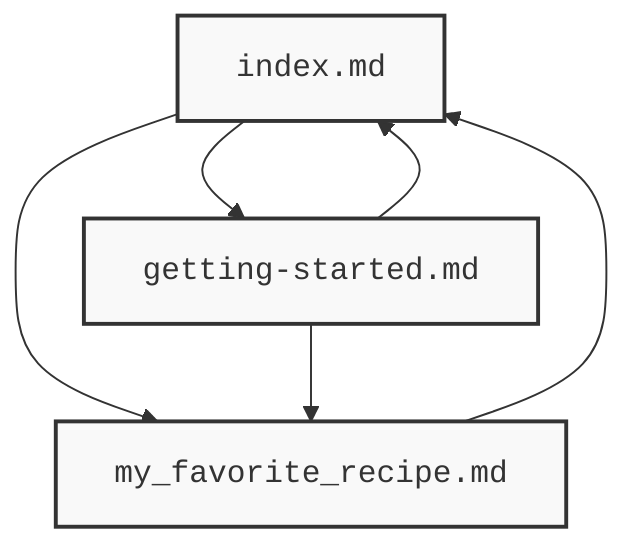
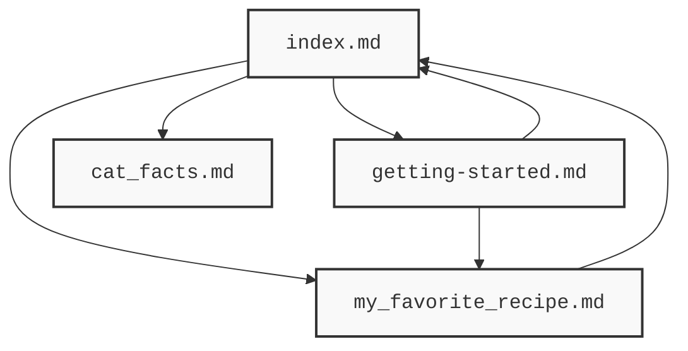

# Building a HackMD-style wiki on Fangorn

A walkthrough for publishing a set of linked markdown documents to Fangorn as a versioned, content-addressed **graph**.

This example shows how you can implement a custom graph builder using the [build-asset-graph harness](../../../harness/index.ts), so you don't have to "roll your own". Here, the markdown extractor ensures that **your links are the graph.** Every `[text](other.md)` and`[[wikilink]]` in your docs is an edge.

---

## 1. Install and configure the CLI

```bash
npm i -g @fangorn-network/sdk
# One-time setup: stores your wallet key + storage creds in ~/.fangorn/config.json
fangorn init
# Register your wallet as a publisher on-chain (one-time)
fangorn register
```

`fangorn init` prompts for a wallet private key, a Pinata JWT + gateway (content
storage), and your access-worker URL. You can skip it and set `ETH_PRIVATE_KEY`,
`PINATA_JWT`, `PINATA_GATEWAY`, `WORKER_URL` in the environment instead.

## 2. Write markdown that links the normal way

A Fangorn dataset is a graph of **vertices** (your docs) and **edges** (the
links between them). You express both in plain markdown — no special syntax:

```
docs/
  index.md                 # links to the others
  getting-started.md
  my_favorite_recipe.md
```

```markdown
<!-- docs/index.md -->
# My Fangorn Wiki

- [Getting started](getting-started.md)
- [My favorite recipe](my_favorite_recipe.md)

See also [[getting-started]] for the short version.
```

Both link styles work and become edges:

- `[label](getting-started.md)` — standard markdown link to a `.md` file
- `[[getting-started]]` — wiki-style link (filename, no extension)

External URLs (`https://…`), self-links, and `#anchors` are ignored. The graph
that falls out of the sample docs in `docs/`:



## 3. Initialize a repo

Fangorn treats a dataset like a git repo. `repo init` starts tracking a
**namespace** in the current directory (allocating it on-chain if it's new) and
drops a `.fangorn/` pointer — the analogue of `.git/`.

```bash
# create a new repository
pnpm init
# install the sdk
pnpm i @fangorn-network/sdk
# initialize a fresh Fangorn repo 
fangorn repo init fangorn-md
```

### Implement the markdown graph builder 

``` ts
      import { buildAssetGraph, extractMarkdownLinks } from "../../index.js";

      const buildMarkdownGraph = (dir: string) => {
          return buildAssetGraph(dir, {
              processors: {
                  ".md": (file) => ({
                      tag: "doc",
                      payload: { content: file.readText() },
                      links: extractMarkdownLinks(file.readText())
                  })
              }
          });
      }

      // CLI: build-graph.mjs <dir>
      if (import.meta.url === `file://${process.argv[1]}`) {
          const dir = process.argv[2] ?? ".";
          process.stdout.write(JSON.stringify(buildMarkdownGraph(dir), null, 2) + "\n");
      }

```

## 4. Derive the graph and commit it

This is the ergonomic part. Instead of writing `vertices` and `edges` JSON by
hand, generate it from your markdown:

```bash
# files → vertices, markdown links → edges
node build-graph.mjs docs/ > commit.json

# snapshot it into a local commit (no on-chain tx yet)
fangorn commit commit.json -m "publish wiki"

# settle the commit as the on-chain tip (the permissioned step)
fangorn push
```

`build-graph.mjs` (in this folder) is the whole bridge — a filename is a vertex
id, a markdown link is an edge:

```js
const LINK = /\]\(([^)\s]+?\.md)(?:#[^)]*)?\)|\[\[([^\]|#]+?)(?:[|#][^\]]*)?\]\]/g;
// glob *.md → vertices { id, tag:"doc", payload:{ path, content } }
// matchAll(LINK) → edges  { rel:"links", from, to }
```

The `commit.json` it emits is exactly what `fangorn commit` expects:

```json
{
  "vertices": [
    { "id": "index", "tag": "doc",
      "payload": { "path": "index.md", "content": "# My Fangorn Wiki\n..." } }
  ],
  "edges": [
    { "rel": "links", "from": "index", "to": "getting-started" }
  ]
}
```

**Editing loop:** change your markdown, re-run the three commands. Each
`commit` builds on the previous one (like git), so you get full history.

## 5. Inspect and share

```bash
fangorn status          # local tip vs. on-chain tip
fangorn log             # commit history from the local tip
fangorn show            # what the latest commit changed
fangorn read --pretty   # dump every vertex + edge as JSON
```

Anyone can track your published wiki by cloning it by address + namespace:

```bash
fangorn clone <your-wallet-address> fangorn-md
fangorn read --pretty
```

Or follow it live — `subscribe` streams JSON diffs on every on-chain push (like a light client):

```bash
fangorn subscribe --pretty
```

---

**Add more data.**

We can add more files to our repo. Lets add some cat facts.




1. create cat_facts.md and write a cool cat fact
2. link it somewhere in index.md.
3. rebuild
4. commit
5. push

---

## Try it end to end

```bash
cd examples/hackmd
node build-graph.test.mjs        # sanity-check the link scanner
node build-graph.mjs docs/ > commit.json
# then, once configured:  fangorn repo init fangorn-md && fangorn commit commit.json -m init && fangorn push
```

## Where to go from here

The `build-graph.mjs` bridge is deliberately tiny. Reach for more only when you
actually need it:

- **Links inside code fences get picked up** — the scanner is a regex, not a
  markdown parser. Swap in `remark`/`marked` if that bites.
- **Nested folders** — `readdirSync` is one level deep. Make it recursive and
  use the relative path (minus `.md`) as the vertex id.
- **Richer payloads** — parse frontmatter into `payload.title`, `payload.tags`,
  etc. The `payload` is arbitrary JSON.
- **A rendered site** — `fangorn read` gives you the full graph as JSON; feed it
  to any static-site renderer to get the HackMD reading experience.
