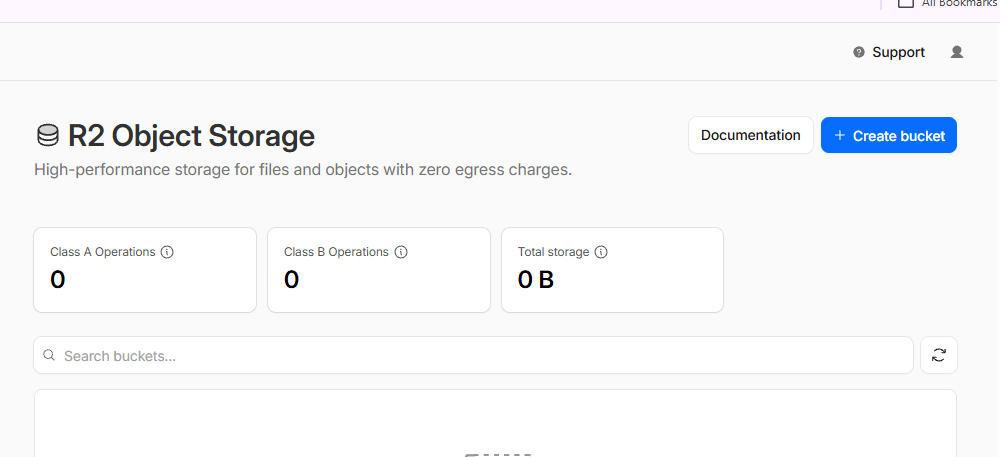
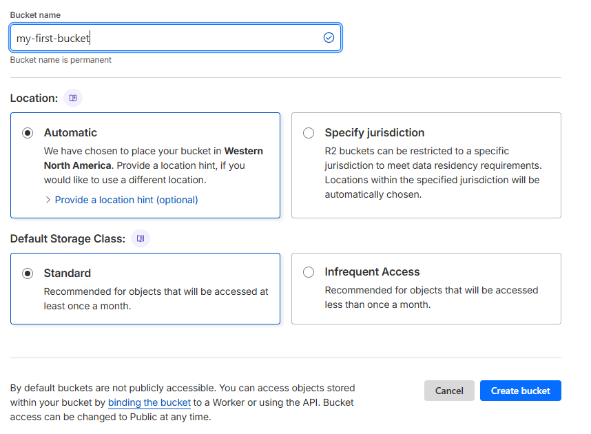
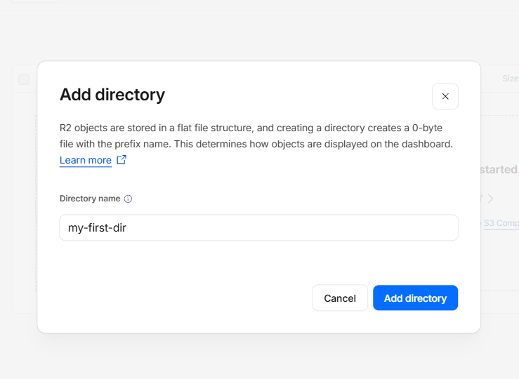

# Storage Config

1. Sign up for cloudflare and subscribe to R2 database (10gb/month for free)
2. Create a new bucket, `my-first-bucket`

---

---

3. Add a directory `my-first-dir`

4. Click on the directory, upload a file (e.g. an mp3).